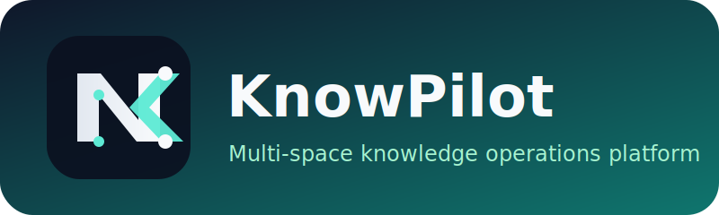
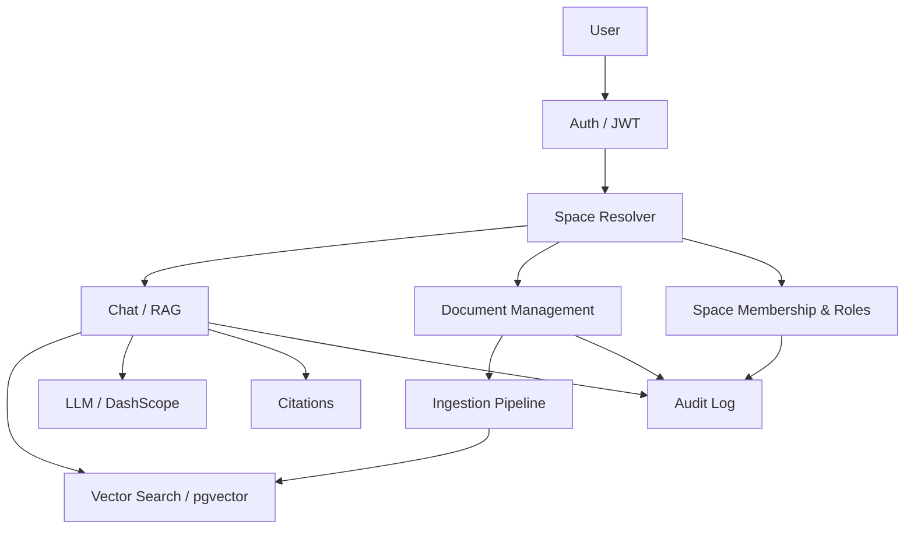
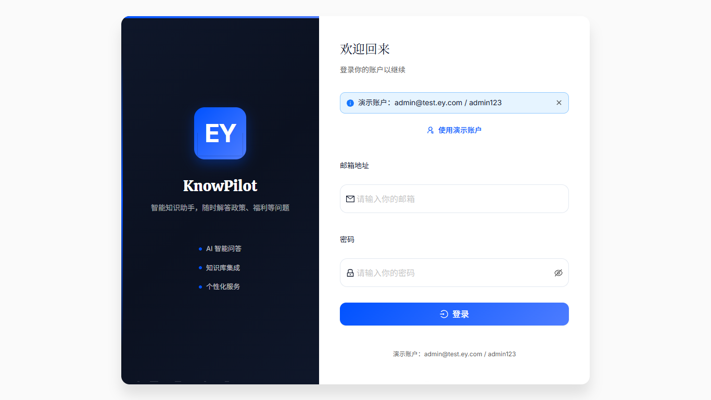
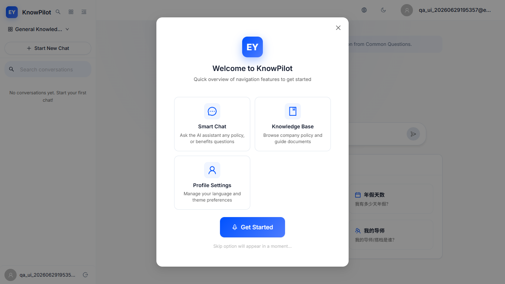
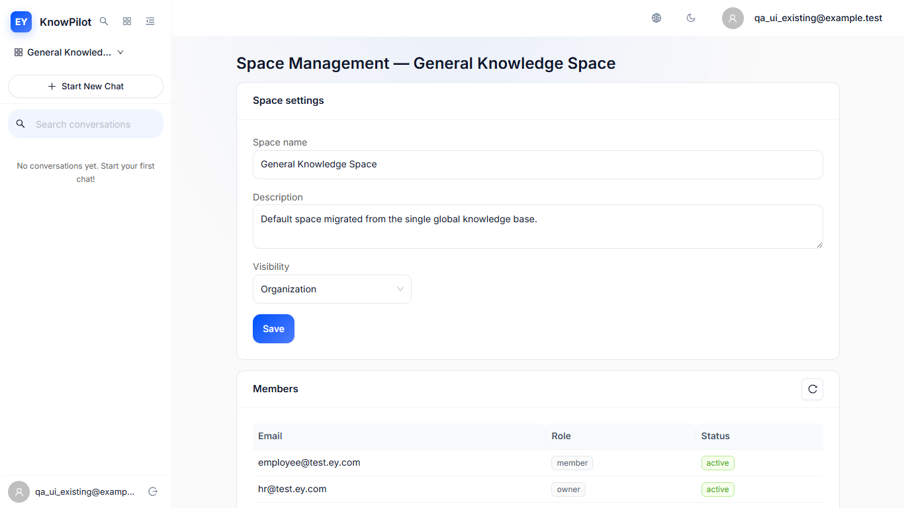



# KnowPilot

### Multi-space knowledge operations platform for professional teams

> RAG-powered knowledge agent for professional teams.  
> **Languages**: [English](README.md) / [中文](README_ZH.md)

KnowPilot turns documents, methods, project memory, and compliance rules into a governed knowledge product.  
It helps teams ask once, reuse everywhere, and keep institutional knowledge inside the organization.

---

## TL;DR

KnowPilot is a multi-space knowledge agent for professional services and compliance-heavy organizations. It uses RAG to answer with citations, isolates knowledge by organization/business line/space, and provides reusable templates for onboarding, audit methodology, standards Q&A, and project work.

The business outcome is lower onboarding cost, faster delivery, more consistent judgment, and less knowledge loss when people move. The platform is designed so one deployment can be cloned into many governed spaces without multiplying the full stack.

If you need a knowledge product that is more than a chatbot, KnowPilot is built to become the operating layer for team knowledge.

---

## Why It Exists

### Business problem

Professional teams waste time searching for answers that already exist but are scattered across folders, handbooks, PDFs, and senior staff memory. The result is slow delivery, inconsistent judgment, and repeated reinvention across projects.

### What KnowPilot changes

KnowPilot turns knowledge retrieval into a governed product surface:

- one question returns a source-backed answer;
- one platform can serve many spaces;
- one knowledge base can evolve without re-deploying the whole stack;
- one audit trail can reconstruct who did what, where, and when.

### This Is Not

KnowPilot is **not**:

- a generic public chatbot;
- a consumer search engine;
- a document storage system without governance;
- a one-size-fits-all LLM wrapper for every industry;
- a substitute for human review in high-stakes decisions.

It is designed for organizations that care about boundaries, traceability, and repeatable knowledge operations.

---

## Core Capabilities

| Capability | Business scenario | Value produced |
| --- | --- | --- |
| Source-backed RAG Q&A | Audit standards, onboarding, project questions | Seconds-level answers with citations instead of manual search |
| Multi-space isolation | Organization / business line / project team separation | Keeps data boundaries clear and reduces leakage risk |
| Access-code joining | Pilot spaces, controlled onboarding, demo activation | Low-friction entry without weakening governance |
| Role-based governance | Owner, knowledge admin, reviewer, member, guest | Right people manage the right space with least privilege |
| Document lifecycle management | Upload, re-index, delete, archive | Keeps the knowledge base current and actionable |
| Template-driven replication | Onboarding, audit methodology, standards, project AI | Cuts setup time for new spaces and new teams |
| Audit logging | Sensitive operations, permission failures, admin actions | Reconstructs changes for compliance and review |
| Session-scoped chat | Continued work across sessions and spaces | Preserves context without leaking across boundaries |

### Data-backed statements

Replace bracketed placeholders with real numbers from your own testing before public release:

- Reduces question-to-answer latency from `[X]` to `[Y]`
- Cuts onboarding time by `[X]%`
- Supports `[Y]` concurrent sessions or `[Y] QPS`
- Lowers repeated manager escalations by `[X]%`
- Reduces knowledge lookup time from `[X] minutes` to `[Y] seconds`

---

## Architecture

KnowPilot uses a shared application core with logical isolation. The product is built to scale by spaces, not by duplicating the whole system per team.

### Scalability model

- **Scale by space**: add new business lines or project spaces without deploying a new codebase.
- **Scale by template**: clone a proven scenario instead of designing each space from scratch.
- **Scale by asynchronous ingestion**: document processing runs through Celery so upload traffic does not block the chat path.
- **Scale by retrieval scope**: search is restricted to the active `space_id`, which keeps retrieval efficient and containment clear.

---

## Product Surface

KnowPilot provides:

- source-backed Q&A with RAG
- document upload, re-indexing, deletion, and archival
- organization, business-line, and project-space isolation
- access-code based space joining
- role-based governance and audit logs
- reusable templates for onboarding, standards, audit methodology, and project work
---

## Screenshots

### Login

Root-level screenshots:

### Space Access

### Module Isolation

### Chat

Reference screenshots from smoke testing:

---

## Replication Model

KnowPilot is designed to be copied at the space level, not forked per team.

### Reuse path

1. Create a new organization or business line.
2. Create a knowledge space from a scenario template.
3. Assign roles and access codes.
4. Upload or ingest the relevant documents.
5. Start answering with the same governed RAG engine.

### Integration boundary

Teams can reuse individual modules without pulling in the entire product:

- Chat only
- Document management only
- Space governance only
- Audit and logging only
- Template-based onboarding only

This keeps adoption incremental and reduces the cost of partial rollout.
