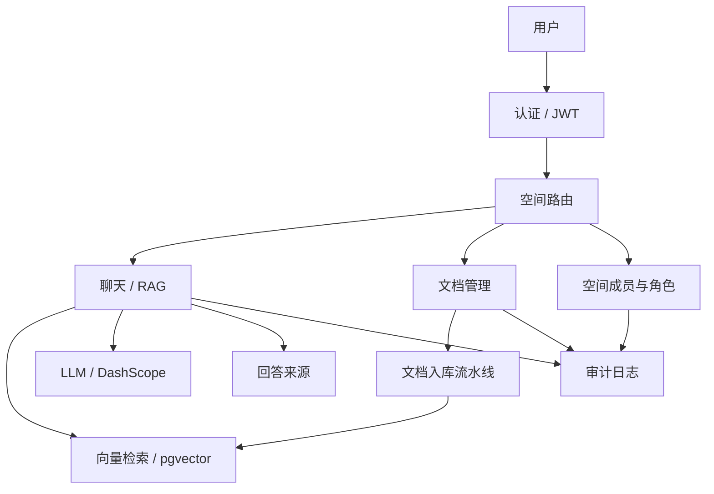

# KnowPilot

### 面向专业服务团队的多空间知识平台

> 面向专业服务团队的 RAG 知识 Agent。  
> **语言**：[English](README.md) / [中文](README_ZH.md)

KnowPilot 将分散在文档、方法论、项目记忆与合规规则中的知识，构造成可治理、可复用的组织级知识平台。平台支持一次提问、多次复用，并把组织知识留在组织内部。

---

## TL;DR

KnowPilot 是一个面向专业服务与高合规场景的多空间知识 Agent。它基于 RAG 提供带来源引用的回答，按组织、业务线与空间隔离，并提供可复用模板，例如入职、审计方法论、标准问答与项目知识沉淀。

它的核心价值不是“多一个聊天窗口”，而是把团队知识变成一个可管理、可复制、可持续扩展的产品能力。

---

## 为什么要做这件事

### 业务问题

专业团队中的知识常散落在文档、手册、PDF 与个人经验中，查询成本高。结果是交付缓慢、判断口径不一致、同类问题反复重复、组织经验难以沉淀。

### 我们解决了什么

KnowPilot 把知识检索做成一个可治理的产品体验：

- 一次提问，返回带来源的答案；
- 一套平台服务多个空间；
- 一套知识底座持续演进，不需要重建整站；
- 一条审计链路可支撑治理与复盘。

### 边界定义

KnowPilot **不做**：

- 面向公众的通用聊天机器人；
- 仅做文档文件仓库；
- 无治理的“万能”LLM 包装器；
- 高风险决策的人类替代。

---

## 核心能力与业务价值

| 能力 | 场景 | 价值产出 |
| --- | --- | --- |
| 带来源的 RAG 问答 | 审计准则、入职培训、项目咨询 | 用可追溯答案代替手工查找 |
| 多空间隔离 | 组织、业务线、项目团队 | 明确边界，降低数据误触与泄露风险 |
| 访问码接入 | 新空间试运行、演示、受控接入 | 低摩擦加入，同时保留治理边界 |
| 角色治理 | Owner / 管理员 / 审核者 / 成员 / 访客 | 让“对的人”管理“对的空间” |
| 文档生命周期 | 上传、重建索引、删除、归档 | 让知识库持续可用、可追溯 |
| 模板化复制 | 入职、标准问答、审计、项目 | 新空间上线时间更短 |
| 审计日志 | 敏感操作、权限失败、管理员行为 | 支撑合规与复盘 |
| 会话上下文隔离 | 跨会话、跨空间持续咨询 | 复用上下文但不跨界泄露 |

### 数据化表述

发布前请用真实值替换：

- 将问题响应时延从 `[X]` 降到 `[Y]`
- 将入职准备时间降低 `[X]%`
- 支撑并发 `[Y]` 会话或 `[Y] QPS`
- 降低重复上报工单率 `[X]%`
- 查找知识耗时从 `[X] 分钟` 降到 `[Y] 秒`

---

## 架构与扩展性

KnowPilot 采用“共享核心 + 空间逻辑隔离”架构，优先按空间增长，而非按团队复制系统。

### 扩展策略

- 空间扩展：新增业务线或项目空间，不必重新部署新代码库。
- 模板扩展：基于模板快速复用成熟场景。
- 异步入库：文档处理走异步流水线，不阻塞聊天主路径。
- 检索范围约束：按 `space_id` 限定检索，提升效率并强化边界。

---

## 产品能力

KnowPilot 提供：

- RAG 带来源问答
- 文档上传、重建索引、删除与归档
- 组织 / 业务线 / 项目空间隔离
- 访问码加入空间
- 角色治理与审计日志
- 可复用的入职、标准和审计模板

---

## 关键截图

### 登录页

### 空间访问

### 模块隔离

### 对话页

---

## 复用与落地

KnowPilot 以空间为单位复制，不以项目重建为单位重复搭建。

### 落地路径

1. 创建组织或业务线。
2. 基于场景模板创建知识空间。
3. 配置角色与访问码。
4. 上传或接入知识文档。
5. 使用同一套治理 RAG 引擎开始服务。

### 集成边界

- 仅启用聊天能力
- 仅启用文档能力
- 仅启用空间治理
- 仅启用审计日志
- 仅启用模板化入职
