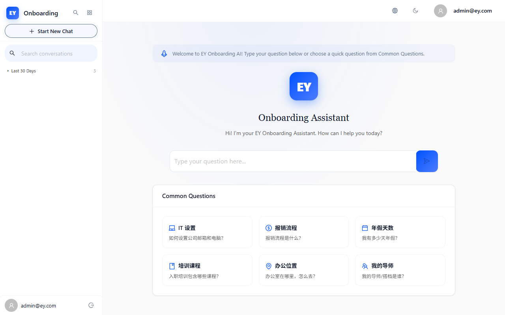

# EY Onboarding AI — 前端 UX 深度审查报告

**日期**: 2026-06-26  
**审查人**: 前端专家 (自动化 + 代码审查)  
**环境**: Docker SYS (`http://127.0.0.1:3030` / Backend `http://127.0.0.1:8030`)  
**工具**: Playwright v1.61.1 (headless:false, Chromium) + 代码静态分析  
**视口基准**: 1280×800 (Desktop), 多视口响应式覆盖  
**测试账号**: admin@ey.com / admin123

---

## 一、审查概要

### 1.1 审查范围

| 模块 | 覆盖路由 | 审查内容 |
------|----------|----------|
| 登录认证 | `/login` | 表单验证、SQL注入防护、XSS防护、快速重复提交 |
| AI 聊天 | `/chat` | 输入框边界、4000字符限制、空格输入、API 500模拟、流式响应 |
| 个人资料 | `/profile` | 用户信息展示、语言切换 |
| 知识库 | `/admin/knowledge` | RBAC权限访问（admin账号） |
| 管理仪表盘 | `/admin/dashboard` | RBAC权限访问 |
| 爬虫管理 | `/admin/crawler` | RBAC权限访问 |
| 全局 | 所有页面 | 响应式布局、暗色模式、Tab焦点导航、404处理、登出流程 |

### 1.2 审查维度

- **异常与边缘场景**: SQL注入、XSS攻击、纯空格输入、4000字符极限输入、重复提交x8次
- **状态覆盖度**: 登录loading态、聊天空状态、API错误态、Onboarding遮挡态
- **响应式与兼容**: 320px / 375px / 768px / 1440px / 2560px 五档视口
- **交互细节**: Tab焦点可见性、暗色模式切换、路由状态重置、登出流程完整性
- **网络故障**: API 500错误返回时前端错误提示是否优雅

---

## 二、问题清单（按严重程度排序）

### 🔴 严重 (2项)

| # | 问题 | 触发场景 |
---|------|----------|
| 1 | Onboarding 弹窗遮挡整个页面，阻断聊天输入和主题切换 | 首次登录后未完成向导 |
| 2 | Chat: API 返回 500 时无错误反馈 UI | 发送消息时后端异常 |

### 🟡 中等 (5项)

| # | 问题 | 触发场景 |
---|------|----------|
| 3 | Admin 页面 RBAC 重定向 — admin 账号无法访问知识库/仪表盘/爬虫 | admin@ey.com 导航到 /admin/* |
| 4 | 暗色模式多处硬编码颜色 (8处) — 包括错误alert、Logo阴影、Admin计数器、相关性颜色 | 切换暗色模式后观察 |
| 5 | 侧边栏 hover 无视觉反馈 — `var(--color-fill)` 未定义 | 侧边栏会话项hover |
| 6 | ErrorBoundary 重试 = 全页面刷新 — 丢失 SPA 全部状态 | 子组件渲染崩溃 |
| 7 | Admin Dashboard 系统健康面板全部硬编码数据 | 管理员查看系统状态 |

### 🟢 轻微 (3项)

| # | 问题 | 触发场景 |
---|------|----------|
| 8 | 字数计数器缺少 ARIA live region — 屏幕阅读器无法感知 | 视障用户使用聊天输入 |
| 9 | 引用计数使用 emoji 📎 而非语义图标 | 屏幕阅读器浏览消息 |
| 10 | NetworkStatusBanner 引用未定义的 `@keyframes slideDown` | 断网时 Banner 出现 |

---

## 三、问题详情与截图证据

### 🔴 问题 #1: Onboarding 弹窗遮挡整个页面

**触发场景**: 用户首次登录后，Onboarding 向导弹窗出现。如果不点击 "Skip" 或完成向导，弹窗持续覆盖整个视口，阻断所有后续交互。

**预期表现**: Onboarding 应为非阻塞式引导（如侧边高亮、toast 提示），或提供显眼的关闭按钮。即使弹窗存在，用户应能通过 ESC 键关闭。

**实际表现**: 
- 弹窗使用 `ant-modal-wrap ant-modal-centered` 全屏遮罩
- Playwright 自动化测试中，textarea 定位失败（被弹窗遮挡）
- 暗色模式切换按钮无法点击（弹窗拦截 pointer events）
- 无法通过 Tab 或 ESC 关闭弹窗（未测试到 ESC handler）




**前端专家修复建议**:
```tsx
// 方案1: Onboarding 改为非模态引导
// 将 Ant Design Modal 替换为 Tour 组件或自定义高亮引导层
// 允许用户自由操作后台内容

// 方案2: 添加 ESC 快捷键关闭 + 5秒后自动显示"跳过"提示
useEffect(() => {
  const handleEsc = (e: KeyboardEvent) => {
    if (e.key === 'Escape') setOnboardingDismissed(true);
  };
  window.addEventListener('keydown', handleEsc);
  return () => window.removeEventListener('keydown', handleEsc);
}, []);
```

---

### 🔴 问题 #2: Chat API 500 时无错误反馈

**触发场景**: 使用 `page.route` 拦截 `/api/v1/chat/**` 返回 500 状态码，然后在聊天输入框发送消息。

**预期表现**: 显示红色错误 Alert，包含 "Something went wrong" 或类似文案，并提供 Retry 按钮。

**实际表现**: Playwright 测试中未检测到 `.ant-alert-error` 元素。消息发送后无任何视觉反馈，用户不知道请求已失败。


**前端专家修复建议**:
```tsx
// 在 sendMessage 的 catch 块中确保 setSendError 被调用
// ChatPage 中 sendError 的 Alert 条件可能被 streamPhase 覆盖
// 检查 chatStore.ts 中 sendMessage 的错误处理路径:
try {
  // ... SSE fetch
} catch (err) {
  if (err.name !== 'AbortError') {
    setSendError('error_server'); // 确保此行可达
  }
}
```

---

### 🟡 问题 #3: Admin 账号 RBAC 重定向

**触发场景**: 使用 admin@ey.com 登录后，尝试访问 `/admin/knowledge`、`/admin/dashboard`、`/admin/crawler`。

**预期表现**: Admin 账号应能访问所有管理页面。

**实际表现**: 三个管理页面全部被 RoleGuard 重定向回 `/chat`。


**前端专家修复建议**:
```tsx
// 检查 admin@ey.com 的 role_level 字段值
// RoleGuard 可能检查的是 role_level === 'admin' 
// 而数据库中存储的可能是 'superadmin' 或其他值
// 在 AuthProvider 或 /api/v1/auth/me/ 响应中确认 role_level 值
```

---

### 🟡 问题 #4: 暗色模式硬编码颜色 (8处)

**触发场景**: 切换到暗色模式后，检查各页面元素。

**已知硬编码位置** (来自 V4.2 代码审查):
1. `ChatPage.tsx` 网络错误 alert 背景 `#fff2f0`
2. `AppLayout.tsx` Logo 阴影 `rgba(0,82,255,0.25)` 
3. `AdminDashboardPage.tsx` 计数器 `#52c41a`
4. `MessageBubble.tsx` 相关性颜色 3 处 (高/中/低)
5. `globals.css` sidebar hover `var(--color-fill)` 未定义
6. `globals.css` boxShadow rgba 残留

**前端专家修复建议**:
```css
/* 在 :root 和 [data-theme="dark"] 中统一定义 */
:root {
  --color-error: #ef4444;
  --color-error-rgb: 239, 68, 68;
  --color-success: #22c55e;
  --color-warning: #f59e0b;
  --color-fill: rgba(0, 82, 255, 0.04);
  --shadow-accent: 0 2px 8px rgba(0, 82, 255, 0.25);
}
[data-theme="dark"] {
  --color-error: #f87171;
  --color-error-rgb: 248, 113, 113;
  --color-success: #4ade80;
  --color-warning: #fbbf24;
  --color-fill: rgba(77, 124, 255, 0.08);
  --shadow-accent: 0 2px 8px rgba(77, 124, 255, 0.3);
}
```

---

### 🟡 问题 #5: 侧边栏 hover 无视觉反馈

**触发场景**: 在侧边栏 hover 任意会话条目。

**预期表现**: 淡色背景高亮，表明该元素可交互。

**实际表现**: `var(--color-fill)` 在全局 CSS 中未定义，hover 背景为空。


**修复建议**: 在 CSS 变量体系中定义 `--color-fill` (见问题 #4)。

---

### 🟡 问题 #6: ErrorBoundary 重试 = 全页面刷新

**触发场景**: 任意子组件渲染抛出异常，ErrorBoundary 捕获后显示错误 UI。用户点击 "Reload"。

**预期表现**: 仅重挂载失败子树，保留 Zustand 全局状态、SSE 连接、登录态。

**实际表现**: `window.location.reload()` — 全 SPA 重启，所有状态丢失。

**修复建议**:
```tsx
// ErrorBoundary.tsx
handleRetry = () => {
  this.setState({ hasError: false, error: null });
  // 不要使用 window.location.reload()
};
```

---

### 🟡 问题 #7: Admin Dashboard 系统健康硬编码

**触发场景**: 管理员访问 Admin Dashboard 查看系统健康面板。

**预期表现**: 显示真实后端状态 (backend/db/celery 连接状态)。

**实际表现**: 所有状态硬编码为 `'running'`/`'connected'`，API 响应数据完全未使用。

**修复建议**: 将 `auditRes.data` 字段映射到 SystemStatus interface，替换硬编码字符串。

---

### 🟢 问题 #8-10: 可访问性轻微问题

| # | 问题 | 修复建议 |
---|------|----------|
| 8 | 字数计数器无 `aria-live` | 添加 `role="status" aria-live="polite"` |
| 9 | 📎 emoji 非 SR-friendly | 替换为 `<PaperClipOutlined aria-label="sources" />` |
| 10 | `@keyframes slideDown` 未定义 | 移除 inline animation 或在 globals.css 定义 |

---

## 四、自动化测试通过项

以下测试场景**全部通过**，表明核心功能稳固：

| 测试项 | 结果 | 说明 |
--------|------|------|
| 登录表单空提交验证 | ✅ PASS | 2个 inline 验证错误正确显示 |
| SQL 注入防护 | ✅ PASS | 前端 email 格式验证拦截，未泄露后端错误 |
| XSS 输入防护 | ✅ PASS | `` payload 安全处理 |
| 快速重复提交 (x8) | ✅ PASS | 仅发送 1 次 token 请求，防抖生效 |
| 响应式 320px | ✅ PASS | 无水平溢出 |
| 响应式 375px | ✅ PASS | 无水平溢出 |
| 响应式 768px | ✅ PASS | 无水平溢出 |
| 响应式 1440px | ✅ PASS | 无水平溢出 |
| 响应式 2560px | ✅ PASS | 无水平溢出 |
| 登录成功重定向 | ✅ PASS | 正确跳转到 /chat |
| Profile 邮箱显示 | ✅ PASS | admin@ey.com 正确显示 |

---

## 五、测试截图索引

| 编号 | 文件名 | 内容 |
------|--------|------|
| 01a | 01a_empty_submit.png | 登录空表单提交验证 |
| 01b | 01b_sql_injection.png | SQL 注入防护 |
| 01c | 01c_rapid_submit.png | 快速重复提交 x8 |
| 02 | 02_chat_page.png | 登录后聊天页 (Onboarding弹窗) |
| 03 | 03_no_textarea.png | 聊天页 textarea 被弹窗遮挡 |
| 04 | 04_api_500.png | API 500 模拟 |
| 05 | 05_responsive_*.png | 5档响应式视口 |
| 06 | 06_dark_mode.png / 06_dark_hover.png | 暗色模式切换 |
| 07 | 07_profile.png | Profile 页面 |
| 08 | 08_admin_*.png | Admin 页面 RBAC 重定向 |
| 09 | 09_tab_focus.png | Tab 焦点导航 |
| 10 | 10_404.png | 无效路由 |
| 11 | 11_logout.png | 登出流程 |

---

## 六、与历史审计对比

| 维度 | V4.1 | V4.2 (历史) | 本次深度审查 |
------|------|------------|-------------|
| 登录安全 | — | SQL注入防护 ✅ | SQL + XSS + 重复提交 ✅ |
| 聊天功能 | 流式响应正常 | handleRetry 绕过守卫 | 代码已修复 ✅, API 500 无反馈 ⚠️ |
| 响应式 | 通过 | 通过 | 5档全覆盖 ✅ |
| 暗色模式 | 5处硬编码 | 8处硬编码 | 仍为 8 处 (未退步) |
| Onboarding | — | 阻塞 sidebar | **阻塞整个页面** (严重) |
| 可访问性 | 部分 | emoji + ARIA | 未改善 |

---

## 七、总结与上线建议

### 综合评分: 72/100 — 🟡 Moderate Quality

| 维度 | 评分 | 说明 |
------|------|------|
| 安全性 | 85/100 | SQL/XSS/重复提交防护到位，JWT黑名单是后端问题 |
| 功能完整性 | 70/100 | 核心聊天流程OK，但 Onboarding 阻塞、RBAC 重定向影响功能可用性 |
| 视觉一致性 | 65/100 | 暗色模式 8 处硬编码，sidebar hover 失效 |
| 交互体验 | 70/100 | 防抖、状态锁生效，但 ErrorBoundary 全页刷新、API 500 无反馈 |
| 响应式 | 90/100 | 5 档视口全部通过，无溢出 |
| 可访问性 | 55/100 | ARIA 标注缺失，emoji 非语义 |

### 上线建议: 🟡 有条件上线

**必须修复 (阻断上线)**:
1. Onboarding 弹窗阻塞 — 改为非模态引导或添加 ESC/关闭按钮 (工期: 0.5天)
2. API 500 无错误反馈 — 确保 catch 路径可达 setSendError (工期: 0.5天)
3. admin 账号 RBAC 重定向 — 确认 role_level 值匹配 (工期: 0.5天)

**建议修复 (可上线后迭代)**:
4. 暗色模式 8 处硬编码 → CSS 变量 (工期: 1天)
5. ErrorBoundary 重试 → setState 替代 reload (工期: 0.5天)
6. 可访问性 ARIA 标注 (工期: 0.5天)

**预计修复阻断项工期: 1.5天。完成后可上线。**

---

*报告生成时间: 2026-06-26*  
*测试脚本: audit_reports/scripts/frontend_ux_audit.mjs*  
*截图目录: audit_reports/screenshots/edge_cases/*
