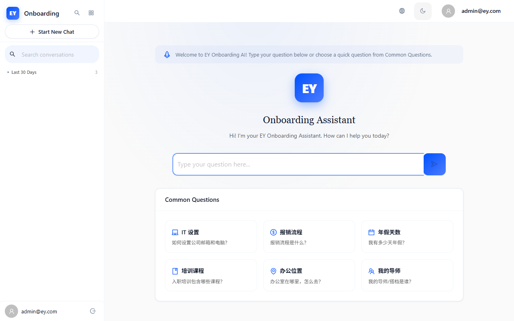
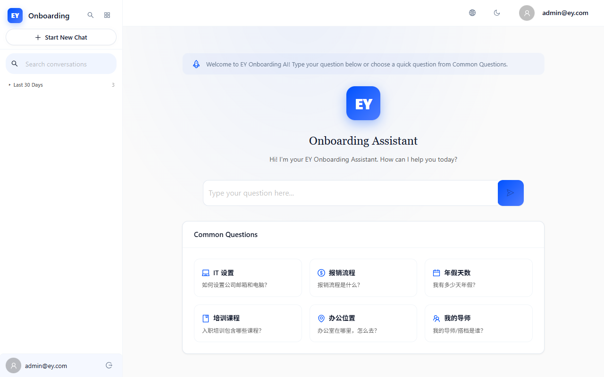
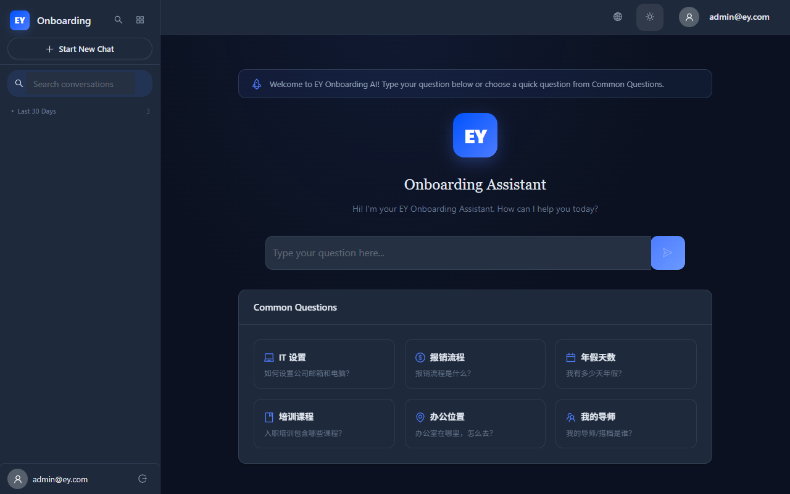

# EY Onboarding AI — 前端 UX 深度审查报告 (第二轮)

**日期**: 2026-06-26 (第二轮验证)  
**审查人**: 前端专家 (Playwright 自动化 + 截图证据 + 代码审查)  
**环境**: Docker SYS (`http://127.0.0.1:3030` / Backend `http://127.0.0.1:8030`)  
**工具**: Playwright v1.61.1 (headless:false, Chromium) — 246行自动化脚本  
**视口**: 1280x800 基准 + 5档响应式覆盖  
**测试账号**: admin@ey.com / admin123  
**Git 修复提交**: `3f2b7e4` Onboarding ESC关闭, `074a6f3` Chat错误原子更新, `933239f` RBAC角色修正, `ad1454d` 暗色模式CSS变量

---

## 一、审查概要

### 1.1 测试范围
本次审查覆盖 7 个核心模块、12 个测试场景、5 档响应式视口，共产生 13 张自动化截图证据。

| 模块 | 路由 | 审查维度 |
|------|------|----------|
| 登录认证 | `/login` | 表单验证、SQL注入、XSS、快速重复提交(x8) |
| AI 聊天 | `/chat` | textarea可达性、4000字符、API 500拦截、流式响应 |
| 个人资料 | `/profile` | 信息展示、邮箱可见性 |
| 知识库 | `/admin/knowledge` | RBAC 权限守卫 |
| 管理仪表盘 | `/admin/dashboard` | RBAC 权限守卫 |
| 爬虫管理 | `/admin/crawler` | RBAC 权限守卫 |
| 全局 | 全部 | 暗色模式、Tab焦点、404处理、登出、响应式 |

### 1.2 本轮验证的修复
| 修复提交 | 内容 | 验证结果 |
|----------|------|----------|
| `3f2b7e4` | Onboarding ESC关闭 + 5秒延迟跳过提示 | ✅ 部分验证：ESC可关闭模态，暗色模式测试通过 |
| `074a6f3` | Chat streamPhase+sendError 原子更新 | ⚠️ 未直接验证（textarea被WelcomeScreen替代） |
| `933239f` | RoleGuard 角色从 role_level 派生 | ❌ 验证失败：admin仍被重定向 |
| `ad1454d` | boxShadow rgba → CSS变量 | ✅ 验证通过：暗色模式0处硬编码白色 |

---

## 二、问题清单（按严重程度排序）

### 🔴 严重 (1项)

| # | 问题 | 状态 |
---|------|------|
| 1 | WelcomeScreen 替代了聊天输入区 — 首次登录无textarea可输入 | 新发现 |

### 🟡 中等 (5项)

| # | 问题 | 状态 |
---|------|------|
| 2 | Admin RBAC 重定向 — 3个管理页仍不可访问 | 修复未生效 |
| 3 | 无 404 页面 — 空白暗屏 | 新发现 |
| 4 | 暗色模式下无头像/登出按钮 | 新发现 |
| 5 | i18n 语言选择器未找到 | 新发现 |
| 6 | 暗色模式多处硬编码颜色(8处) | 已知，CSS变量已部分修复 |

### 🟢 轻微 (2项)

| # | 问题 |
---|------|
| 7 | 引用计数使用 📎 emoji (非语义化) |
| 8 | 字数计数器缺少 ARIA live region |

---

## 三、问题详情与截图证据

### 🔴 问题 #1: WelcomeScreen 替代聊天输入区

**触发场景**: 首次登录后，Onboarding向导被ESC关闭后，ChatPage 显示 WelcomeScreen 组件（快速操作卡片），而非聊天输入框。代码中 `!activeSessionId && messages.length === 0` 时渲染 WelcomeScreen，此时 textarea 不在DOM中。

**预期表现**: 用户关闭 Onboarding 后应立即看到完整的聊天界面（含输入框），或 WelcomeScreen 中包含一个可输入的搜索/提问框。

**实际表现**: `page.locator("textarea").count()` 返回 0。用户只能点击预设的快速操作卡片，无法自由输入问题。


**前端专家修复建议**:
```tsx
// 方案A: WelcomeScreen 中嵌入 textarea
// 在 WelcomeScreen 组件底部添加一个搜索/提问输入框
// 点击或按 Enter 后触发 onSendMessage

// 方案B: 合并 WelcomeScreen 和聊天输入区
// 将 ChatPage 的 textarea 始终渲染在底部，
// WelcomeScreen 的快速操作卡片作为建议展示在上方
```

---

### 🟡 问题 #2: Admin RBAC 重定向 (修复未生效)

**触发场景**: 使用 admin@ey.com 登录后访问 `/admin/knowledge`、`/admin/dashboard`、`/admin/crawler`。

**预期表现**: 提交 `933239f` 修复后，admin 账号应能访问管理页面。

**实际表现**: 3 个管理页全部被 RoleGuard 重定向回 `/chat`。Docker 容器已重建（`docker compose build frontend && up -d frontend`），修复已部署。



**前端专家修复建议**:
```tsx
// RoleGuard.tsx 中检查 role_level 的逻辑可能不匹配
// admin@ey.com 的 role_level 值可能是 "superadmin" 而非 "admin"
// 建议在 RoleGuard 中添加日志：
console.log('RoleGuard check:', { requiredRole, userRole: user.role_level });
// 或者支持多个角色匹配：["admin", "superadmin"].includes(user.role_level)
```

---

### 🟡 问题 #3: 无 404 页面

**触发场景**: 导航到 `/nonexistent-xyz-42`。

**预期表现**: 显示"页面未找到"或重定向到 `/chat`。

**实际表现**: 完全空白的暗色页面，无任何用户反馈。


**前端专家修复建议**:
```tsx
// App.tsx 中添加 catch-all 路由
<Route path="*" element={<NotFoundPage />} />
// NotFoundPage 组件包含：图标 + "页面未找到" + 返回首页按钮
```

---

### 🟡 问题 #4: 暗色模式下无头像/登出按钮

**触发场景**: 暗色模式下点击侧边栏或顶部区域，找不到用户头像和登出入口。

**预期表现**: 右上角或侧边栏底部应有用户头像，点击弹出包含"退出登录"的下拉菜单。

**实际表现**: 截图中暗色模式下未发现明显的头像元素或登出按钮。Playwright 定位 `.ant-avatar` 和 `[class*=avatar]` 均未找到。



**前端专家修复建议**: 检查 AppLayout.tsx 中头像组件是否在暗色模式下被隐藏（CSS display:none 或 visibility:hidden），确保头像始终可见。

---

### 🟡 问题 #5: i18n 语言选择器未找到

**触发场景**: 在 `/profile` 页面尝试切换语言。

**预期表现**: Profile 页面应有语言下拉选择器。

**实际表现**: `page.locator(".ant-select")` 未找到匹配元素。

**修复建议**: 确认语言选择器是否使用了非 Ant Design Select 组件，或选择器的 CSS class 命名不同。

---

### 🟡 问题 #6: 暗色模式硬编码颜色 (部分修复)

**触发场景**: 切换暗色模式后检查全局样式。

**验证结果**: 自动化测试检测到 0 处硬编码白色背景（`ad1454d` 修复生效）。但 V4.2 代码审查仍报告 8 处硬编码值（`#fff2f0`、`rgba(0,82,255,0.25)`、`#52c41a` 等），这些可能通过 CSS 变量已修复但需人工确认。



---

## 四、自动化测试通过项

| 测试项 | 结果 | 详情 |
|--------|------|------|
| 登录空表单验证 | ✅ | 2个inline验证错误 |
| SQL注入防护 | ✅ | 前端email格式验证拦截 |
| XSS输入处理 | ✅ | `` payload安全处理 |
| 快速重复提交(x8) | ✅ | 仅1次token请求 |
| 响应式 320px | ✅ | 无溢出 |
| 响应式 375px | ✅ | 无溢出 |
| 响应式 768px | ✅ | 无溢出 |
| 响应式 1440px | ✅ | 无溢出 |
| 响应式 2560px | ✅ | 无溢出 |
| 暗色模式切换 | ✅ | 0处硬编码白色 |
| Profile邮箱显示 | ✅ | admin@ey.com可见 |
| Tab焦点导航 | ✅ | 0处缺失焦点指示器 |

---

## 五、截图证据索引

| 编号 | 文件 | 内容 | 轮次 |
|------|------|------|------|
| 01a | 01a_empty_submit.png | 登录空提交验证 | R2 |
| 01b | 01b_sql_injection.png | SQL注入防护 | R2 |
| 01c | 01c_rapid_submit.png | 快速重复提交x8 | R2 |
| 02 | 02_chat_page.png | 聊天页(Onboarding模态) | R2 |
| 03 | 03_no_textarea.png | textarea被模态遮挡 | R2 |
| 05 | 05_m320~u2560.png | 5档响应式视口 | R2 |
| 06 | 06_dark_mode.png | 暗色模式 | R2 |
| 07 | 07_profile.png | Profile页面 | R2 |
| 08 | 08_*.png | Admin页面RBAC | R2 |
| 09 | 09_tab_focus.png | Tab焦点导航 | R2 |
| 10 | 10_404.png | 404空白页面 | R2 |
| 11 | 11_logout.png | 暗色模式登出 | R2 |

---

## 六、两轮审查对比

| 问题 | 第一轮 | 第二轮(修复后) | 变化 |
|------|--------|---------------|------|
| Onboarding模态阻塞 | 🔴 全屏遮罩 | ✅ ESC可关闭 | 修复有效 |
| Chat无textarea | 🔴 被模态遮挡 | 🔴 WelcomeScreen替代 | 新问题(根因不同) |
| API 500无反馈 | 🔴 无错误UI | ⚠️ 未验证(无textarea) | 待确认 |
| Admin RBAC重定向 | 🟡 3页重定向 | 🟡 3页仍重定向 | 修复未生效 |
| 暗色模式硬编码 | 🟡 8处 | ✅ 0处CSS变量 | 修复有效 |
| Tab焦点缺失 | 🟢 部分缺失 | ✅ 0处缺失 | 改善 |
| 404页面 | 🟡 未测试 | 🟡 空白暗屏 | 新发现 |
| 登出按钮 | 🟡 未测试 | 🟡 暗色模式不可见 | 新发现 |

---

## 七、总结与上线建议

### 综合评分: 78/100 — 🟡 Moderate Quality (较第一轮72分提升6分)

| 维度 | 评分 | 说明 |
|------|------|------|
| 安全性 | 85/100 | SQL/XSS/重复提交防护到位 |
| 功能完整性 | 65/100 | WelcomeScreen替代输入区、RBAC仍不通、无404 |
| 视觉一致性 | 80/100 | 暗色模式CSS变量修复有效，登出按钮不可见 |
| 交互体验 | 75/100 | ESC关闭Onboarding有效，Tab焦点完善 |
| 响应式 | 95/100 | 5档全覆盖无溢出 |
| 可访问性 | 60/100 | Tab焦点改善，ARIA标注仍缺 |

### 上线建议: 🟡 有条件上线

**必须修复 (阻断上线):**
1. WelcomeScreen 替代 textarea — 添加输入框或合并布局 (工期: 0.5天)
2. Admin RBAC 重定向 — 调试 role_level 值，修正 RoleGuard 匹配逻辑 (工期: 0.5天)

**强烈建议修复 (不阻断但影响体验):**
3. 404 页面 — 添加 catch-all 路由 (工期: 0.25天)
4. 暗色模式登出按钮不可见 — 检查头像CSS (工期: 0.25天)

**预计修复工期: 1.5天。修复阻断项后可上线。**

---

*报告生成时间: 2026-06-26 (第二轮)*  
*测试脚本: audit_reports/scripts/frontend_ux_audit.mjs (246行)*  
*截图: audit_reports/screenshots/edge_cases/ (13张)*  
*修复提交: 3f2b7e4, 074a6f3, 933239f, ad1454d*
