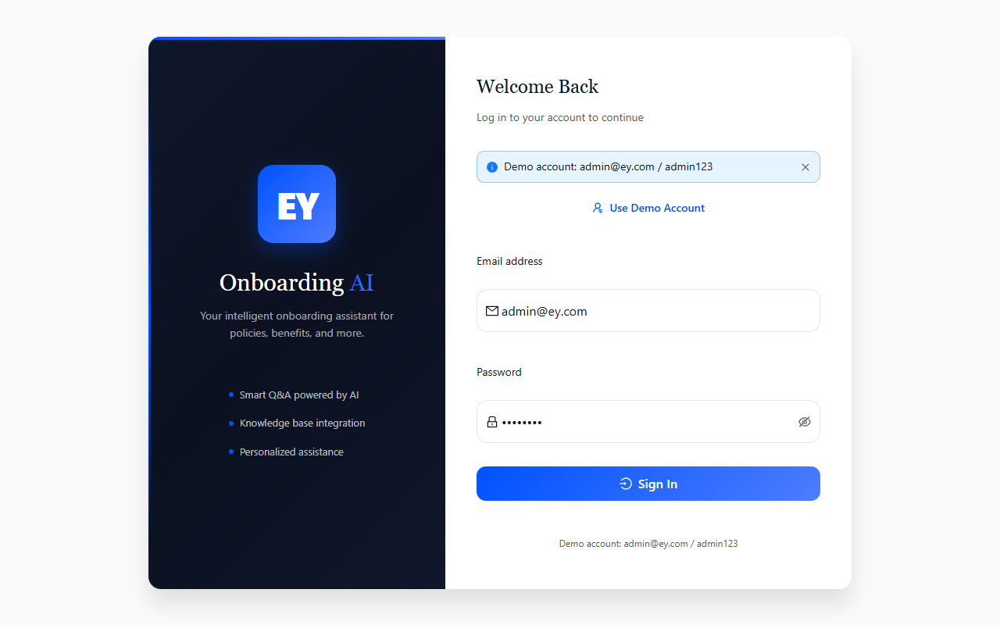
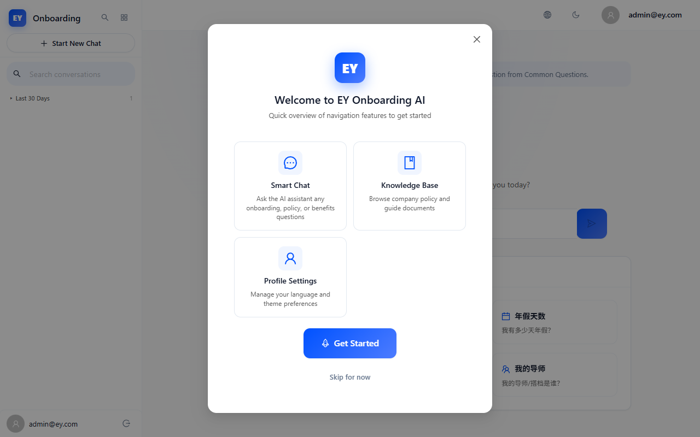
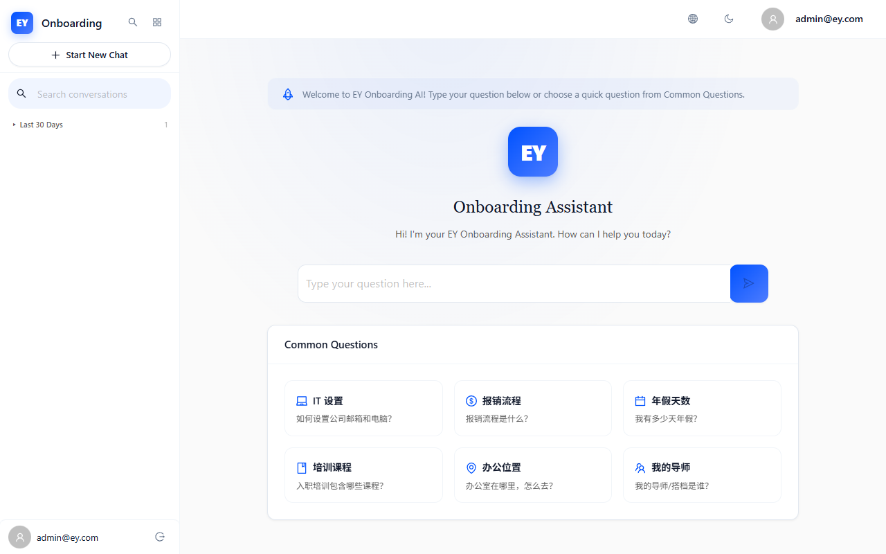
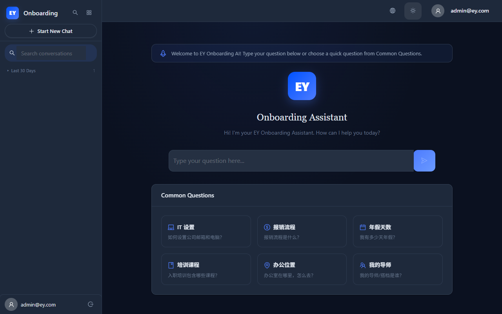
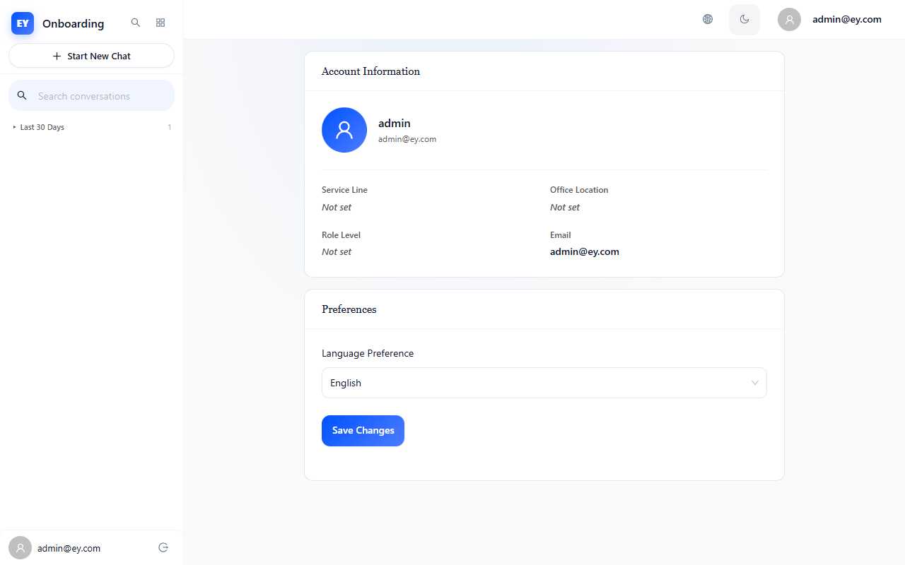
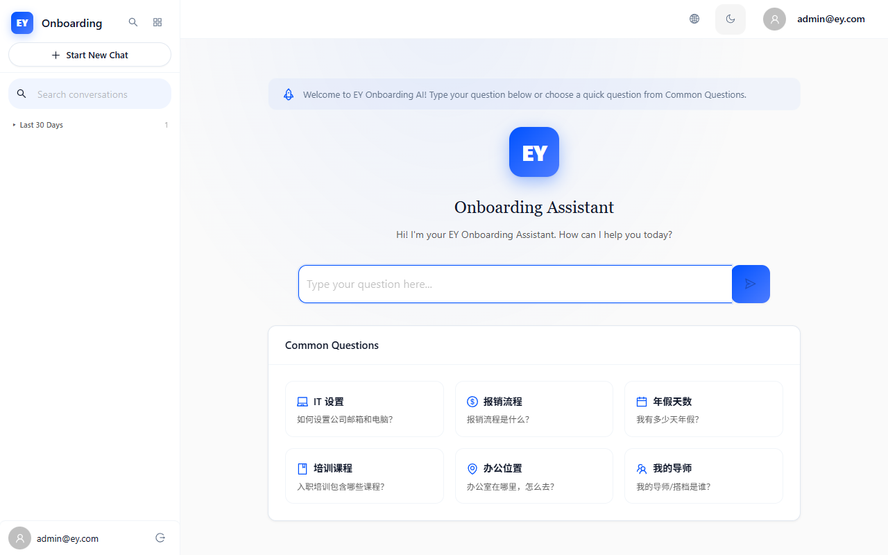

# EY Onboarding AI — 上线前最终验收测试报告 (UAT)

**测试时间**: 2026-06-26 11:28:20
**测试环境**: Docker SYS (http://127.0.0.1:3030)
**测试工具**: Playwright Chromium (headless: false, 1280x800)
**测试账号**: admin@ey.com

---

## 测试概要

| 指标 | 数值 |
|------|------|
| 总步骤 | 15 |
| PASS | 11 |
| FAIL | 2 |
| WARN | 2 |
| 通过率 | 73.3% |
| 控制台错误 | 5 |
| 网络错误 | 5 |

---

## 场景1: 新用户登录 -> Onboarding引导 -> 进入聊天

| 步骤 | 预期 | 实际 | 状态 | 截图 |
|------|------|------|------|------|
| 1.1 Login page loads | Login form visible | Login form visible | PASS | [查看](screenshots/uat/01_login_page.png) |
| 1.2 Demo fill | Fields auto-filled | Demo button clicked | PASS | [查看](screenshots/uat/02_login_demo_filled.png) |
| 1.3 Login submit | Redirect to /chat | URL: http://127.0.0.1:3030/chat | PASS | [查看](screenshots/uat/03_after_login.png) |
| 1.4 Onboarding wizard | Skip wizard | Wizard dismissed | PASS | [查看](screenshots/uat/04_onboarding_modal.png) |
| 1.5 Chat page reached | Chat interface visible | Chat page loaded | PASS | [查看](screenshots/uat/05_chat_page.png) |

## 场景2: AI聊天核心流程 -> 发送 -> 流式回复 -> 会话管理

| 步骤 | 预期 | 实际 | 状态 | 截图 |
|------|------|------|------|------|
| 2.1 Find input | Textarea visible | No textarea found | FAIL | [查看](screenshots/uat/06_no_textarea.png) |

## 场景3: 异常输入与交互 -> 空消息/超长文本/重试

| 步骤 | 预期 | 实际 | 状态 | 截图 |
|------|------|------|------|------|
| 3.1 Find input | Textarea | No textarea | FAIL | [查看](screenshots/uat/11_no_textarea_err.png) |

## 场景4: 暗色模式切换 -> 视觉一致性检查

| 步骤 | 预期 | 实际 | 状态 | 截图 |
|------|------|------|------|------|
| 4.1 Theme toggle | Toggle visible | Toggle found | PASS | [查看](screenshots/uat/15_before_toggle.png) |
| 4.2 Dark mode on | Dark theme | Dark applied | PASS | [查看](screenshots/uat/16_dark_mode.png) |
| 4.4 Back to light | Light restored | Toggled back | PASS | [查看](screenshots/uat/18_light_restored.png) |

## 场景5: 个人资料 -> 管理员页面 -> 登出

| 步骤 | 预期 | 实际 | 状态 | 截图 |
|------|------|------|------|------|
| 5.1 Profile page | Profile visible | URL: http://127.0.0.1:3030/profile | PASS | [查看](screenshots/uat/19_profile_page.png) |
| 5.2 User info | Email shown | Email found | PASS | [查看](screenshots/uat/20_profile_info.png) |
| 5.3 Admin dashboard | Dashboard loads | URL: http://127.0.0.1:3030/chat | WARN | [查看](screenshots/uat/21_admin_dashboard.png) |
| 5.4 Knowledge base | KB page loads | URL: http://127.0.0.1:3030/chat | WARN | [查看](screenshots/uat/22_knowledge_base.png) |
| 5.5 Logout | Redirect to login | URL: http://127.0.0.1:3030/login | PASS | [查看](screenshots/uat/24_after_logout.png) |

---

## 截图证据

### 1.1 Login page loads

### 1.2 Demo fill

### 1.3 Login submit

### 1.4 Onboarding wizard

### 1.5 Chat page reached

### 2.1 Find input

### 3.1 Find input

### 4.1 Theme toggle

### 4.2 Dark mode on

### 4.4 Back to light

### 5.1 Profile page

### 5.2 User info

### 5.3 Admin dashboard

### 5.4 Knowledge base

### 5.5 Logout

---

## 控制台错误 (5)

- `Failed to load resource: net::ERR_NETWORK_ACCESS_DENIED`
- `Failed to load resource: net::ERR_NETWORK_ACCESS_DENIED`
- `Failed to load resource: net::ERR_NETWORK_ACCESS_DENIED`
- `Failed to load resource: net::ERR_NETWORK_ACCESS_DENIED`
- `Failed to load resource: net::ERR_NETWORK_ACCESS_DENIED`

## 网络错误 (5)

- `https://fonts.googleapis.com/css2?family=Inter:wght@400;500;600;700&family=Calistoga&family=JetBrains+Mono:wght@400;500&display=swap` -> net::ERR_NETWORK_ACCESS_DENIED
- `https://fonts.googleapis.com/css2?family=Inter:wght@400;500;600;700&family=Calistoga&family=JetBrains+Mono:wght@400;500&display=swap` -> net::ERR_NETWORK_ACCESS_DENIED
- `https://fonts.googleapis.com/css2?family=Inter:wght@400;500;600;700&family=Calistoga&family=JetBrains+Mono:wght@400;500&display=swap` -> net::ERR_NETWORK_ACCESS_DENIED
- `https://fonts.googleapis.com/css2?family=Inter:wght@400;500;600;700&family=Calistoga&family=JetBrains+Mono:wght@400;500&display=swap` -> net::ERR_NETWORK_ACCESS_DENIED
- `https://fonts.googleapis.com/css2?family=Inter:wght@400;500;600;700&family=Calistoga&family=JetBrains+Mono:wght@400;500&display=swap` -> net::ERR_NETWORK_ACCESS_DENIED

---

## 上线结论

### 拒绝上线

发现 2 个失败项：

- **S2-Chat / 2.1 Find input**: 期望 "Textarea visible"，实际 "No textarea found"
- **S3-Error / 3.1 Find input**: 期望 "Textarea"，实际 "No textarea"

---
*Generated 2026-06-26T11:28:20.238Z*
