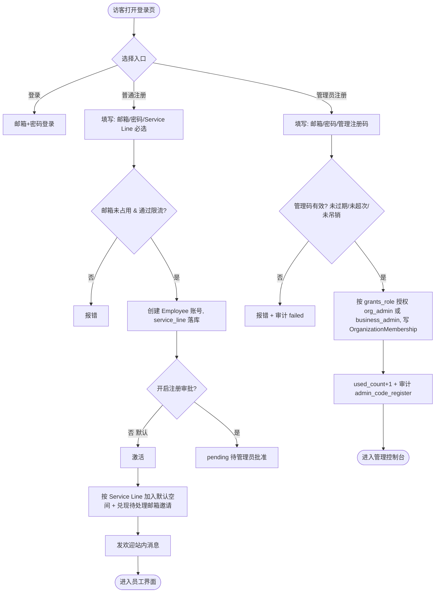
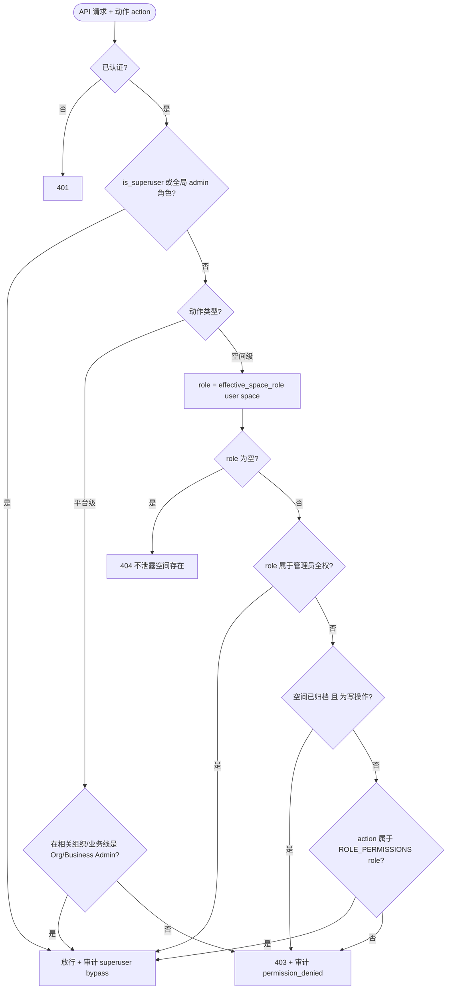

# KnowPilot V7 — 身份接入、分级 RBAC 与通知系统设计

> Version: V7.0
> Status: Implemented (verified 2026-07-01)
> Source: 本文是 `SPEC.MD` (V6.1) §M1/§M2/§M8/§M9 的延伸落地规格。
> Purpose: 在已建成的多租户骨架上，补齐「人怎么进系统、怎么分级开通、怎么收消息、管理员/员工界面怎么分」这一身份与治理闭环。

---

## 1. 概述与目标

到 V6.6，平台已具备一套**完整但只完成一半**的多租户 RBAC 骨架：数据层（`Organization → BusinessLine → KnowledgeSpace`、`SpaceMembership`、`OrganizationMembership`、`InviteCode`、全局 RBAC）与权限解析层（`apps/spaces/permissions.py`）质量很高。但缺少身份接入层。

V7 的目标是补齐以下闭环，**不推翻重建**：

1. **自助注册**：普通用户注册必选 Service Line；管理员通过**分级管理码**开通。
2. **分级管理员**：Super Admin / Org Admin / Business Admin / Space Owner(组长) / Knowledge Admin。
3. **邮箱邀请**：管理员填邮箱即可把人加进空间维护知识库（站内通知投递）。
4. **消息通知**：版本更新公告 + 被邀请/被授权等定向消息。
5. **界面分离**：独立管理控制台 vs 员工界面。
6. **前端 RBAC 收敛**：清除把组织职级当访问角色的脏逻辑。

### 设计总原则

> KnowPilot 对用户是**一个产品**，对组织是**许多互相隔离的知识大脑**。
> 权限永远是「**你在组织里是谁**」×「**你在这个空间能干什么**」的叠加。

---

## 2. 两条正交的权限轴（核心心智模型）

```
轴一：平台 / 组织身份（你是谁）            轴二：空间角色（在某空间能干什么）
──────────────────────────────          ──────────────────────────────────
Super Admin    超级管理员（全平台）         Owner            空间所有者 / 项目组组长
Org Admin      组织管理员（一个组织）        Knowledge Admin  知识库维护员
Business Admin  业务线管理员（一条业务线）    Reviewer         审阅 / 审计查看
Employee       普通员工（默认）              Member           提问 / 看来源
                                           Guest            受限问答（公开 demo）
```

| 轴 | 来源（数据） | 解析位置 |
|---|---|---|
| 轴一 | `is_superuser` / 全局 RBAC `admin` 角色 → Super Admin；`OrganizationMembership(org_admin/business_admin)` → 组织/业务线管理员；其余 Employee | `apps/spaces/permissions.py: is_platform_admin / admin_scope` |
| 轴二 | `SpaceMembership.role`（owner/knowledge_admin/reviewer/member/guest） | `apps/spaces/permissions.py: effective_space_role / has_space_permission` |

**两条铁律**：

- `role_level`（staff/senior/manager/senior_manager/partner）= **组织职级**，仅展示/元数据用，**永不参与授权**。V7 清除前端对它的授权误用。
- 管理员在其**管辖范围内**对空间自动拥有全权（FULL_ACCESS），无需逐空间加成员关系。优先级：`super > org_admin > business_admin > membership > public_demo guest`。

---

## 3. 角色目录（8 角色）

| 角色 | 范围 | 典型能力 | 如何获得 |
|---|---|---|---|
| **Super Admin** | 平台 | 系统配置、应急访问、提升他人、所有空间全权 | `createsuperuser` 或现有 Super Admin 在控制台提升。**不可自助注册** |
| **Org Admin** | 一个组织 | 管理本组织业务线/用户/空间、签发业务线管理码、本组织审计 | 组织管理码注册，或被 Super Admin 授予 |
| **Business Admin** | 一条业务线 | 管理本业务线下所有空间与成员、本业务线审计 | 业务线管理码注册，或被上级授予 |
| **Space Owner（组长）** | 一个空间 | 配置空间、增删成员、签发邀请码、审批来源 | 创建空间即 Owner；或被管理员指派 |
| **Knowledge Admin** | 一个空间 | 上传/更新/删除/重建索引文档 | Owner/管理员按邮箱邀请并赋此角色 |
| **Reviewer** | 一个空间 | 审阅答案、标记文档、查看空间审计 | 同上 |
| **Member** | 一个空间 | 提问、查看允许的来源、分享/导出 | 注册默认、邀请码、或被邀请 |
| **Guest** | 空间/demo | 受限问答，不可下载来源 | 公开 demo 空间自动授予 |

---

## 4. 角色 × 能力矩阵

### 4.1 平台级动作（不依赖具体空间）

| 动作 | Super Admin | Org Admin | Business Admin | Employee |
|---|:--:|:--:|:--:|:--:|
| 管理组织 / 业务线 | ✅ | ✅(本组织) | ❌ | ❌ |
| 创建空间 | ✅ | ✅(本组织) | ✅(本业务线) | ❌ |
| 管理用户 / 分配全局角色 | ✅ | ✅(本组织) | ❌ | ❌ |
| 签发管理注册码 | ✅ | ✅(签发 business_admin 码) | ❌ | ❌ |
| 发布版本公告 | ✅ | ✅(本组织范围) | ❌ | ❌ |
| 查看全局审计 | ✅ | ✅(本组织) | ✅(本业务线) | ❌ |
| 提升他人为 Super Admin | ✅ | ❌ | ❌ | ❌ |

### 4.2 空间级动作（`effective_space_role()` 决定；管理员在管辖内 = 全权）

| 空间动作 \ 角色 | Owner | Knowledge Admin | Reviewer | Member | Guest |
|---|:--:|:--:|:--:|:--:|:--:|
| space.view | ✅ | ✅ | ✅ | ✅ | ✅ |
| space.update / archive | ✅ | ❌ | ❌ | ❌ | ❌ |
| space.invite / manage_members | ✅ | ❌ | ❌ | ❌ | ❌ |
| document.view | ✅ | ✅ | ✅ | ✅ | ✅ |
| document.upload/update/delete/reindex | ✅ | ✅ | ❌ | ❌ | ❌ |
| document.download | ✅ | ✅ | ✅ | ❌ | ❌ |
| chat.ask | ✅ | ✅ | ✅ | ✅ | ✅ |
| chat.view_history / share / export | ✅ | 部分 | 部分 | ✅ | ❌ |
| audit.view | ✅ | ❌ | ✅ | ❌ | ❌ |

> 此矩阵已基本由 `apps/spaces/permissions.py: ROLE_PERMISSIONS` 表达。V7 仅做文档化 + 小幅校准：**知识库维护从「全局 hr 角色」改为「按空间 knowledge_admin」**。

---

## 5. 逻辑图

### 5.1 图一 — 注册 / 开通决策流



**关键安全约束**：`AdminRegistrationCode.grants_role` 枚举**只有** `org_admin` / `business_admin`，**没有 super_admin**——最高权限永远无法从注册入口获得。

### 5.2 图二 — 统一权限判定（请求时）



> 此流程**已存在**于 `spaces/permissions.py: has_space_permission`。V7 新增的平台级动作接入同一判定。

### 5.3 图三 — 空间访问与切换可见域

```
accessible_spaces(user) =
    Super Admin   → 所有空间
    其他用户       → (我加入的 active 成员空间)
                   ∪ (我管辖组织下所有空间)        ← org_admin
                   ∪ (我管辖业务线下所有空间)       ← business_admin
                   ∪ (public_demo 且 active；可按部署关闭 ENABLE_PUBLIC_DEMO_SPACES)

Switch Space 下拉 = accessible_spaces(user)  →  「仅已加入 / 被邀请 / 管辖」的空间
进入新空间的唯一途径 = 邀请码 join，或管理员按邮箱把我加为成员
```

### 5.4 图四 — 通知与公告

```
                ┌─────────────── 触发源 ───────────────┐
  邮箱邀请成员 ─┤                                       │
  分配全局角色 ─┤──► Notification (per-user, targeted)  │──► 用户通知中心
  文档待审阅   ─┤      type/title/body/link/is_read     │     (合并 feed, 时间倒序)
                │                                       │     未读红点 =
  版本更新发布 ─┼──► Announcement (global/scoped, 单行) │       targeted 未读
                │      + AnnouncementDismissal (已读态)  │       + 命中受众且未消除的公告
                └───────────────────────────────────────┘
```

- **targeted 通知**：每用户一行，量小，写 `Notification`。
- **公告（版本更新）**：单行存 `Announcement`（受众 all/org/business_line/role），`AnnouncementDismissal(user, announcement)` 记已读，避免向数千用户扇出写行。

---

## 6. 数据模型新增

| 模型 | 关键字段 | 说明 |
|---|---|---|
| `AdminRegistrationCode` | `code_hash`(SHA256), `code_prefix`, `grants_role`(org_admin\|business_admin), `organization`(FK), `business_line`(FK,可空), `expires_at`, `max_uses`, `used_count`, `status`, `created_by` | 仿 `InviteCode` 范式。明文只显示一次 |
| `SpaceEmailInvite` | `email`, `space`(FK), `role`, `invited_by`(FK), `status`(pending/accepted/revoked), `expires_at` | 邮箱尚未注册时的待兑现邀请；注册时按 email 兑现 |
| `Notification` | `recipient`(FK), `type`, `title`, `body`, `level`, `link`, `metadata`, `is_read`, `read_at`, `created_at` | 定向站内消息 |
| `Announcement` | `title`, `body`, `level`, `audience`(all/org/business_line/role), `audience_ref`, `version`, `published_at`, `created_by`, `is_active` | 版本更新等广播 |
| `AnnouncementDismissal` | `user`(FK), `announcement`(FK), `dismissed_at` | 公告已读态，`unique(user, announcement)` |

> 用户 service_line 已在 `User` 模型；项目组 = `KnowledgeSpace`（不新增层级）。

---

## 7. API 新增面

### 7.1 身份 / 注册

| Method | Path | 用途 | 权限 |
|---|---|---|---|
| POST | `/api/v1/auth/register/` | 普通注册（必选 service_line） | 公开 + 限流 3/min/IP |
| POST | `/api/v1/auth/register-admin/` | 管理码注册 | 公开 + 限流 |
| GET | `/api/v1/auth/me/` | 扩展 identity 负载（admin_scope 等） | 已认证 |

### 7.2 管理注册码

| Method | Path | 用途 | 权限 |
|---|---|---|---|
| GET / POST | `/api/v1/admin/registration-codes/` | 列表 / 签发 | 平台或组织管理员 |
| POST | `/api/v1/admin/registration-codes/{id}/revoke/` | 吊销 | 同上 |

### 7.3 通知

| Method | Path | 用途 |
|---|---|---|
| GET | `/api/v1/notifications/` | 合并 feed（targeted + 命中公告） |
| GET | `/api/v1/notifications/unread-count/` | 未读数 |
| POST | `/api/v1/notifications/{id}/read/` | 标记已读 / 消除公告 |
| POST | `/api/v1/notifications/read-all/` | 全部已读 |
| POST | `/api/v1/admin/announcements/` | 发布公告（版本更新） |

### 7.4 空间成员（阶段 2）

| Method | Path | 用途 | 权限 |
|---|---|---|---|
| POST | `/api/v1/spaces/{id}/members/` | 按邮箱加成员（在则建关系+通知，不在则建 SpaceEmailInvite） | space.manage_members |
| PATCH | `/api/v1/spaces/{id}/members/{user_id}/` | 改成员角色 | space.manage_members |
| DELETE | `/api/v1/spaces/{id}/members/{user_id}/` | 移除成员 | space.manage_members |

---

## 8. 注册与管理员开通细节

- **普通注册**：`email + password + service_line(必选)` → 建 Employee（active，除非 `REQUIRE_SIGNUP_APPROVAL`）→ 按 service_line 映射默认空间（缺省 `general`，复用 `ensure_default_membership`）→ 兑现该邮箱的 `SpaceEmailInvite` → 发欢迎通知。
- **管理码注册**：`email + password + code` → 校验码（哈希比对 + 有效性）→ 按 `grants_role` 写 `OrganizationMembership(org_admin|business_admin)` → `used_count+1` → 审计 `admin_code_register`。
- **Super Admin**：永不经注册入口；`createsuperuser` 或控制台「提升用户为 Super Admin」（仅 Super Admin 可操作，强审计）。
- **管理码签发**：Super Admin 可签发任意级别；Org Admin 仅可签发本组织的 `business_admin` 码。

---

## 9. 通知系统细节

- **类型**：`system_broadcast`（公告）、`space_invite`、`role_granted`、`document_review`、`account`。
- **未读数** = targeted 未读 + 命中受众且未 dismiss 的 active 公告。
- **服务函数** `notify(recipient, type, title, body, level, link, metadata)`：供 spaces 邀请、角色授予、审阅流等各处调用，best-effort（失败不阻塞主流程，仿 `_audit()`）。
- **留存**：targeted 通知 90 天清理（可选 Celery beat）。

---

## 10. `is_hr_admin` / 全局 `hr` 弃用

- V7 **保留双轨**（直接删除有回归风险）。
- 数据迁移：每个 `is_hr_admin=True` 用户在其相关空间补一条 `knowledge_admin` 成员关系，语义平滑迁移。
- 标注 Deprecated：新功能一律走「空间 knowledge_admin」；后续版本清理 `is_hr_admin` 列与全局 `hr` 角色。

---

## 11. 补充项（原始需求未列出，本设计补齐）

- **账号生命周期**：停用/离职（复用 `user.deactivate`）、忘记密码（令牌式重置）、可选邮箱验证（默认关，留钩子）。
- **首启引导** `seed_identity`：建默认 Organization、各 Service Line 对应 BusinessLine、`general` 默认空间、首个 Super Admin（若无）、首批管理码（明文打印一次）。
- **注册审批开关** `REQUIRE_SIGNUP_APPROVAL`（默认 False）：开启时普通注册落 pending，控制台审批。
- **滥用防护**：注册端点独立限流（3/min/IP）；管理码错误尝试限流 + 哈希存储，杜绝枚举爆破。
- **审计扩充**：`user_register`、`admin_code_register`、`admin_code_create/revoke`、`space_member_add/update/remove`、`notification_broadcast`、`signup_approved/rejected`。
- **i18n**：所有新文案中英双语 key（沿用 `frontend/src/i18n`）。

---

## 12. 实施分期（详见 plan 文件）

- **阶段 0**：本设计文档落盘。
- **阶段 1**：身份接入地基（注册端点 + identity 负载 + 管理码 + 通知后端 + seed/审计/设置/迁移 + 前端登录 Tab + 通知铃铛）。
- **阶段 2**：管理控制台 + 邮箱邀请成员管理 + 平台治理端点。
- **阶段 3**：前端 RBAC 收敛 + 界面分离打磨 + 回归。

---

## 13. 验收标准

1. 未认证用户不能访问任何应用页面或 API。
2. 普通注册必须选 Service Line；注册后自动落入默认空间并收到欢迎通知。
3. 管理码可按级别签发、过期、限次、吊销；每次使用入审计；**注册入口无法获得 Super Admin**。
4. 管理员按邮箱邀请未注册者 → 对方注册后自动成为该空间成员并收到通知。
5. 发布版本公告 → 命中受众用户在通知中心可见、可消除，未读数正确。
6. Switch Space 只列出「已加入/被邀请/管辖」的空间。
7. 知识库维护页仅对该空间 knowledge_admin/owner 或管辖管理员开放；普通用户不可见。
8. 员工界面无管理控制台入口；管理员可在两界面间切换。
9. 前端授权不再依赖 `role_level`；所有写动作后端二次校验。
10. 既有核心链路（登录、聊天 SSE 流、空间切换、知识库）无回归。

---

## 14. Implementation Status (2026-07-01)

Status: implemented and verified for the V7 identity/RBAC/notification closure pass.

Completed in this pass:

- Local V7 backend tests now run under `config.settings.local_test`; the pgvector extension migration is skipped outside PostgreSQL.
- `apps.users.tests_v7_identity` passes all 11 tests, covering registration, admin-code registration, email invite redemption, notifications, announcements, and admin-code authorization.
- `SpaceEmailInvite` redemption now upgrades an existing default membership when an invite targets the same space, so the invited role is not lost.
- Optional signup approval is wired end-to-end: inactive/pending users can be activated from the admin console via `/api/v1/rbac/users/{id}/activate/`, with `signup_approved` audit logging and an account notification.
- Announcement publishing supports scoped audiences by requiring and sending `audience_ref` for `role`, `org`, and `business_line`.
- Frontend authorization no longer derives roles or permissions from `role_level`; `role_level` remains display/profile metadata only.

Verification:

- `python manage.py test apps.users.tests_v7_identity --settings=config.settings.local_test` - PASS.
- `npm run build` - PASS.
- `npm run check:i18n` - currently fails because the existing checker treats API paths, dynamic imports, test names, and other string literals as translation keys; this is pre-existing checker noise, not a V7 runtime failure.

