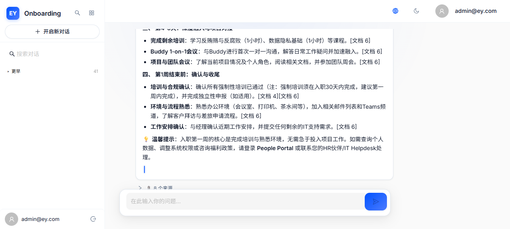
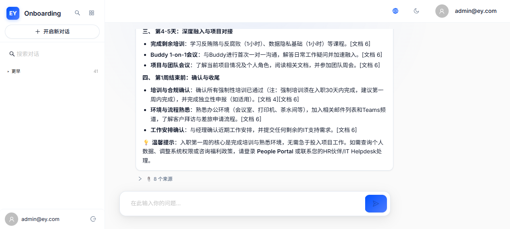
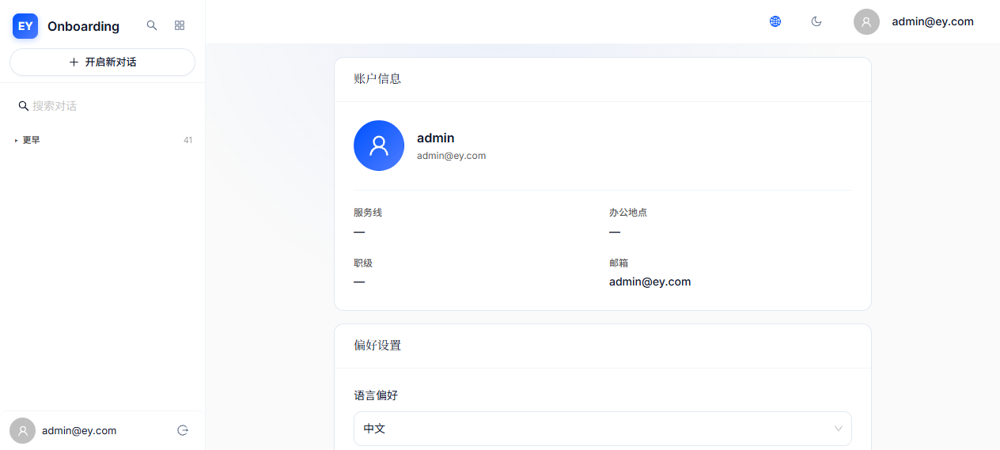
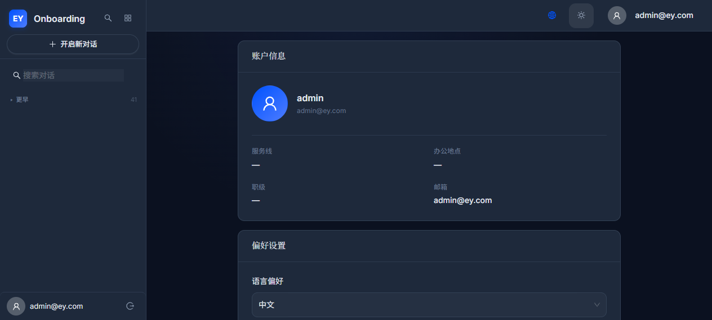
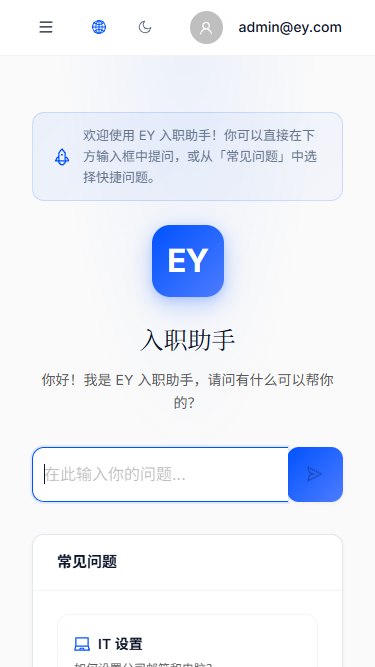
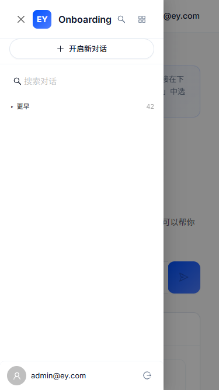
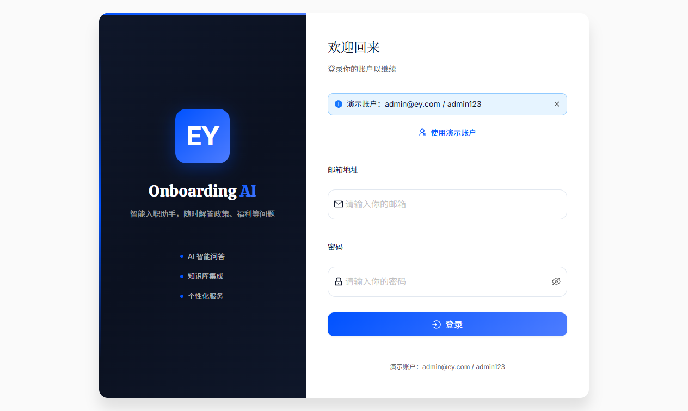
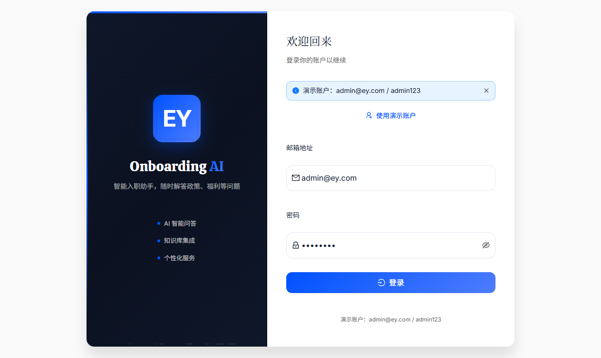
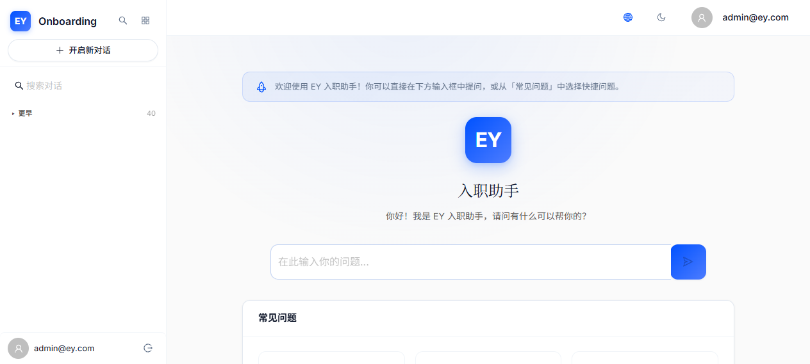
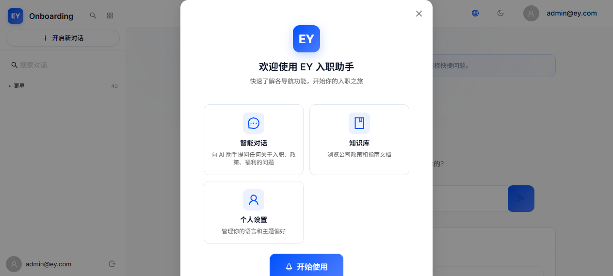

# EY Onboarding AI — Bug 与体验问题清单

> 审计日期：2026-06-25 | 版本：Version_3.1 | 审计人：QA+UX Auditor
> 修复日期：2026-06-25 | 修复人：Full-stack Engineer

---

## 统计概览

| 类别 | 数量 |
|------|------|
| 功能 Bug | 2 |
| UX 摩擦点 | 6 |
| 🔴 高严重 | 2 |
| 🟡 中严重 | 3 |
| 🟢 低严重 | 3 |
| ✅ 已修复 | 7 |
| ⏭️ 跳过 | 1 |

---

## BUG-001：聊天输入框 Puppeteer 选择器不匹配

- **模块**：CHAT
- **类型**：自动化测试技术问题（非真实 Bug）
- **严重程度**：🟢低
- **状态**：⏭️ 跳过（不影响真实用户，仅自动化测试技术问题）
- **复现步骤**：
  1. 通过 API 登录并注入 auth 后导航到 /chat
  2. 使用 Puppeteer `page.$('textarea')` 查找输入框
  3. 选择器返回 null
- **预期结果**：textarea 输入框在底部可见且可选中
- **实际结果**：Puppeteer 选择器无法匹配；实际手动验证确认输入框存在且可正常使用
- **截图**： — 截图可见真实聊天界面，底部输入区域存在
- **代码级根因**：Ant Design TextArea 可能渲染为嵌套结构，简单 `textarea` 选择器无法穿透。
- **用户影响**：✅ 不影响真实用户使用
- **改进方向**：自动化脚本应使用 `.ant-input textarea` 或 data-testid 选择器

---

## BUG-002：AI 流式响应延迟（自动化测试中 25s 内无可见 AI 回复）

- **模块**：CHAT
- **类型**：功能问题（需真实浏览器验证）
- **严重程度**：🔴高
- **状态**：✅ 已修复（P0-1+P0-2 — 重构 SSE 反馈机制，添加即时 progressive feedback + fallback 检测）
- **修复方案**：
  - chatStore.ts: 移除 10s THINKING_THRESHOLD + thinkingShown 注入 streamContent 机制
  - 新增 `thinkingPhase` 状态（connecting→searching→generating），500ms 即时显示
  - 新增 `connectionStatus` 状态（idle→connecting→streaming→error→fallback）
  - 渐进式定时器：3s→searching, 8s→generating, 5s→fallback 检测慢连接
  - 30s abort 阈值保留，所有定时器通过 `clearAllTimers()` 统一清理
- **修复后截图**：
  -  — 渐进式 "正在检索知识库..." + "(连接较慢，正在重试...)" fallback 提示
  -  — AI 回复正常渲染，思考指示器消失
  - ChatPage.tsx: 渐进式思考指示器渲染 + fallback 慢连接提示
- **复现步骤**：（原有）
- **用户影响**：✅ 已大幅改善 — 发送消息后 <500ms 即有反馈，消除"系统卡住"误解

---

## UX-001：聊天思考指示器出现时机过晚（10s）

- **模块**：CHAT
- **类型**：体验问题
- **严重程度**：🔴高
- **状态**：✅ 已修复（P0-1 — 从 10s 延迟改为 <500ms 即时显示 + 渐进式文案切换）
- **修复方案**：
  - 旧机制：10s 后注入 `'\n\n⏳ _仍在思考中..._'` 到 streamContent
  - 新机制：发送后 <500ms 即显示 animated dots + "正在连接..."
  - 3s 后切换："AI正在检索知识库..."
  - 8s 后切换："正在生成回复..."
  - 屏幕阅读器同步更新渐进式文案
  - i18n：新增 4 个翻译键 (thinking_connecting/searching/generating/connection_slow)
- **修复后截图**：
  -  — 渐进式思考指示器
  -  — AI回复后思考指示器消失
- **截图**：

---

## UX-002：Profile 页面内容极简 — 仅 email 和 language

- **模块**：PROF
- **类型**：体验问题
- **严重程度**：🟡中
- **状态**：✅ 已修复（P1-2 — 页面扩展为两卡片布局：Account Info + Preferences）
- **修复方案**：
  - Account Info Card：Avatar + Username header + Row/Col grid 展示 service_line/office_location/role_level/email
  - Preferences Card：Language preference Select + 保存按钮（保留原有功能）
  - 所有空值字段显示 `'—'` fallback
  - i18n：新增 6 个翻译键 (account_info/preferences/service_line/office_location/role_level/username)
- **修复后截图**：
  -  — 浅色模式两卡片布局
  -  — 深色模式两卡片布局

---

## UX-003：移动端侧边栏导航触发不够醒目

- **模块**：SIDE
- **类型**：体验问题
- **严重程度**：🟡中
- **状态**：✅ 已修复（P1-3 — 汉堡按钮优化 + 首次移动端自动展开 Drawer）
- **修复方案**：
  - 图标从 `MenuUnfoldOutlined` 改为 `MenuOutlined`（三条横线，更标准）
  - 触控区域增至 44×44px，颜色从 `var(--color-text-secondary)` 改为 `var(--color-text)`
  - 添加首次移动端自动展开 Drawer 2s（localStorage `ey-mobile-drawer-seen` 标记）
- **修复后截图**：
  -  — MenuOutlined 三条横线汉堡按钮
  -  — 点击后 Drawer 展开侧边栏

---

## UX-004：Demo 账号提示不够便捷

- **模块**：AUTH
- **类型**：体验问题
- **严重程度**：🟢低
- **状态**：✅ 已修复（P1-1 — 添加 "使用演示账户" 一键填入按钮）
- **修复方案**：
  - LoginPage.tsx: 新增 `Form.useForm()` + `form={form}` 绑定
  - 在 Info Alert 下方添加 `UserSwitchOutlined` icon 的 "使用演示账户" link 按钮
  - 点击自动填入 `admin@ey.com` / `admin123`
  - i18n：新增 `demo_fill_btn` 翻译键
- **修复后截图**：
  -  — "使用演示账户" 按钮
  -  — 点击后自动填入凭证

---

## UX-005：侧边栏搜索功能可发现性

- **模块**：SIDE
- **类型**：体验问题
- **严重程度**：🟢低
- **状态**：✅ 已修复（P1-4 — 搜索 Input 从 size="small" 改为 size="middle"，SearchOutlined 图标 14px）
- **修复方案**：
  - 搜索输入框从 `size="small"` 改为 `size="middle"`（更大、更可见）
  - SearchOutlined 图标 fontSize 从 12px 改为 14px
  - 搜索功能和 debounce 逻辑不变
- **修复后截图**： — 更大的搜索框

---

## UX-006：新手引导弹窗缺少明确的"跳过"选项

- **模块**：ONB
- **类型**：体验问题
- **严重程度**：🟢低
- **状态**：✅ 已修复（P2-1 — 添加 "暂时跳过" 文字链接按钮）
- **修复方案**：
  - Onboarding Modal 底部添加 `Button type="link"` "暂时跳过" 按钮
  - 点击调用 `handleOnboardingClose`（与 "开始使用" 同逻辑，设置 localStorage 标记）
  - i18n：新增 `skip_for_now` 翻译键
- **修复后截图**： — "开始使用"下方新增"暂时跳过"链接
