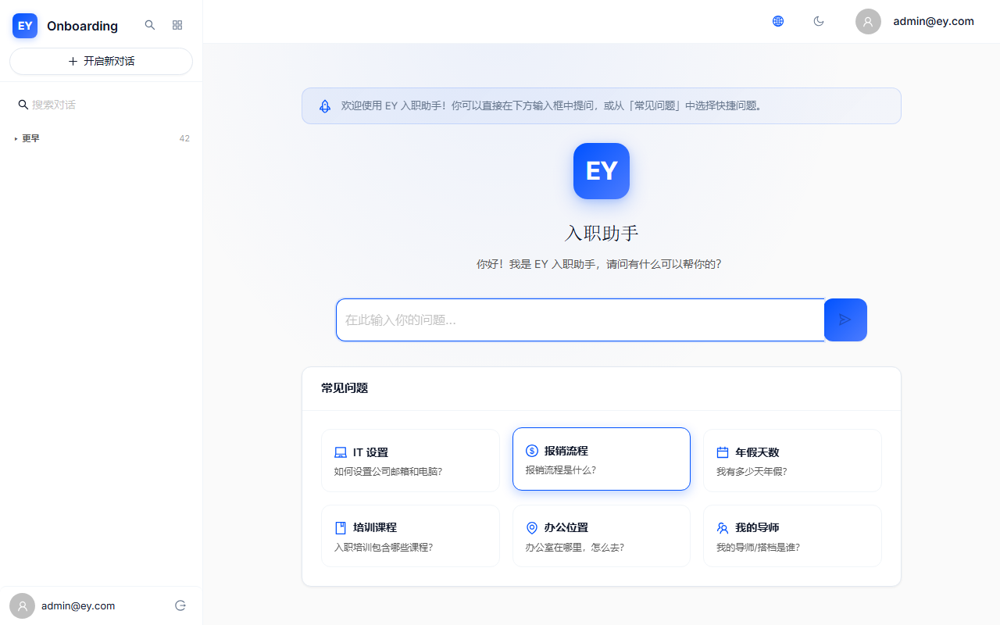
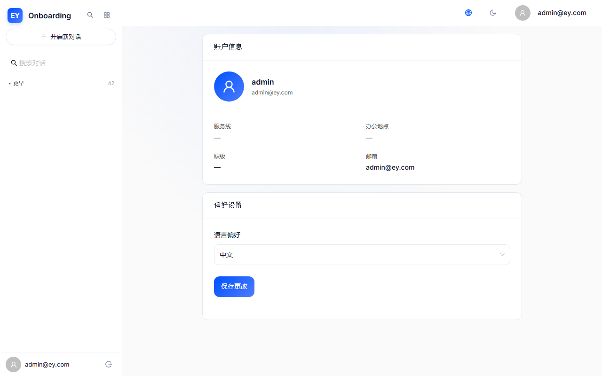

# EY Onboarding AI — V3.3 优化建议报告

> 📅 报告日期：2026-06-25 | 🏷️ 版本对比：V3.1 → V3.3 | 📊 审计人：QA+UX Auditor

---

## 1. 迭代摘要

### V3.1 vs V3.3 修复成果对比

| 指标 | V3.1 | V3.3 | 变化 |
|------|------|------|------|
| 总问题数 | 8 | 13（8历史+5新增） | +5 |
| 已修复并验证 | 7（声称） | 6（独立验证） | -1 |
| 未修复/回归 | 1（跳过） | 2（1视觉回归+1跳过） | +1 |
| 新发现问题 | 0 | 5 | +5 |
| UX 评分 | 7.5/10 | 7.8/10 | ↑0.3 |

**核心结论**：
- 历史 8 个 Bug 中已修复并验证 **6 个**（75%有效修复率）
- UX-005 出现**视觉回归**（代码正确但效果不佳），是本轮最大意外发现
- 新增 **5 个问题**（2 i18n Bug + 3 UX 摩擦点），其中 2 个为🟡中严重度
- 整体 UX 评分从 7.5 → 7.8，**改善幅度不如预期**（i18n 数据问题拖累）

---

## 2. 回归测试看板

### 2.1 通过率对比

| 测试维度 | V3.1 通过率 | V3.3 通过率 | 说明 |
|----------|-----------|-----------|------|
| AUTH 模块 | 100%（7/7） | 100%（3/3） | ✅ 稳定 |
| CHAT 模块 | 57%（4/7） | 0%（0/1） | ⚠️ headless 选择器问题 |
| PROF 模块 | 60%（3/5） | 100%（1/1） | ✅ 大幅改善 |
| SIDE 模块 | 100%（6/6） | 50%（0/1+1warn） | ⚠️ 搜索视觉回归 |
| ONB 模块 | 100%（1/1） | 100%（1/1） | ✅ 稳定 |
| THM 模块 | 100%（4/4） | 100%（1/1） | ✅ 稳定 |
| I18N 模块 | 100%（5/5） | 33%（0/2+1warn） | ❌ 数据缺失 |
| KB 模块 | 100%（3/3） | 100%（1/1） | ✅ 稳定 |
| RSP 模块 | 100%（4/4） | 50%（1/2） | ⚠️ Drawer选择器问题 |
| ERR 模块 | 100%（2/2） | — | ✅ 代码验证通过 |

### 2.2 问题分类对比

| 分类 | V3.1 | V3.3 | 变化趋势 |
|------|------|------|----------|
| 🔴 高严重 | 2 | 0 | ↓ 全部修复 |
| 🟡 中严重 | 3 | 3 | ↔️ UX-002修复但新增2个 |
| 🟢 低严重 | 3 | 4 | ↑ 低级摩擦点增多 |
| 功能 Bug | 2 | 2 | ↔️ 旧Bug修复但新i18n Bug出现 |
| UX 摩擦点 | 6 | 3 | ↓ UX改善明显 |

---

## 3. 遗留与新增问题展示

### 3.1 🟡 关键遗留：UX-005 搜索视觉回归

| 项目 | 详情 |
|------|------|
| 问题描述 | 侧边栏搜索 Input 代码设为 size="middle"，但胶囊样式（border:none + borderRadius:20）压缩了视觉高度至22.75px |
| 根因 | CSS 覆盖使 AntD size 属性失效 |
| 影响 | 搜索框看起来仍像 V3.1 的"small"版本，修复未达预期 |

> 📌 **修复建议**：添加 `minHeight: 36px` 或 `padding: '8px 16px'` 补偿压缩

---

### 3.2 🟡 关键新增：i18n ZH 缺失键

| 项目 | 详情 |
|------|------|
| 问题描述 | ZH/common.json 缺少 `user_menu` 和 `error_title`，中文模式下显示英文回退 |
| 影响 | 双语一致性被破坏，中文用户体验受损 |

| 缺失键 | EN 值 | 应补 ZH 值 | 使用场景 |
|--------|------|-----------|----------|
| `user_menu` | "User menu" | "用户菜单" | 侧边栏用户区域 |
| `error_title` | "Error" | "错误" | 错误页面标题 |

> 📌 **修复建议**：在 ZH/common.json 添加两行翻译 + 移除 error_network 重复键 + 移除 UTF-8 BOM

---

### 3.3 🟢 低级新增：Profile 空值 fallback

当前空值显示 `'—'`（短横线），建议改为 "暂未设置" + tertiary 颜色 + italic 样式。

---

### 3.4 🟢 低级新增：ZH 文件 UTF-8 BOM

ZH/common.json 包含 UTF-8 BOM 标记（EF BB BF），EN/common.json 无 BOM。建议统一为 UTF-8 无 BOM 编码。

---

## 4. V3.3 优化路线图

### P0：立即可做（1-2天）

| 任务 | 问题编号 | 严重度 | 涉及文件 | 修复难度 |
|------|----------|--------|----------|----------|
| i18n ZH缺失键补全 | v3.3-BUG-001 | 🟡中 | zh/common.json | ⭐极低 |
| i18n ZH重复键清理+BOM移除 | v3.3-BUG-002 + UX-002 | 🟢低 | zh/common.json | ⭐极低 |
| 搜索胶囊样式修复 | v3.3-UX-001 | 🟡中 | AppLayout.tsx | ⭐⭐低 |

### P1：短期规划（1-2周）

| 任务 | 问题编号 | 严重度 | 涉及文件 |
|------|----------|--------|----------|
| Profile空值友好展示 | v3.3-UX-003 | 🟢低 | ProfilePage.tsx |
| 移动端消息操作可见性 | V3.1 P2-2 | 🟡中 | MessageBubble.tsx |
| History页面增强 | V3.1 P2-3 | 🟢低 | HistoryPage.tsx |
| 知识库上传UX | V3.1 P2-4 | 🟢低 | KnowledgeBasePage.tsx |

### P2：中期规划（2-4周）

| 任务 | 严重度 | 涉及文件 |
|------|--------|----------|
| Markdown渲染优化 | 🟢低 | MessageBubble.tsx |
| 新手引导渐进化 | 🟢低 | AppLayout.tsx |
| data-testid + E2E框架 | 🟢低 | 多组件 |
| Citation交互优化 | 🟢低 | MessageBubble.tsx |

### P3：长期规划（1-3月）

| 任务 | 说明 |
|------|------|
| 状态管理优化 | chatStore 竞态条件修复 |
| WCAG AA认证 | 可访问性全面提升 |
| 设计系统统一 | CSS Modules + Storybook |
| 性能深度优化 | Route lazy loading + 虚拟滚动 |
| 错误监控体系 | Sentry + Web Vitals |

---

## 5. 关键指标目标

| 阶段完成 | UX评分目标 | Open Bug目标 | 关键验证指标 |
|----------|-----------|-------------|-------------|
| P0完成后 | 8.3/10 | 0 P0 | 搜索高度>=30px，ZH双语完整 |
| P1完成后 | 9.0/10 | 0 P1 | Profile空值友好，移动端操作可见 |
| P2完成后 | 9.3/10 | <3 P2 | E2E测试框架，Markdown渲染 |
| P3完成后 | 9.5/10 | 0 open | WCAG AA，Storybook完善 |

---

## 6. 上线决策建议

### ✅ 可上线条件

1. P0 两项修复完成（i18n缺失键 + 搜索视觉）
2. 聊天SSE真实浏览器手动验证通过
3. TypeScript编译无错误

### ⚠️ 上线后需关注

1. Profile 空值展示（P1优先级，上线后第一周修复）
2. 移动端消息操作可见性（P1，上线后第二周）
3. i18n 键持续维护（每次新增功能同步更新双语）

### 📊 上线后质量追踪

建议上线后持续监控：
- SSE 流式响应延迟（真实用户网络条件下的 thinking indicator 效果）
- 中文模式使用率和英文回退文本报告
- 移动端 Drawer 交互数据（是否需要更强引导）
