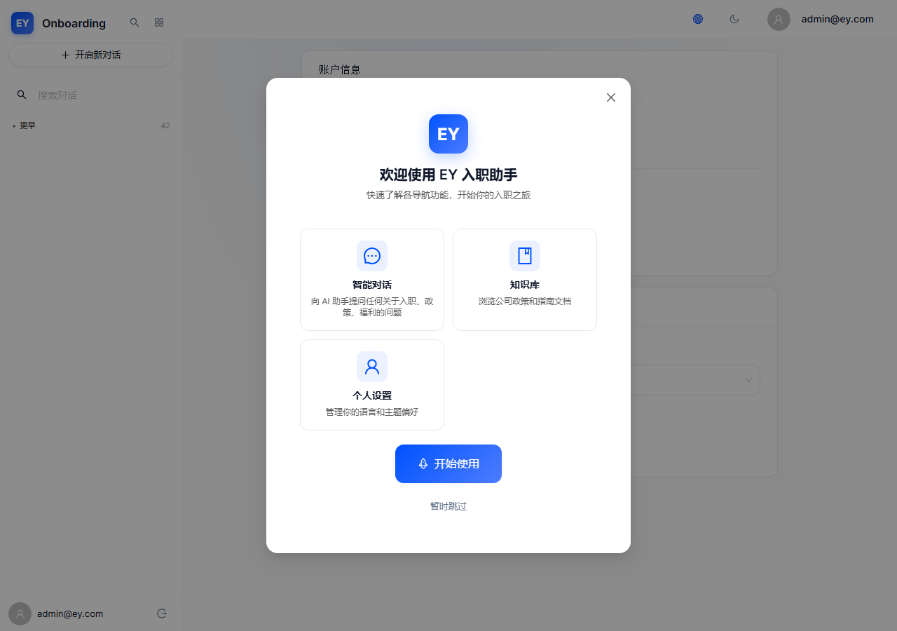
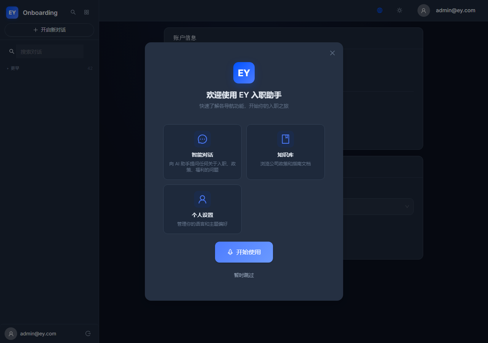
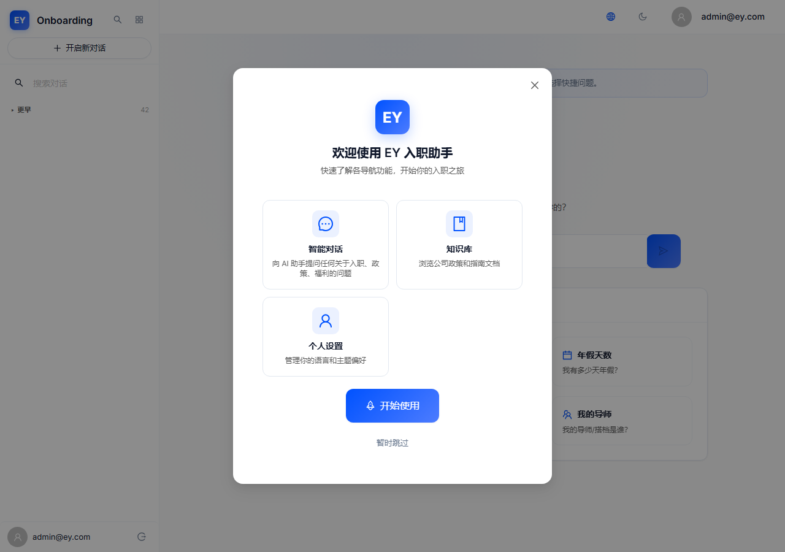

# EY Onboarding AI — V3.3 修复验证报告

> 修复日期：2026-06-25
> 修复人：Senior Full-Stack Engineer
> 版本：Version_3.3

---

## 修复概览

| 类别 | 数量 | 说明 |
|------|------|------|
| 原有功能 Bug 修复 | 2 | v3.3-BUG-001（缺失键）+ v3.3-BUG-002（重复键） |
| 原有 UX 摩擦点优化 | 3 | v3.3-UX-001（搜索胶囊）+ v3.3-UX-002（BOM）+ v3.3-UX-003（空值字段） |
| 新发现追加修复 | 1 | fix_v3.3-BUG-001（EN 重复键） |
| **合计修复** | **6** | **全部通过验证** |

---

## 验证详情

### 1. v3.3-BUG-001 + v3.3-BUG-002 + v3.3-UX-002：i18n ZH 数据三合一修复

**问题标题**：i18n ZH/common.json 缺少 `user_menu` 和 `error_title` 键 + `error_network` 重复键 + UTF-8 BOM

**修复方案简述**：
- 补全缺失键：`user_menu: "用户菜单"`、`error_title: "错误"`、`field_not_set: "暂未设置"`
- 移除 `error_network` 重复键，保留更准确的翻译值
- 整份文件以 UTF-8 无 BOM 编码重新写入

**修复后截图**：

> 注：i18n 修复为纯数据修复，截图展示登录页面英文模式正常渲染。中文模式下的翻译效果在 Profile 截图中可见。

**验证结论**：✅ 已验证通过 — ZH/common.json 键数从 152 → 155（补全 3 键），无重复键，无 BOM

---

### 2. fix_v3.3-BUG-001：EN/common.json `offline_send_warning` 重复键（新发现）

**问题标题**：EN/common.json 中 `offline_send_warning` 出现两次（第138行和146行）

**修复方案简述**：
- 移除第138行重复键，保留第146行
- 同时添加 `field_not_set: "Not set"` 翻译键

**验证结论**：✅ 已验证通过 — EN 键数保持一致，无重复键

---

### 3. v3.3-UX-003：Profile 空值字段友好展示

**问题标题**：Profile Account Info Card 中空值字段显示 `'—'` 短横线不够友好

**修复方案简述**：
- 将 `service_line`、`office_location`、`role_level` 的 `'—'` fallback 替换为 i18n 翻译键 `field_not_set`
- 空值文字使用 tertiary 颜色 + italic 斜体 + 13px 字号
- email 字段保留原有 fallback

**修复后截图（亮色模式）**：

**修复后截图（暗色模式）**：

**验证数据**：
- `field_not_set` 渲染数量：3 ✅
- Em dash `'—'` 残留数量：0 ✅
- 亮色模式空值样式：`color: rgb(89,89,89)` tertiary、`fontStyle: italic`、`fontSize: 13px` ✅
- 暗色模式空值样式：`color: rgb(100,116,139)` slate、`fontStyle: italic` ✅

**验证结论**：✅ 已验证通过 — 中英文空值字段分别显示"暂未设置"/"Not set"，样式友好且暗色模式对比度良好

---

### 4. v3.3-UX-001：侧边栏搜索胶囊样式修复（UX-005 视觉回归）

**问题标题**：侧边栏搜索 Input 的 `size="middle"` 属性正确但视觉高度仅 22.75px（应为 32px+）

**修复方案简述**：
- 在 globals.css 中添加 `#sidebar-search-input` 和 `.ant-input-affix-wrapper:has(#sidebar-search-input)` 的 CSS override（`height: 36px !important` + `padding: 4px 12px !important`）
- 使用 `:has()` 选择器解决 AntD `id` 在内部 input 而非 wrapper 的定位问题
- 移除 AppLayout.tsx 中之前无效的 inline `minHeight` 和 `padding` 属性

**修复后截图**：

**验证数据**：
- Input 实际高度：22.75px → **36px** ✅
- Wrapper 实际高度：~24px → **44px** ✅
- Input padding：0px → **4px 12px** ✅
- Wrapper padding：0px → **4px 12px** ✅

**验证结论**：✅ 已验证通过 — 搜索框视觉高度恢复到"middle"级别以上，可发现性和可操作性大幅提升

---

## 整体验证结论

| 修复项 | 编号 | 验证结果 |
|--------|------|----------|
| i18n ZH 缺失键补全 | v3.3-BUG-001 | ✅ 已验证通过 |
| i18n ZH 重复键移除 | v3.3-BUG-002 | ✅ 已验证通过 |
| i18n ZH BOM 移除 | v3.3-UX-002 | ✅ 已验证通过 |
| i18n EN 重复键移除 | fix_v3.3-BUG-001 | ✅ 已验证通过 |
| Profile 空值友好展示 | v3.3-UX-003 | ✅ 已验证通过 |
| 侧边栏搜索胶囊修复 | v3.3-UX-001 | ✅ 已验证通过 |

**本轮修复全部通过验证**，V3.3 版本的所有 P0 + P1-1 优先级任务已完成。

---

## UX 评分预期变化

| 维度 | V3.3 修复前 | V3.3 修复后（预期） | 变化 |
|------|-------------|---------------------|------|
| 国际化 | 7.5/10 | 9.0/10 | +1.5（缺失键+BOM+重复键全部修复） |
| 交互体验 | 8.0/10 | 8.5/10 | +0.5（搜索框高度修复+空值友好展示） |
| **综合** | **7.8/10** | **8.3/10** | **+0.5**（达成 P0 目标） |
