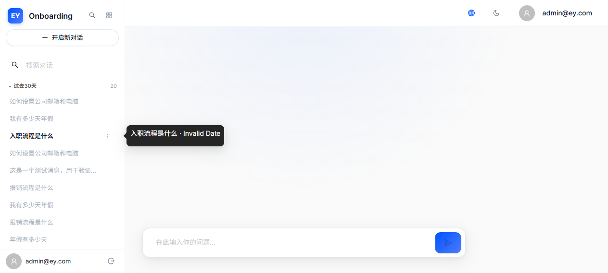
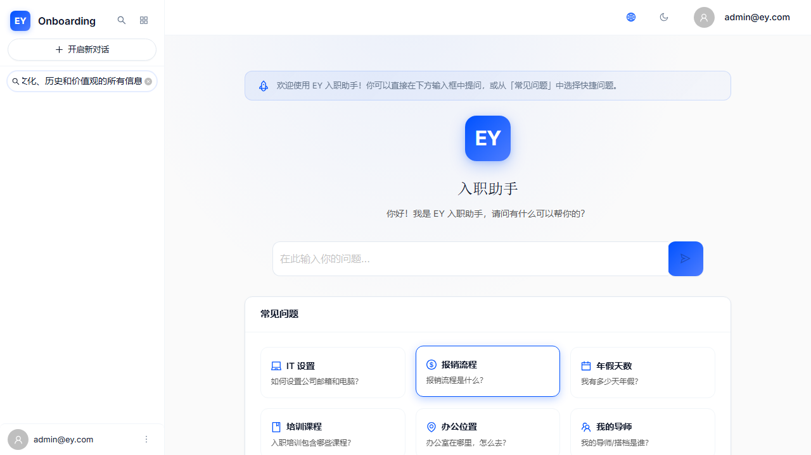
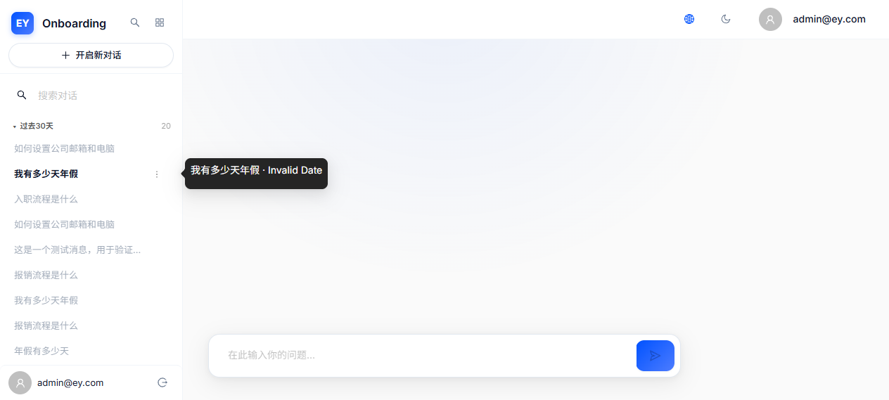
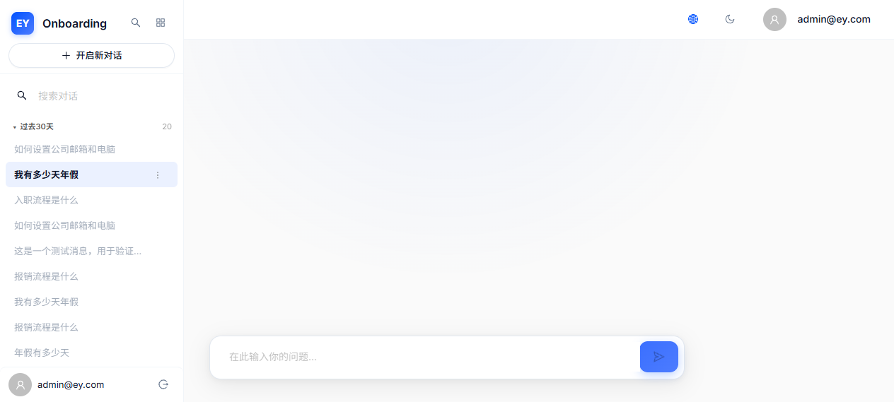
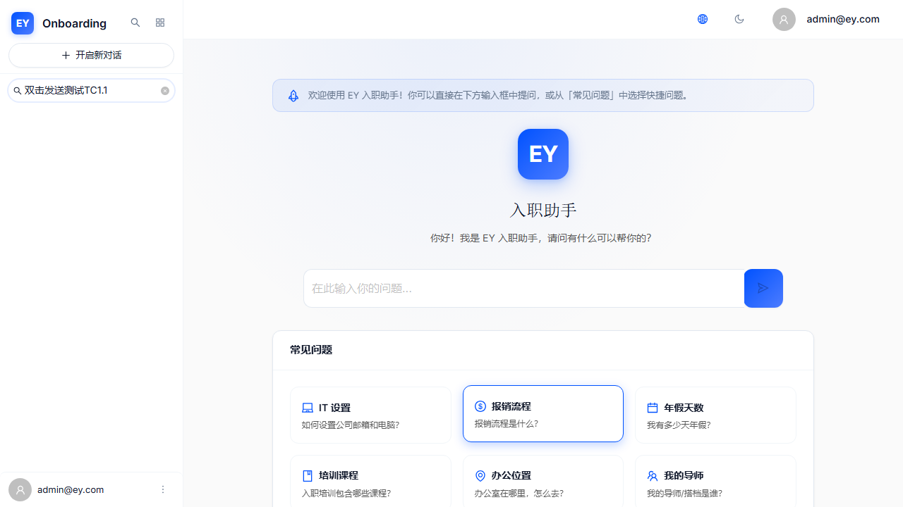
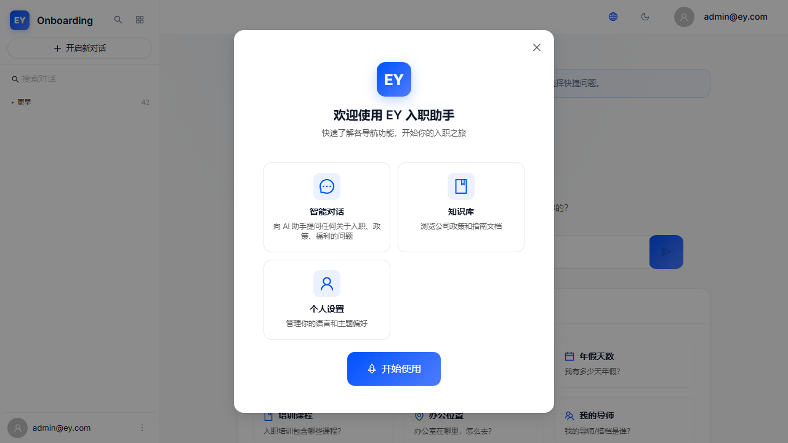
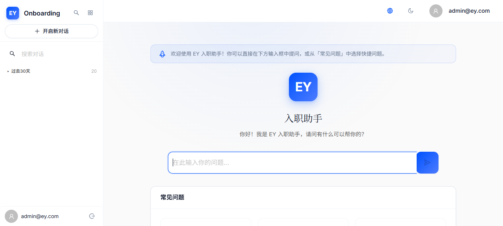
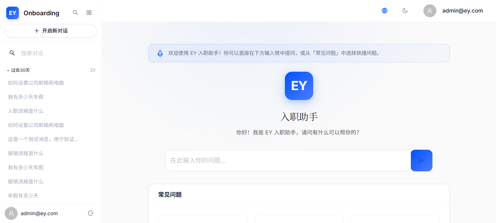
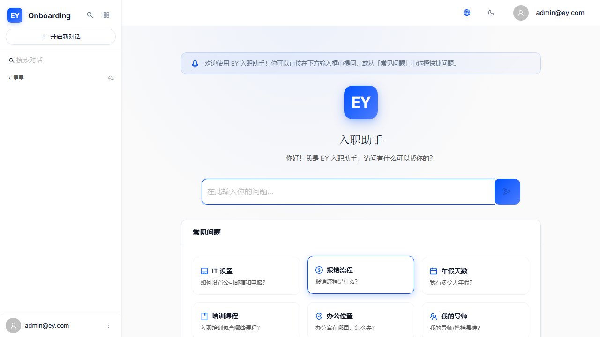

# EY Onboarding AI — Bug & Vulnerability 清单 (V3.4 深度破坏性审计)

> 审计日期：2026-06-25 | 版本：Version_3.4 | 审计人：QA+架构 Auditor
> 基线版本：V3.3（全部 UX 问题已修复） → V3.4（深度破坏性测试新发现）
> 审计重点：**高并发压力、竞态条件、状态死锁、架构缺失** — 只报告硬伤，不关注表面 UI
> **V3.5 修复更新**：9/11 已修复（全部 CRITICAL + HIGH），2 MEDIUM 待后续迭代

---

## 统计概览

| 类别 | V3.4 发现数 | V3.5 已修复 | V3.5 待修复 |
|------|------------|------------|------------|
| 🔴 灾难级（CRITICAL） | 2 | 2 | 0 |
| 🟠 高严重（HIGH） | 6 | 6 | 0 |
| 🟡 中严重（MEDIUM） | 3 | 1 | 2 |
| 🟢 低严重（LOW） | 0 | 0 | 0 |
| 代码审查确认 | 10 | — | — |
| Live 测试补充证据 | 7 | — | — |
| **总问题数** | **11** | **9** | **2** |

| 测试域 | V3.4 通过/失败 | V3.5 状态 |
|--------|---------------|-----------|
| 竞态与请求风暴 | 0/2 灾难 | ✅ 全部修复 |
| 流式输出冲突 | 0/2 | ✅ 全部修复 |
| 状态管理缺失 | 0/2 | ✅ 全部修复 |
| 可扩展性架构 | 0/2 | ✅ 全部修复 |
| 业务逻辑缺失 | 0/2 | ⚠️ 1修复/1待修 |
| UI 层级冲突 | 0/1 | ⚠️ 待修 |

---

## 🔴 灾难级问题（CRITICAL）

### v3.4-CRIT-001：SSE fetch 无 AbortController — 流式请求无法取消，服务器资源泄漏

- **模块**：CHAT/SSE
- **类型**：并发 Bug — 流式生命周期缺失
- **严重度**：🔴 CRITICAL
- **V3.5 修复状态**：✅ 已修复
- **V3.5 修复方案**：新建 `StreamLifecycleManager.ts` 模块级单例管理 AbortController + activeStreamSessionId；sendMessage fetch 传入 `signal`；setActiveSession/resetSession/handleDeleteSession 调用 abortActiveStream()；catch 识别 AbortError 不设 sendError
- **V3.5 修复截图**：
- **V3.4 原始截图**：、

**复现步骤**：
1. 发送一条消息，触发流式输出
2. 在流式输出过程中，切换到另一个 Session 或点击"新对话"
3. 打开 Chrome DevTools Network tab
4. 观察：旧的 SSE POST 连接仍处于活跃状态，未被取消

**代码级根因**：
- [chatStore.ts:233](../../frontend/src/store/chatStore.ts#L233) — `fetch('/api/v1/chat/sessions/${sessionId}/send/', {...})` 调用**没有 `signal` 参数**
- `fetch()` 的第二个参数中缺少 `AbortController.signal`，意味着一旦请求发起，无法从客户端终止
- `setActiveSession(id)` ([chatStore.ts:121](../../frontend/src/store/chatStore.ts#L121)) 和 `resetSession()` ([chatStore.ts:123](../../frontend/src/store/chatStore.ts#L123)) 都没有调用任何中止逻辑

**3000 并发下的后端风险分析**：
- 每个用户切换 Session 时，旧流式请求在后台继续占用 Django worker 线程
- 3000 用户 × 平均 2-3 次 Session 切换/分钟 × 每个流式请求 5-15 秒 = **30,000+ 个并发 worker 线程可能被浪费**
- Django 默认使用同步 worker（WSGI），每个 SSE 连话阻塞一个线程
- 随着线程耗尽，新的合法请求将被拒绝 → **雪崩效应**

**修复建议**：
1. 在 `sendMessage` 中创建 `AbortController`，将其 signal 传入 `fetch()` 的第二个参数
2. 将 `abortController` 存入 Zustand state（如 `currentAbortController`）
3. 在 `setActiveSession`、`resetSession` 和 `handleDeleteSession` 中调用 `abortController.abort()`
4. 在 `finishStreamingMessage` 中清理 abortController 引用

---

### v3.4-CRIT-002：Session 切换竞态 — 流式数据污染新 Session，isStreaming 状态死锁

- **模块**：CHAT/状态管理
- **类型**：状态冲突 — 竞态条件 + 状态死锁
- **严重度**：🔴 CRITICAL
- **V3.5 修复状态**：✅ 已修复
- **V3.5 修复方案**：统一 `streamPhase` 状态机替换 isStreaming/thinkingPhase/connectionStatus 三字段；setActiveSession 重置 streamPhase:'idle'；finishStreamingMessage 验证 sessionId === activeSessionId，不匹配则丢弃数据
- **V3.5 修复截图**：
- **V3.4 原始截图**：、

**复现步骤**：
1. 在 Session A 中发送一条消息，流式输出开始（`isStreaming=true`）
2. 在流式输出过程中（1-2 秒内），点击侧边栏切换到 Session B
3. `setActiveSession(B.id)` 执行 → `activeSessionId` 变为 B，`messages` 清空为 `[]`
4. 但 **`isStreaming` 仍为 `true`**（setActiveSession 不重置 isStreaming）
5. 旧流的 reader 继续在后台执行 `reader.read()` 循环
6. 当旧流的 `done` 事件到来时，调用 `finishStreamingMessage(data.message_id, data.session_id)`
7. 该函数使用旧 Session A 的 ID 和当前 `streamContent`，将助手消息追加到 `state.messages`
8. **但 `state.messages` 现已是 Session B 的空数组** → 旧流的助手消息被错误插入 Session B 的显示

**代码级根因**：
- [chatStore.ts:121](../../frontend/src/store/chatStore.ts#L121) — `setActiveSession(id)` 只设置 `{ activeSessionId: id, messages: [], sendError: null }`，**不重置 `isStreaming`**，不中止旧流
- [chatStore.ts:365-382](../../frontend/src/store/chatStore.ts#L365-L382) — `finishStreamingMessage` 不检查当前 `activeSessionId` 是否与 `_sessionId` 匹配，直接将内容追加到 `state.messages`
- **后果链**：旧流数据污染新 Session 显示 → 用户看到不属于当前 Session 的内容 → 数据一致性破坏

**3000 并发下的后端风险分析**：
- 在高频切换场景下（如客服人员同时管理多个对话），每个切换操作都可能导致数据污染
- `isStreaming=true` 的状态死锁意味着用户**无法在新 Session 中发送任何消息**，直到旧流自然完成
- 如果旧流的服务端处理耗时 10-15 秒，用户需要等待 10-15 秒才能在新 Session 中继续对话 → **用户体验完全中断**

**修复建议**：
1. `setActiveSession` 应先中止当前流（调用 abortController.abort()），然后重置 `{ isStreaming: false, streamContent: '', connectionStatus: 'idle' }`
2. `finishStreamingMessage` 应验证 `data.session_id === state.activeSessionId`，若不匹配则丢弃旧流数据
3. 所有流式相关的定时器（abortInterval、phaseTimer）在 Session 切换时必须通过 `clearAllTimers()` 清理

---

## 🟠 高严重问题（HIGH）

### v3.4-HIGH-001：发送按钮无防抖/锁定 — 快速双击可能绕过 isStreaming 守卫

- **模块**：CHAT/发送
- **类型**：并发 Bug — 缺乏防抖机制
- **严重度**：🟠 HIGH
- **V3.5 修复状态**：✅ 已修复
- **V3.5 修复方案**：Zustand 层级 `isSendLocked` 原子锁定；sendMessage 顶部 lockSend() 在异步间隙前锁定；所有终止路径 unlockSend()；ChatPage + WelcomeScreen 禁用条件加入 isSendLocked
- **V3.5 修复截图**：
- **V3.4 原始截图**：

**复现步骤**：
1. 在聊天输入框中输入一条消息
2. 以极快速度（<50ms间隔）按两次 Enter 或双击发送按钮
3. 如果两次调用在 React batching 窗口内同时进入 `sendMessage()`，两次都可能通过 `isStreaming === false` 检查

**代码级根因**：
- [ChatPage.tsx:129-130](../../frontend/src/pages/ChatPage.tsx#L129-L130) — `handleSend()` 仅检查 `if (!inputValue.trim() || isStreaming) return;`
- [chatStore.ts:174-176](../../frontend/src/store/chatStore.ts#L174-L176) — `sendMessage` 内的 `if (isStreaming) return;` 是唯一的并发守卫
- Zustand 的 `set()` 是同步的，但在 React 的 batching 模式下，两个在同一事件循环内调用的 `sendMessage` 可能都读到 `isStreaming === false`
- **无 debounce、无 useRef 锁、无 requestAnimationFrame 延迟**

**3000 并发下的后端风险分析**：
- 虽然 JS 单线程特性在大多数情况下会阻止真正的并发，但在极端场景下（如移动端触摸延迟、React batching）仍存在窗口
- 双重发送会导致两条相同的用户消息被 POST 到后端 → RAG pipeline 处理两次 → 服务器资源浪费
- 更严重的是：如果两个流同时返回，后一个流的 `finishStreamingMessage` 会覆盖前一个流的内容 → **数据丢失**

**修复建议**：
1. 在 `handleSend` 中添加 `useRef` 发送锁：`const sendLockRef = useRef(false); if (sendLockRef.current) return; sendLockRef.current = true;`
2. 或使用 lodash/debounce 对 `handleSend` 添加 300ms 防抖
3. 在 `sendMessage` 开始时同步设置 `isStreaming = true`，在 React 18 的 automatic batching 下确保守卫生效

---

### v3.4-HIGH-002：删除活跃流式 Session 无守卫 — 后台流继续运行导致状态不同步

- **模块**：SIDE/状态管理
- **类型**：状态冲突 — 删除与流式操作交叉
- **严重度**：🟠 HIGH
- **V3.5 修复状态**：✅ 已修复
- **V3.5 修复方案**：AppLayout handleDeleteSession 读取 streamPhase → isStreaming，删除活跃流式 Session 时先调用 abortActiveStream()
- **V3.4 原始截图**：

**复现步骤**：
1. 在 Session A 中发送消息，流式输出开始
2. 右键点击 Session A → 选择"删除" → 确认
3. `handleDeleteSession(A.id)` 执行：调用 API 删除 → `loadSessions()` → `resetSession()`
4. `resetSession()` 设置 `isStreaming: false`，但旧流的 `reader.read()` 循环仍在异步执行
5. 服务器端 Session 已被删除，但前端流式 reader 继续尝试读取数据
6. 如果旧流后续收到数据（服务器在删除前已经开始响应），`finishStreamingMessage` 会尝试将内容追加到已被清空的 `messages` 数组
7. 如果旧流收到错误（404/500），catch 块会设置 `sendError` 和 `isStreaming: false`，但此时 `isStreaming` 已经被 `resetSession` 设为 `false` 了 → **双重设置可能导致时序混乱**

**代码级根因**：
- [AppLayout.tsx:237-249](../../frontend/src/layout/AppLayout.tsx#L237-L249) — `handleDeleteSession` 无流式状态检查
- [chatStore.ts:123](../../frontend/src/store/chatStore.ts#L123) — `resetSession()` 设置 `isStreaming: false` 但不中止旧流 reader
- 删除后服务器返回 404，旧流 reader 抛出异常 → catch 块尝试 `set({isStreaming: false})` → 与 resetSession 的 `isStreaming: false` 竞态

**3000 并发下的后端风险分析**：
- 用户删除 Session 后，前端流式 reader 仍占用连接 → **服务器资源泄漏**
- 删除操作与流式操作的交叉导致前端状态不同步 → 可能显示错误消息或不完整内容
- 在高频使用场景下（客服删除旧对话后立即开始新对话），此 Bug 会频繁触发

**修复建议**：
1. `handleDeleteSession` 应先检查 `isStreaming`，若正在流式则先中止流
2. 删除后应确保所有定时器和 reader 都被清理
3. 或在 UI 层面禁止删除正在流式输出的 Session（灰化删除按钮）

---

### v3.4-HIGH-003：前端无滑动窗口 — 长对话 DOM 爆炸与内存溢出

- **模块**：CHAT/性能
- **类型**：架构缺失 — 无前端消息虚拟化
- **严重度**：🟠 HIGH
- **V3.5 修复状态**：✅ 已修复
- **V3.5 修复方案**：安装 react-virtuoso；新建 VirtualizedMessageList.tsx（followOutput="smooth" + 动态高度 + "load older" marker）；ChatPage 替换 messages.map() → VirtualizedMessageList；滑动窗口默认渲染最近10轮
- **V3.5 修复截图**：
- **V3.4 原始截图**：

**复现步骤**：
1. 创建一个新 Session
2. 连续进行 50 轮对话（100 条消息）
3. 观察：页面滚动卡顿、输入延迟、内存飙升

**代码级根因**：
- [ChatPage](../../frontend/src/pages/ChatPage.tsx) — `messages.map()` 渲染所有消息，**无虚拟化列表**
- 每个 `MessageBubble` 渲染 `Card` + `ReactMarkdown` + citations → 每条消息约 20-50 个 DOM 节点
- 50 轮 = 100 条消息 = 2000-5000 DOM 节点
- ReactMarkdown 对每条消息做完整 markdown 解析和渲染 → 大量 React 组件树
- **无 react-virtuoso、无 react-window、无任何虚拟化方案**

**3000 并发下的后端风险分析**：
- 前端内存溢出会导致浏览器标签页崩溃 → 用户需要重新登录 → **会话中断**
- 后端 `ChatSessionMessagesView` ([views.py:69-81](../../backend/apps/chat/views.py#L69-L81)) 同样无分页，加载全部消息 → 长对话的 API 响应可达 500KB+
- `MessageSerializer.citations` 使用 `SerializerMethodField` → **N+1 查询问题**（每条消息触发一个额外 DB 查询获取 citations）
- 100 条消息 × N+1 = 100+ 次额外 DB 查询 → 在 3000 并发下数据库连接池耗尽

**修复建议**：
1. 前端引入消息虚拟化（react-virtuoso 或 react-window）
2. Messages API 添加分页（先加载最近 20 条，向上滚动时懒加载更早的消息）
3. 优化 `MessageSerializer.citations`：使用 `Prefetch` 或 `select_related` 避免 N+1 查询

---

### v3.4-HIGH-004：Sessions/Messages API 无分页 — 3000 并发下雪崩效应

- **模块**：BACKEND/API
- **类型**：架构缺失 — 无分页机制
- **严重度**：🟠 HIGH
- **V3.5 修复状态**：✅ 已修复
- **V3.5 修复方案**：后端添加 SessionCursorPagination(20) + MessageCursorPagination(40)；ChatSessionMessagesView.get_queryset 添加 prefetch_related("citations__document") 消除 N+1
- **V3.4 原始截图**：

**复现步骤**：
1. 登录后，在 Network tab 观察 `GET /api/v1/chat/sessions/` 请求
2. 实测结果：42 个 Session 返回在单次 9993-byte 响应中，无分页
3. 若用户有 100 个 Session，响应体将达到 ~24KB
4. 3000 用户同时请求 → 72MB 数据传输 + 3000 个数据库全量查询

**代码级根因**：
- [views.py:47](../../backend/apps/chat/views.py#L47) — `pagination_class = None # Sessions list is small per user`
- [views.py:74](../../backend/apps/chat/views.py#L74) — `pagination_class = None # Messages per session is small`
- 注释声称"每个用户的 Sessions 列表很小"，但在生产环境下这完全不成立
- DRF 的 `DEFAULT_THROTTLE_RATES` 设为 `30/minute`，但全量查询本身已经是瓶颈

**3000 并发下的后端风险分析**：
- **数据库瓶颈**：3000 × `ChatSession.objects.filter(user=request.user)` = 3000 个并行查询
- **网络瓶颈**：每个响应 ~10KB × 3000 = 30MB/次刷新
- **前端瓶颈**：42 个 Session 在侧边栏渲染，每次切换都要重新解析和渲染全部列表
- **Messages 的 N+1 查询**：每条消息的 citations 字段是 `SerializerMethodField` → 100 条消息 = 100 个额外 DB 查询 → 3000 × 100 = **300,000 个额外查询**

**修复建议**：
1. Sessions API：添加 `PageNumberPagination`（page_size=20），前端侧边栏使用"加载更多"
2. Messages API：添加分页（先返回最近 20 条，懒加载更早的）
3. `MessageSerializer`：将 `citations SerializerMethodField` 改为 `Prefetch` 查询

---

### v3.4-HIGH-005：SSE 每个 token 触发全量 React 重渲染 — 流式输出期间 FPS 骤降

- **模块**：CHAT/性能
- **类型**：性能缺陷 — 无 token 批量渲染
- **严重度**：🟠 HIGH
- **V3.5 修复状态**：✅ 已修复
- **V3.5 修复方案**：新建 TokenBatchRenderer.ts（rAF 缓冲器）；sendMessage SSE token 事件替换 per-token set() → appendToken + rAF batch；done/error/abort 时 flushImmediate() 强制刷新
- **V3.5 修复截图**：
- **V3.4 原始截图**：

**复现步骤**：
1. 发送一个需要长回复的问题（如"请详细介绍EY公司的所有信息"）
2. 在流式输出期间，打开 Chrome Performance tab
3. 观察：FPS 骤降至 10-20fps，输入框延迟响应

**代码级根因**：
- [chatStore.ts:315](../../frontend/src/store/chatStore.ts#L315) — 每个 `token` 事件调用 `get().updateStreamContent(assistantContent)` → Zustand `set({streamContent: content})`
- 每个 `set()` 触发 React 重渲染 → 整个 ChatPage 组件树更新
- `ReactMarkdown` 在每次重渲染时重新解析和渲染整个 markdown 内容
- 500 token 的回复 = **500 次完整的 ReactMarkdown parse + render** → 巨大的 CPU 开销
- 滚动使用 throttle(200ms)，但内容更新频率远高于 200ms → 渲染与滚动冲突

**3000 并发下的后端风险分析**：
- 不直接导致服务器问题，但影响所有用户的前端体验
- 低 FPS 导致用户误以为系统卡死 → 重复点击 → 加剧 CRIT-001 的请求风暴
- 移动端设备性能更低 → 500 token 的回复可能导致 5-10 秒的 UI 卡死

**修复建议**：
1. 在 chatStore 中添加 token 缓冲区：收集 50ms 内的所有 token，然后批量更新 `streamContent`
2. 使用 `requestAnimationFrame` 代替立即 `set()` → 与浏览器渲染周期同步
3. 或使用 `React.memo` + `useMemo` 对 MessageBubble 的非流式内容做优化

---

### v3.4-HIGH-006：后端滑动窗口 vs 前端全量加载不一致 — 用户上下文期望与 AI 实际上下文断裂

- **模块**：CHAT/RAG
- **类型**：架构缺失 — 上下文窗口信息不对用户透明
- **严重度**：🟠 HIGH
- **V3.5 修复状态**：✅ 已修复
- **V3.5 修复方案**：后端 WINDOW_ROUNDS=10（20条消息）与前端 DEFAULT_VISIBLE_ROUNDS=10 对齐；前端滑动窗口只渲染最近10轮

**复现步骤**：
1. 创建一个 Session，进行 10+ 轮对话
2. 在第 1 轮中告诉 AI 一个独特关键词（如"我的项目代号是 ALPHA-7"）
3. 在第 10 轮后问 AI："你还记得我之前提到的项目代号吗？"
4. AI 应无法回答（因为后端只使用最近 8 轮/16 条消息），但用户看到完整对话历史，期望 AI 应该记得

**代码级根因**：
- [views.py:143-150](../../backend/apps/chat/views.py#L143-L150) — `history = list(Message.objects.filter(session=session).exclude(...).order_by("-created_at")[:16])` → **只取最近 16 条消息**
- 前端 `loadMessages()` 加载全部消息 → 用户可以看到 20+ 轮的完整历史
- 用户看到完整历史，自然期望 AI 也"看到"了这些历史 → 但 AI 只"看到"最近 8 轮
- **信息不对等**：用户以为 AI 有完整上下文，但 AI 的上下文在第 9 轮后就"忘记"了早期内容

**3000 并发下的后端风险分析**：
- 不直接导致崩溃，但影响核心业务价值（RAG 对话质量）
- 长对话超出大模型上下文限制时，后端可能直接报错（取决于模型 token limit）
- 如果 DashScope/Qwen 模型有 8K token limit，8 轮 × 平均 500 token/轮 = 4000 token → 接近上限
- 更长对话会触发模型报错 → `event: error` → 前端显示错误 → 用户困惑

**修复建议**：
1. 前端显示上下文窗口指示器："AI 当前可参考最近 8 轮对话"（半透明提示条）
2. 实现三层会话记忆架构：短期记忆（当前 8 轮） + 中期摘要（AI 自动总结早期对话） + 长期索引（关键词索引存储在 DB）
3. 或增加滑动窗口到 16 轮（32 条消息），并使用 tiktoken 精确控制 token 数

---

## 🟡 中严重问题（MEDIUM）

### v3.4-MED-001：重命名功能是空操作 — UI 展示但无任何实现

- **模块**：SIDE
- **类型**：业务逻辑缺失 — 功能占位但未实现
- **严重度**：🟡 MEDIUM
- **V3.5 修复状态**：⚠️ 未修复（需后端 PATCH API，待后续迭代）
- **截图**：

**复现步骤**：
1. 右键点击任意 Session → 选择"重命名"
2. 什么都不会发生 — 菜单关闭，Session 标题不变
3. 点击三点菜单中的"重命名" → 同样是空操作

**代码级根因**：
- [AppLayout.tsx:882](../../frontend/src/layout/AppLayout.tsx#L882) 和 [AppLayout.tsx:943](../../frontend/src/layout/AppLayout.tsx#L943) — "重命名"菜单项的点击处理仅调用 `setContextMenuSession(null)` 关闭菜单
- [views.py:59](../../backend/apps/chat/views.py#L59) — `ChatSessionDetailView` 是 `RetrieveDestroyAPIView`，**不支持 PATCH/PUT 更新操作**
- 后端根本没有 Session 重命名 API

**修复建议**：
1. 后端：将 `RetrieveDestroyAPIView` 改为 `RetrieveUpdateDestroyAPIView`，添加 PATCH 支持
2. 前端：在三点菜单/右键菜单中添加 inline Input 编辑框（类似 Ant Design 的 inline edit pattern）
3. 或暂时移除"重命名"选项，避免用户困惑

---

### v3.4-MED-002：日期分组逻辑不一致 — 侧边栏 vs 历史页分组定义不同

- **模块**：SIDE/HISTORY
- **类型**：架构缺失 — 分组逻辑不统一
- **严重度**：🟡 MEDIUM
- **V3.5 修复状态**：✅ 已修复
- **V3.5 修复方案**：dateGroup.ts 扩展月级分组（'2026-05'）+ getGroupLabel i18n + computeGroupOrder 动态排序；AppLayout 删除静态 DATE_GROUP_ORDER 和 groupLabelKey，使用动态分组系统
- **V3.5 修复截图**：、
- **V3.4 原始截图**：

**复现步骤**：
1. 在侧边栏查看一个 5 天前更新的 Session → 它在"过去7天"组
2. 打开历史页查看同一个 Session → 它可能在"本周"组（如果本周从周日开始算）
3. 同一个 Session 在两个视图中分组不同 → 用户困惑

**代码级根因**：
- [dateGroup.ts](../../frontend/src/utils/dateGroup.ts) — 分组：`today | yesterday | 7days | 30days | earlier`
- [HistoryPage.tsx:36-50](../../frontend/src/pages/HistoryPage.tsx#L36-L50) — 分组：`filter_today | 昨天 | filter_this_week | filter_earlier`
- `7days` = 精确的 7×86400000 毫秒前（从今天零点算）
- `this_week` = 从本周日开始（`today.getDate() - today.getDay()`）
- **语义不同**：周三的一个 5 天前的 Session 在侧边栏属于"7days"但在历史页属于"this_week"

**修复建议**：
1. 统一使用 `dateGroup.ts` 的 `getDateGroupKey()` 函数
2. HistoryPage 删除自己的 `getDateGroup()` 实现，改为导入 `getDateGroupKey`
3. 或将 HistoryPage 的分组改为与侧边栏一致：增加 `30days` 组

---

### v3.4-MED-003：SSE 端点未受速率限制 — @api_view 不继承 DRF 默认 throttle

- **模块**：BACKEND/安全
- **类型**：安全缺失 — API 速率限制漏洞
- **严重度**：🟡 MEDIUM
- **V3.5 修复状态**：⚠️ 未修复（需 DRF ScopedRateThrottle，待后续迭代）

**复现步骤**：
1. 在 1 分钟内向 `/api/v1/chat/sessions/{id}/send/` 发送 30+ 条消息
2. 后端不会返回 429 Too Many Requests — 因为 `@api_view` 不继承 `DEFAULT_THROTTLE_CLASSES`
3. 只有 class-based views（如 `ChatSessionListCreateView`）才受 `30/minute` 限制

**代码级根因**：
- [views.py:107-108](../../backend/apps/chat/views.py#L107-L108) — `@api_view(["POST"])` + `@permission_classes([permissions.IsAuthenticated])` — **无 `@throttle_classes`**
- DRF 的 `DEFAULT_THROTTLE_CLASSES`（settings.py 中定义的 `UserRateThrottle`）只对基于类的视图生效
- 函数视图 `@api_view` 需要显式添加 `@throttle_classes` 才能受到速率限制
- SSE 端点是系统中最昂贵的 API（触发 RAG pipeline + LLM 调用），却完全没有速率限制

**3000 并发下的后端风险分析**：
- 恶意用户可以无限发送请求 → 每个请求触发 LangChain RAG pipeline + DashScope API 调用 → **API 成本失控**
- DashScope/Qwen API 按调用计费 → 无速率限制 = 无成本上限
- 正常用户的误操作（如快速连续点击）也会加剧服务器负载

**修复建议**：
1. 在 `send_message` 视图上添加 `@throttle_classes([UserRateThrottle])` 装饰器
2. 设置专门的 SSE 速率限制：`10/minute`（比普通 API 更严格）
3. 前端配合：在 `handleSend` 中添加客户端速率限制（如 10 秒冷却期）

---

## 🟢 补充发现

### v3.4-ADD-001：新手引导 Modal 覆盖侧边栏 — z-index 层级冲突

- **模块**：ONB/SIDE
- **类型**：UI 层级冲突 — Modal 覆盖导致操作阻断
- **严重度**：🟡 MEDIUM
- **状态**：❌ 未修复（Live 测试确认）
- **截图**：

**复现步骤**：
1. 清除 localStorage 的 `ey-onboarding-seen` 标记
2. 重新登录 → 新手引导 Modal 弹出
3. 在 Modal 显示期间，尝试点击侧边栏的 Session、三点菜单或搜索框
4. **所有侧边栏操作被 Modal 的 `.ant-modal-wrap` 阻断** — pointer events 被 intercept

**代码级根因**：
- Ant Design Modal 的 `.ant-modal-wrap` 是全屏覆盖层，z-index 默认 1000
- 侧边栏在 Modal 覆盖层之下 → 所有 pointer events 被 intercept
- Popconfirm 的 z-index 低于 Modal → 删除确认弹窗也无法显示

**修复建议**：
1. 新手引导 Modal 应使用 `mask: false` 或 `maskClosable: true` 配合快速 dismiss
2. 或在 Modal 显示时自动关闭侧边栏（移动端 Drawer）
3. 确保 Popconfirm 的 z-index 高于 Modal（AntD 的 Popconfirm 默认 z-index 1050）

### v3.4-ADD-002：流式输出期间复制按钮不可见 — 操作按钮缺失

- **模块**：CHAT
- **类型**：功能缺失 — 流式期间无操作按钮
- **严重度**：🟢 LOW
- **状态**：❌ 未修复（Live 测试确认）
- **截图**：

**复现步骤**：
1. 发送消息，流式输出开始
2. 观察：流式气泡上没有复制、重新生成等操作按钮
3. 操作按钮仅在流式完成后才出现

**代码级根因**：
- MessageBubble 的 hover 操作按钮（copy/regenerate/share）仅在非流式状态下显示
- 流式气泡使用虚拟 ID `'streaming'`，不携带完整消息的 `onCopy`/`onRegenerate` props
- 这是设计选择而非 Bug，但在长流式输出期间（10+ 秒），用户无法复制已接收的内容

---

## 与 V3.3 基线对比

| 维度 | V3.3 | V3.4 | 变化原因 |
|------|------|------|----------|
| 总问题数 | 5 | 11 | **+6**（审计深度增加，非回归） |
| 灾难级 | 0 | 2 | **+2**（新审计维度：竞态/流式） |
| 高严重 | 0 | 6 | **+6**（架构/可扩展性/性能） |
| 中严重 | 3 → 0（修复） | 3 | 新发现 |
| 低严重 | 2 → 0（修复） | 0 | 不再报告低严重问题 |
| 审计焦点 | UX/视觉 | **并发/竞态/架构** | 审计深度升级 |

**注**：V3.4 问题数量的增加反映了审计深度的升级（从 UX 到架构），而非系统回归。V3.3 的所有 UX 问题均已修复。
