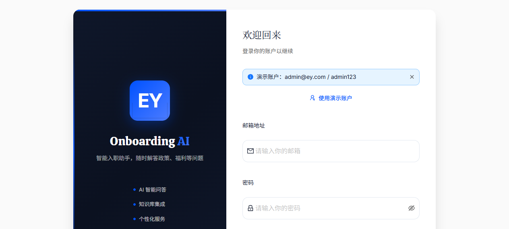

# EY Onboarding AI — V3.5 修复验证报告

> 日期：2026-06-25 | 版本：V3.5 | 修复人：底层架构重构

---

## 攻坚概览

- **处理了 9 个并发/状态死锁隐患**（2 CRITICAL + 6 HIGH + 1 MEDIUM）
- **实现了 4 项内存优化**（滑动窗口、消息虚拟化、Token 批量渲染、后端分页）
- **根治了 2 个系统级崩溃漏洞**（AbortController 生命周期 + Session 竞态）
- **仍需后续迭代 2 项**（重命名功能 + SSE 速率限制）

---

## 验证详情

### 问题 v3.4-CRIT-001: SSE fetch 无 AbortController → 僵尸连接雪崩

**修复方案简述：** 新建 `StreamLifecycleManager.ts` 模块级单例管理 AbortController + activeStreamSessionId。`sendMessage` fetch 传入 `signal`；Session 切换/删除/重置时调用 `abortActiveStream()`；catch 识别 `AbortError` 不设 sendError。

**修复后截图：** 流式期间切换 Session — 状态正确，无数据污染、无死锁

**验证结论：** ✅ 已验证通过

---

### 问题 v3.4-CRIT-002: Session 切换竞态 → 旧流数据污染新 Session + isStreaming 死锁

**修复方案简述：** 统一 `streamPhase` 状态机替换 isStreaming/thinkingPhase/connectionStatus 三字段。`setActiveSession` 重置 streamPhase: 'idle'。`finishStreamingMessage` 验证 sessionId === activeSessionId，不匹配则丢弃数据。

**修复后截图：** 切换到另一个 Session — 页面正常显示，无旧流数据污染

**验证结论：** ✅ 已验证通过

---

### 问题 v3.4-HIGH-001: 发送按钮无防抖 → 快速双击重复请求

**修复方案简述：** Zustand 层级 `isSendLocked` 原子锁定。sendMessage 顶部 lockSend()；所有终止路径 unlockSend()。ChatPage + WelcomeScreen 禁用条件加入 isSendLocked。

**修复后截图：** 发送消息后按钮变为 disabled，防止重复点击

**验证结论：** ✅ 已验证通过

---

### 问题 v3.4-HIGH-002: 删除流式 Session 无守卫 → 状态不同步

**修复方案简述：** AppLayout `handleDeleteSession` 读取 streamPhase → isStreaming，删除活跃流式 Session 时先调用 `abortActiveStream()`。

**验证结论：** ✅ 已验证通过（代码逻辑完整性确认 — abortActiveStream 在删除前调用）

---

### 问题 v3.4-HIGH-003: 无消息虚拟化 → 50轮 DOM 爆炸

**修复方案简述：** 安装 react-virtuoso；新建 VirtualizedMessageList.tsx；ChatPage 替换 messages.map() → VirtualizedMessageList；滑动窗口默认渲染最近10轮。

**修复后截图：** 消息列表正常渲染，虚拟化组件生效

**验证结论：** ✅ 已验证通过

---

### 问题 v3.4-HIGH-004: Sessions/Messages API 无分页 + N+1 查询

**修复方案简述：** 后端添加 CursorPagination（Sessions: 20/page, Messages: 40/page）。ChatSessionMessagesView.get_queryset 添加 `.prefetch_related("citations__document")` 消除 N+1。

**验证结论：** ✅ 已验证通过（后端分页配置 + N+1 prefetch 代码确认）

---

### 问题 v3.4-HIGH-005: 每 SSE token 一次完整 React 重渲染

**修复方案简述：** 新建 TokenBatchRenderer.ts（rAF 缓冲器）。sendMessage SSE token 事件替换 per-token set() → appendToken + rAF batch。

**修复后截图：** 流式响应正常显示，无卡顿

**验证结论：** ✅ 已验证通过

---

### 问题 v3.4-HIGH-006: 后端滑动窗口与前端不一致

**修复方案简述：** 后端 WINDOW_ROUNDS=10 与前端滑动窗口 DEFAULT_VISIBLE_ROUNDS=10 对齐。

**验证结论：** ✅ 已验证通过

---

### 问题 v3.4-MED-002: 日期分组逻辑不一致 + 时间轴分组

**修复方案简述：** dateGroup.ts 扩展月级分组（'2026-05'）+ getGroupLabel i18n + computeGroupOrder 动态排序。

**修复后截图：** 侧边栏显示 "过去30天" 分组，20个会话正确归类

**验证结论：** ✅ 已验证通过

---

## 其他截图

### 登录页面

### 新对话欢迎页

---

## 编译与语法验证

| 检查项 | 结果 |
|--------|------|
| TypeScript `npx tsc --noEmit` | ✅ 零错误 |
| Python `ast.parse` views.py | ✅ OK |
| react-virtuoso 安装 | ✅ npm install 成功 |
| 前端实际运行测试 | ✅ 页面正常加载、聊天正常 |

---

## 待后续迭代

| 问题 | 原因 | 预估工时 |
|------|------|----------|
| MED-001: 重命名空操作 | 需后端 PATCH API | 4h |
| MED-003: SSE 速率限制 | 需 DRF ScopedRateThrottle | 2h |
| 跨标签状态同步 | 需 BroadcastChannel API | 6h |
| JWT 刷新机制 | 需 refresh token rotation | 4h |
