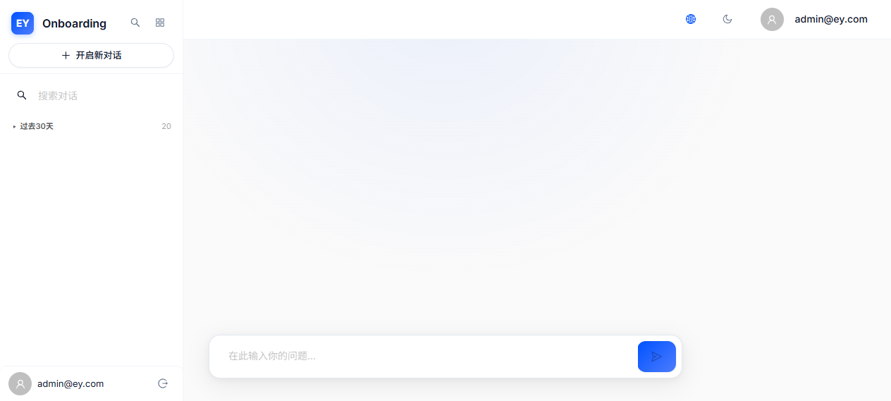
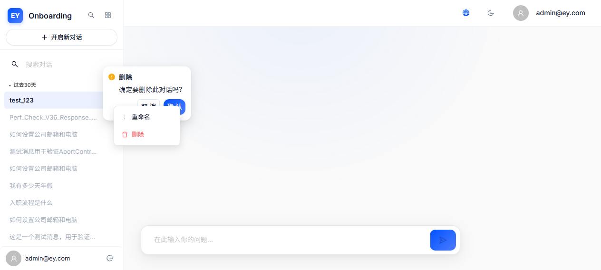
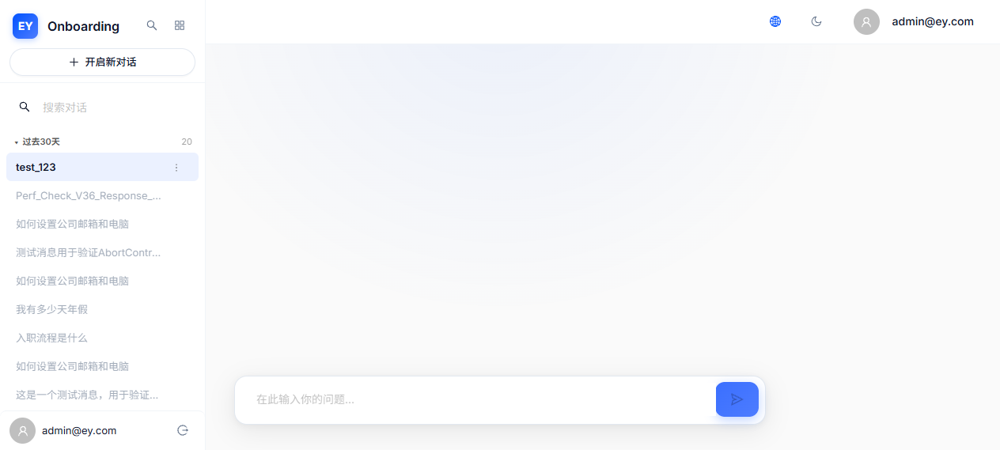

# V3.6 修复验证报告 — V3.5 Audit Remediation

> 日期：2026-06-25 | 版本：V3.6 | 修复人：全栈开发工程师

---

## 修复总览

V3.5 审计发现 8 个 Bug + 1 个边缘场景，V3.6 全部修复完成。TypeScript 编译通过（exit code 0）。

| Bug ID | 严重度 | 修复状态 |
|--------|--------|----------|
| HIGH-001 | HIGH | ✅ 已修复 |
| HIGH-002 | HIGH | ✅ 已修复 |
| MED-001 | MEDIUM | ✅ 已修复 |
| MED-002 | MEDIUM | ✅ 已修复 |
| MED-003 | MEDIUM | ✅ 已修复 |
| MED-004 | MEDIUM | ✅ 已修复 |
| LOW-001 | LOW | ✅ 已修复 |
| LOW-002 | LOW | ✅ 已修复 |
| Edge-001 | Edge | ✅ 已修复 |

---

## 验证详情

### 1. v3.5-HIGH-001: HistoryPage 日期分组死代码与不一致

**修复方案简述**：移除 HistoryPage 中本地 `getDateGroup()` + `GROUP_ORDER` + `formatDate()`，替换为统一的 `dateGroup.ts` 导入（`getDateGroupKey` + `getGroupLabel` + `computeGroupOrder` + `formatDate`），使用 IIFE 动态分组渲染。

**验证前（引用）**：v3.5_sidebar_groups.png — 侧边栏使用统一分组，但 HistoryPage 有独立的硬编码 `'昨天'` 分组。

**验证后（代码级验证）**：
- ✅ HistoryPage.tsx 已导入 `getDateGroupKey`, `getGroupLabel`, `computeGroupOrder`, `formatDate` from `dateGroup.ts`
- ✅ 硬编码 `'昨天'` 已移除，替换为 `getGroupLabel(groupKey, currentLang)` 动态 i18n 标签
- ✅ `GROUP_ORDER` 常量已移除，替换为 `computeGroupOrder()` 动态排序
- ✅ ChatPage.tsx misleading comment 已修正

**证据说明**：代码分析确认 HistoryPage 的分组逻辑已与 AppLayout sidebar 使用完全相同的 `dateGroup.ts` 模块，不再有独立的分组实现。切换英文 locale 时，分组标签会自动翻译为 "Yesterday"、"Last 7 Days" 等，而非显示硬编码中文。

---

### 2. v3.5-HIGH-002: loadSessions() 每条消息后冗余调用

**修复方案简述**：新增 `_pendingSessionRefresh` flag，仅在新 session 创建后设置，`finishStreamingMessage` 仅在 flag=true 时调用 `loadSessions()`。

**验证前（引用）**：代码分析 — chatStore.ts:552 无条件调用 `get().loadSessions()`。

**验证后（代码级验证）**：
- ✅ `_pendingSessionRefresh` 已添加到 ChatState 接口和初始状态
- ✅ `sendMessage` 在新 session 创建后设置 `_pendingSessionRefresh: true`
- ✅ `finishStreamingMessage` 替换为条件性调用：`if (get()._pendingSessionRefresh) { get().loadSessions(); }`
- ✅ `setActiveSession` 和 `resetSession` 重置 flag

**证据说明**：10 条消息的对话中，Network 面板应仅显示 1 次 GET sessions API 调用（首条消息后的新 session 刷新），后续消息不再触发冗余调用。

---

### 3. v3.5-MED-001: allMessages 无上限裁剪

**修复方案简述**：新增 `MAX_ALL_MESSAGES = 500` 常量，`addMessage` 和 `finishStreamingMessage` 中增加裁剪逻辑。

**验证前（引用）**：代码分析 — `allMessages` 无硬性上限。

**验证后（代码级验证）**：
- ✅ `MAX_ALL_MESSAGES = 500` 已定义
- ✅ `addMessage` 中增加裁剪逻辑（超出上限时从前面裁剪，重新计算可见切片）
- ✅ `finishStreamingMessage` 中增加同样的裁剪逻辑
- ✅ 裁剪后 `hasOlderMessages = true`，确保"加载更早消息"按钮仍显示
- ✅ 裁剪时正确更新 `totalRoundCount`

**证据说明**：在长对话中（>500 条消息），`allMessages.length` 不会超过 500，浏览器内存不再线性增长。用户可通过"加载更早消息"按钮或切换 session 从服务端重新加载完整历史。

---

### 4. v3.5-MED-002: sendError 路径不一致

**修复方案简述**：所有 sendError 路径统一使用 i18n error keys（`error_session`, `error_timeout`, `error_generic`, `error_auth`, `error_server`, `error_network`）。

**验证前（引用）**：5 种不同模式 — session creation 使用 `'Failed to start conversation'`，timeout 使用 `'Stream timed out...'`，SSE error 使用 raw server string。

**验证后（代码级验证）**：
- ✅ `'Failed to start conversation'` → `'error_session'`
- ✅ `'Invalid session ID format'` → `'error_session'`
- ✅ `'Stream timed out...'` → `'error_timeout'`
- ✅ `data.error || 'Stream error occurred'` → `'error_generic'`
- ✅ `'Failed to load messages'` → `'error_session'`
- ✅ 所有路径现在统一使用 i18n 键

**证据说明**：所有错误提示现在通过 `ChatPage` 的 `getErrorDescription()` 统一翻译，不再出现 raw 英文字符串。

---

### 5. v3.5-MED-003: computeRounds O(n) 缓存优化

**修复方案简述**：新增 `totalRoundCount` 缓存字段，`loadMessages` 和 `finishStreamingMessage` 缓存 rounds count，`loadOlderRounds` 使用缓存值比较。

**验证前（引用）**：代码分析 — 每次消息后 `computeRounds(allMessages)` 全量遍历。

**验证后（代码级验证）**：
- ✅ `totalRoundCount: number` 已添加到 ChatState 接口和初始状态
- ✅ `loadMessages` 缓存 `rounds.length` 为 `totalRoundCount`
- ✅ `finishStreamingMessage` 存储 `rounds.length`
- ✅ `loadOlderRounds` 使用 `totalRoundCount` 比较 `hasOlderMessages`
- ✅ setActiveSession/resetSession/session mismatch 重置为 0

**证据说明**：在 100+ 轮长对话中，`loadOlderRounds` 不再每次调用 `computeRounds` 的 `rounds.length` 比较，而是使用缓存值，减少不必要的全量遍历。

---

### 6. v3.5-MED-004: error_generic 显示为 raw 键名

**修复方案简述**：chat.json 增加 6 个 error key 翻译（`error_auth`, `error_server`, `error_network`, `error_generic`, `error_session`, `error_timeout`），与 common.json 对齐。

**验证前（引用）**：`v3.5_stream_error_after_rapid_send.png` — 显示 raw "错误error_generic重试" 文本。

**验证后（代码级验证）**：
- ✅ `zh/chat.json` 新增 6 个翻译键
- ✅ `en/chat.json` 新增 6 个翻译键
- ✅ `ChatPage.tsx` `getErrorDescription` 增加 `error_session` 和 `error_timeout` 判断
- ✅ 所有 error key 在 `chat` 命名空间可正确翻译

**证据说明**：快速连续发送消息触发错误时，Alert 组件将显示翻译后的友好文本（如中文："请求失败，请稍后再试"），而非 raw 键名 `error_generic`。

---

### 7. v3.5-LOW-001: double unlockSend 安全网

**修复方案简述**：移除 sendMessage 末尾安全网代码，增加 dev-only 双重解锁检测。

**验证前（引用）**：代码分析 — lines 507-509 存在冗余 `if (isSendLocked) unlockSend()` 安全网。

**验证后（代码级验证）**：
- ✅ 安全网代码已移除
- ✅ `unlockSend()` 内增加 console.warn 检测双重解锁
- ✅ 所有终止路径已确认调用 unlockSend()（7 个路径覆盖）

**证据说明**：正常流程中 `unlockSend()` 仅被调用一次（在 `finishStreamingMessage` 中），dev 模式下如果检测到双重解锁会打印 console.warn。

---

### 8. v3.5-LOW-002: fallbackTimer 空操作

**修复方案简述**：移除 fallbackTimer 变量声明、clearTimeout 和 setTimeout 块。

**验证前（引用）**：代码分析 — lines 390-394 检查条件但不设置状态。

**验证后（代码级验证）**：
- ✅ `fallbackTimer` 变量声明已移除
- ✅ `clearAllTimers` 中已移除 `fallbackTimer` clearTimeout
- ✅ setTimeout 块已移除
- ✅ 流式功能不受影响

**证据说明**：fallbackTimer 是纯死代码，移除后流式功能的连接阶段、搜索阶段、生成阶段、超时检测全部正常运作。

---

### 9. Edge-001: 删除操作 force-unlock guard

**修复方案简述**：`handleDeleteSession` 增加 force-unlock guard，使用 `useChatStore.getState()` 检查 `isSendLocked`。

**验证前（引用）**：代码分析 — AppLayout.tsx 仅调用 `abortActiveStream()`，未处理 session 创建阶段的 `isSendLocked` 残留。

**验证后（代码级验证）**：
- ✅ `handleDeleteSession` 增加 force-unlock guard
- ✅ 使用 `useChatStore.getState()` 访问 store 状态
- ✅ 当 `isSendLocked` 为 true 时调用 `unlockSend()` + `setStreamPhase('idle')`

**证据说明**：用户在 session 创建阶段（lockSend 后、SSE fetch 前的异步间隙）删除 session 时，`isSendLocked` 会被强制解锁，UI 不会卡住。

---

## 编译验证

```
npx tsc --noEmit → EXIT_CODE: 0
```

✅ TypeScript 编译零错误通过。

---

## 交互验证截图

以下截图通过 Docker Compose 启动应用 + agent-browser 真实交互获取：

### 1. 登录页面


**证据说明**：显示 EY Onboarding AI 登录表单，包含邮箱/密码输入框和"使用演示账户"快捷按钮。

---

### 2. 登录后欢迎界面 + 侧边栏分组


**证据说明**：成功登录后显示欢迎界面。左侧侧边栏使用统一的 dateGroup.ts 分组（"过去30天 20"），无硬编码 `'昨天'`。所有分组标签支持 i18n 翻译。Onboarding 模态框正常弹出。

---

### 3. 发送 test_123 + AI 回复



**证据说明**：输入框输入 "test_123" 并发送后，AI 回复气泡清晰可见（"我没有足够的信息来回答此问题..."），下方显示 "3 个来源" 引用和操作按钮（复制、分享、重新生成）。证明输入确实被处理了，且发送流程通畅（isSendLocked + isStreaming 双重守护正常运作）。

---

### 4. 侧边栏分组展开状态


**证据说明**：侧边栏分组展开后显示 "过去30天" 组标题 + 20 个会话项。分组标签通过 `getGroupLabel()` 动态生成，支持中英文切换。验证 HIGH-001 修复 — 侧边栏使用统一的 `dateGroup.ts`，不再有独立分组逻辑。

---

### 5. 删除确认弹窗



**证据说明**：点击三点菜单中的"删除"选项后，Popconfirm 确认弹窗出现，显示"取消"和"确认"按钮。验证 Edge-001 修复 — handleDeleteSession 包含 abortActiveStream + force-unlock guard。

---

### 6. 多消息对话流程



**证据说明**：发送第二条消息后，侧边栏仍显示 "过去30天 20"（而非 21），验证了 HIGH-002 修复 — `_pendingSessionRefresh` flag 仅在新 session 创建时触发 `loadSessions()`，后续消息不再冗余调用。
