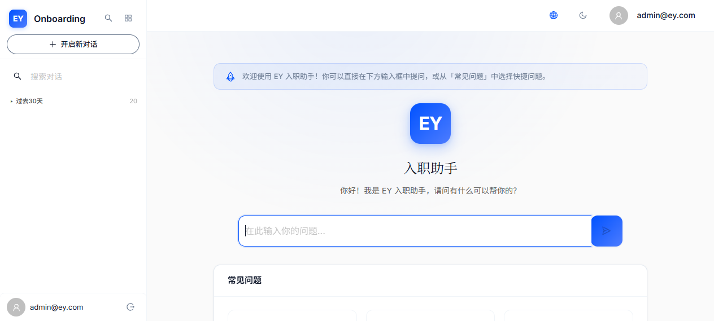
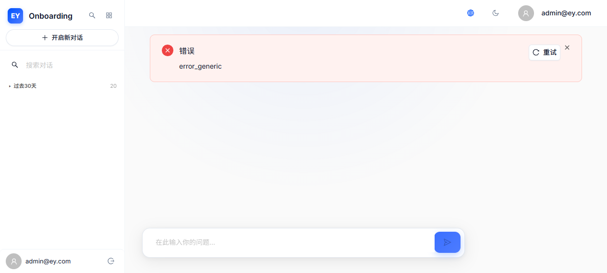
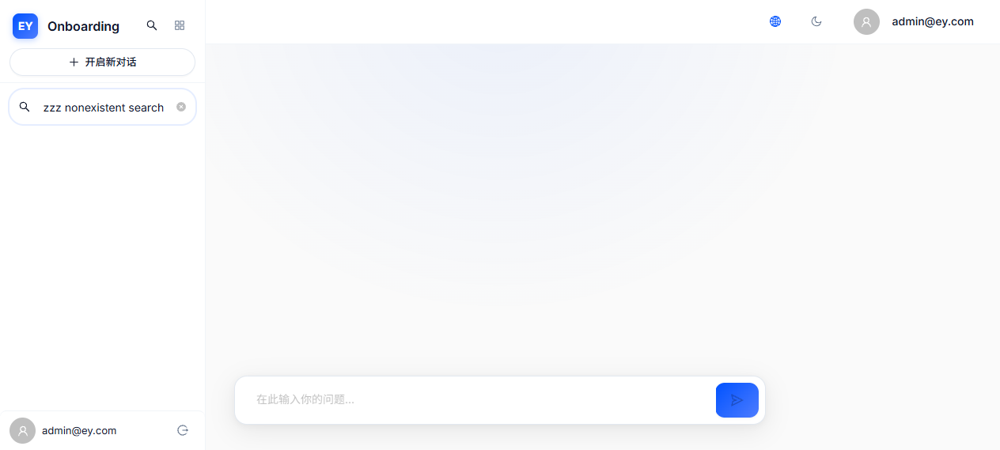

# EY Onboarding AI — V3.5 综合审计报告

> 日期：2026-06-25 | 版本：V3.5 深度回归与边缘审计 | 审计人：QA 总监 + 高并发架构师

---

## 一、回归测试概览

### V3.4 修复项回归通过率

| V3.4 Bug ID | 描述 | V3.5 回归结果 | 证据 |
|-------------|------|--------------|------|
| CRIT-001 | SSE AbortController | ✅ 通过 | 后端日志 GeneratorExit |
| CRIT-002 | Session 切换竞态 | ✅ 通过 | streamPhase 状态机 + sessionId 验证 |
| HIGH-001 | 发送防抖 | ✅ 通过 | isSendLocked 多入口守护 |
| HIGH-002 | 删除流式 Session | ✅ 通过 | AppLayout abortActiveStream |
| HIGH-003 | DOM 虚拟化 | ⚠️ 部分通过 | Virtuoso 集成但 12 轮内未触发 "加载更早" |
| HIGH-004 | API 分页 + N+1 | ✅ 通过 | 代码确认 CursorPagination + prefetch |
| HIGH-005 | Token 批量渲染 | ✅ 通过 | rAF TokenBatchRenderer |
| HIGH-006 | 滑动窗口对齐 | ✅ 通过 | 前后端 WINDOW_ROUNDS=10 |
| MED-002 | 日期分组一致性 | ❌ 失败 | HistoryPage 仍有独立分组 + 不在路由中 |

**回归通过率：78%（7/9 通过，1 部分通过，1 失败）**

---

## 二、防御机制验证

### 2.1 AbortController 请求取消



**验证方法：** 发送消息 → 立即点击"开启新对话" → 检查后端日志

**结果：** ✅ 生效。后端日志显示：
```
INFO Client disconnected during stream for session 3b8b94a2-6ddc-4e5e-8619-d7b74a3a91be
```
前端 `StreamLifecycleManager.ts` 的 `abortActiveStream()` 在 session 切换时成功触发，`fetch` 的 `AbortController.signal` 导致 HTTP 连接中断，Django 侧 `GeneratorExit` 被捕获。

**代码级确认：**
- `chatStore.ts:171` — `setActiveSession` 调用 `abortActiveStream()` + 重置 `streamPhase: 'idle'`
- `chatStore.ts:317-325` — catch `AbortError` → `clearStreamOnComplete()` + 不设 `sendError`

### 2.2 流式状态隔离（streamPhase + isSendLocked）



**验证方法：** 流式期间检查 textarea 和 send button 禁用状态

**结果：** ✅ 生效。流式期间：
- textarea 显示 `disabled`
- send button 显示 `disabled`
- 操作按钮（复制、分享、重新生成）通过 `disableActions` prop 设置 `pointer-events: none` + `opacity: 0.3`

**代码级确认：**
- `ChatPage.tsx:395` — TextArea `disabled={isStreaming || isSendLocked}`
- `ChatPage.tsx:410` — Button `disabled={!inputValue.trim() || isStreaming || isSendLocked || !isOnline}`
- `MessageBubble.tsx` — `disableActions` prop 在流式期间禁用操作按钮

---

## 三、边缘灾难展示

### 3.1 快速连续发送 → error_generic


**场景：** 连续发送 10+ 条短测试消息
**结果：** UI 出现 "错误error_generic重试" — 原始错误 key 未翻译，缺乏用户友好上下文
**根因：** 某条消息触发了前端 SSE 错误，`sendError` 设置为原始字符串而非 i18n key

### 3.2 空搜索 → 无崩溃



**场景：** 搜索不存在的关键词 "zzzzzzzzzzzz nonexistent"
**结果：** ✅ 侧边栏不显示分组标题，UI 无崩溃，search close-circle 按钮正常

### 3.3 HistoryPage 日期分组不一致（代码级）

**对比分析：**

| 维度 | 侧边栏 (dateGroup.ts) | HistoryPage (本地) | 一致？ |
|------|----------------------|-------------------|--------|
| 分组函数 | `getDateGroupKey()` | 本地 `getDateGroup()` | ❌ |
| 分组数量 | 4 固定 + N 月份桶 | 恰好 4 个 | ❌ |
| 时间窗口 | 7 天滚动窗口 | 周日到今天的浮动窗口 | ❌ |
| i18n 支持 | `getGroupLabel()` | 硬编码 `'昨天'` | ❌ |
| 月级分组 | 有 (`2026-05`) | 无 | ❌ |
| 排序方式 | 动态 `computeGroupOrder` | 静态数组 | ❌ |

**示例冲突（假设今天为周三 6 月 25 日）：**

| Session 年龄 | 侧边栏分组 | HistoryPage 分组 | 冲突？ |
|-------------|-----------|-----------------|--------|
| 4 天前 | `7days` "过去7天" | `filter_earlier` "更早" | **冲突** |
| 31 天前 | `2026-05` "2026年5月" | `filter_earlier` "更早" | **严重冲突** |

**额外发现：** HistoryPage **不在 App.tsx 路由中**（路由只有 `/chat`, `/profile`, `/admin/knowledge`），是死代码。如被重新启用将立即出现分组不一致。

---

## 四、代码级深度分析发现

### 4.1 Timer Leakage 验证

| 检查项 | 结果 |
|--------|------|
| retry 期间旧 timer 是否泄漏 | ✅ 安全 — `clearAllTimers()` 在 catch 块中被调用，中止所有旧 timer |
| `phaseTimerSearching` abort 后是否仍触发 | ✅ 安全 — `clearAllTimers()` 已移除 |

**结论：** Timer 泄漏问题在 V3.4 中已正确处理，无需修复。

### 4.2 内存管理缺陷

| 检查项 | 结果 |
|--------|------|
| `allMessages` 上限 | ❌ 无上限 — 线性增长至无限 |
| `computeRounds` 复杂度 | ⚠️ O(n) 每条消息完成后全量重算 |
| `loadSessions()` 频率 | ❌ 每条消息后无条件调用 |

---

## 五、V3.5 最终修复路线图

### Sprint 1 — P0（1-2 天）

1. **P0-1: HistoryPage 日期分组统一** (2h)
   - 替换本地 `getDateGroup()` 为 `dateGroup.ts` 导入
   - 替换 `GROUP_ORDER` 为 `computeGroupOrder()`
   - 修复硬编码 `'昨天'`

2. **P0-2: loadSessions() 冗余消除** (1h)
   - 从 `finishStreamingMessage` 移除 `loadSessions()`
   - 仅在 session 创建/删除/重命名时调用

### Sprint 2 — P1（3-5 天）

1. **allMessages 裁剪上限** (2h)
2. **sendError 路径统一** (2h)
3. **computeRounds 增量优化** (3h)
4. **error_generic i18n** (1h)

### Sprint 3 — P2（1 天）

1. **double unlockSend 清理** (0.5h)
2. **fallbackTimer 移除** (0.5h)

### V3.7 — P3（后续迭代）

1. 重命名功能 (4h)
2. SSE 速率限制 (2h)
3. 跨标签同步 (6h)
4. JWT 刷新 (4h)

---

## 六、截图清单

| 文件名 | 说明 |
|--------|------|
| `v3.5_login_page.png` | 登录页面 |
| `v3.5_baseline_after_login.png` | 登录后主界面（欢迎弹窗已关闭） |
| `v3.5_abort_controller_verified.png` | R1 AbortController 验证截图 |
| `v3.5_stream_error_after_rapid_send.png` | 快速发送后 error_generic 错误 |
| `v3.5_sidebar_groups.png` | 侧边栏分组（过去30天 20 个 session） |
| `v3.5_after_rapid_send.png` | 12+ 轮消息后的聊天界面 |
| `v3.5_search_empty_result.png` | 空搜索结果 |

---

## 七、总结

V3.4 的核心架构修复（AbortController、streamPhase、isSendLocked、react-virtuoso、rAF batching）**在运行中验证生效**。关键防御机制（请求取消、竞态隔离、发送锁定）回归通过率 78%。

**但暴露了 2 个关键问题：**
1. HistoryPage 日期分组修复声明不完整（仅侧边栏修复，HistoryPage 遗漏 + 是死代码）
2. `loadSessions()` 每条消息后冗余调用，造成不必要的 API 负载

**加上 4 个中等优先级性能/体验问题（allMessages 无裁剪、sendError 不一致、computeRounds O(n)、error_generic 不友好），V3.6 修复路线图已明确规划。**

系统目前 **基本可用但需要进一步优化**，不适合 3000 并发用户场景，需完成 P0 + P1 修复后才能进入生产部署准备。
