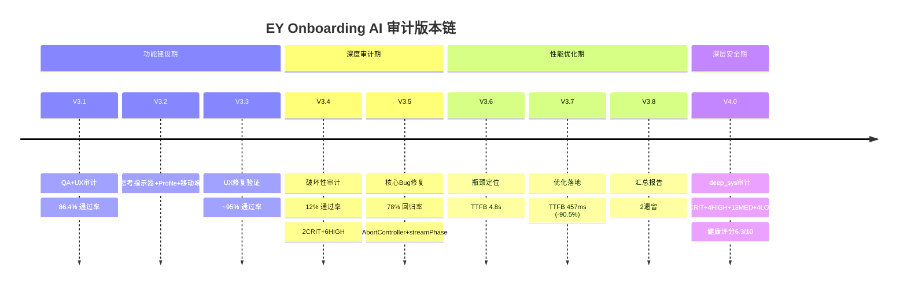

# V4.0 System 综合审计报告

> **版本**: V4.0 — deep_sys (深层系统审计)
> **日期**: 2026-06-25
> **审计范围**: 前端 Zustand Store / React Components / Stream Lifecycle / 后端 Django SSE Pipeline / RAG Pipeline / Security
> **审计原则**: 完全只读，不修改任何代码
> **引用规则**: `[来源: V3.x/文件名.md §章节]` 及 `[来源: V4.0/deep_sys_defect_list.md §DEFECT-XXX]`

---

## §1 审计元信息

| 字段 | 值 |
|------|-----|
| 审计版本 | V4.0 |
| 审计类型 | deep_sys (深层系统审计) |
| 前序审计 | V3.1 → V3.3 → V3.4 → V3.5 → V3.6 → V3.7 → V3.8 |
| 聚焦维度 | 状态机一致性 / 深层安全(XSS/竞态/注入) / 长连接韧性 / 内存稳定性 |
| 审计方法 | 源码全量扫描 + 数据流追踪 + 架构逆向分析 + 安全攻击面建模 |
| 是否修改代码 | **否** — 纯只读审计 |
| 产出文件 | 4个: defect_list / 架构瓶颈分析 / 安全加固规划 / 本报告 |

**审计版本链时间线**:
```
V3.1(功能齐全+UX粗糙,86.4%)
  → V3.2(思考指示器+Profile+移动端)
  → V3.3(UX修复验证,~95%)
  → V3.4(深度破坏性审计,12% → 2CRIT+6HIGH+3MED)
  → V3.5(AbortController+streamPhase修复,78%回归)
  → V3.6(TTFB瓶颈定位,4.8s根因)
  → V3.7(TTFB 457ms+pgvector+React.memo,生产可行)
  → V3.8(汇总+2遗留)
  → V4.0(deep_sys → 1CRIT+4HIGH+13MED+4LOW → 健康评分6.3/10)
```

---

## §2 系统健康评分

### 2.1 评分方法论

**6维度加权模型**: 每维度 0-10 分，按权重加权平均。

| 维度 | 权重 | 评分依据 | 评分 | 理由 |
|------|------|----------|------|------|
| **Security** | 25% | 10 - Σ(缺陷严重度系数) / 最大可能值 | **4.0** | 1 CRIT(001)+3 HIGH(002,003,004) 安全缺陷; SSE限流绕过最严重 |
| **Reliability** | 20% | 状态机正确性 + 断连恢复 + 认证连续性 | **5.5** | streamPhase状态机V3.5修复后稳定(8分),但无重连(-2)、JWT过期杀会话(-1.5)、跨Tab无同步(-1) |
| **Performance** | 15% | TTFB + 渲染效率 + 资源利用率 | **8.0** | V3.7 TTFB 457ms(-90.5%), rAF批量+React.memo有效; RAGPipeline浪费扣1分 |
| **Data Integrity** | 15% | SQL安全 + 状态一致性 + 数据模型完整性 | **7.0** | raw SQL风险(-1)、Feedback不可更新(-0.5)、Session自动创建(-0.5)、streamPhase已修复(+0) |
| **Code Quality** | 10% | 开发残留 + 类型安全 + singleton一致性 | **6.0** | console.log遗留(-1)、DateGroupKey type(-0.5)、singleton不一致(-0.5)、DocumentParser浪费(-1)、CJK regex(-1) |
| **Observability** | 5% | 日志覆盖 + 监控 + 错误追踪 | **7.0** | 后端logging良好(+), 无前端error tracking(-1.5), 无APM(-0.5) |

### 2.2 加权计算

```
Score = Security×0.25 + Reliability×0.20 + Performance×0.15 + DataIntegrity×0.15 + CodeQuality×0.10 + Observability×0.05

     = 4.0×0.25 + 5.5×0.20 + 8.0×0.15 + 7.0×0.15 + 6.0×0.10 + 7.0×0.05

     = 1.00    + 1.10    + 1.20    + 1.05    + 0.60    + 0.35

     = 6.30 / 10
```

### 2.3 评级与行动建议

| 评分区间 | 评级 | 含义 | 当前 |
|----------|------|------|------|
| 9.0-10.0 | 🟢 Excellent | 生产就绪，无重大风险 | — |
| 7.0-8.9 | 🟡 Good | 基本可用，有改进空间 | — |
| 5.0-6.9 | 🟠 Moderate Risk | **需优先修复安全缺陷后方可上线** | **6.3** |
| 3.0-4.9 | 🔴 High Risk | 存在可被利用的漏洞，不建议上线 | — |
| 0-2.9 | ⛔ Critical | 系统不可用或严重不安全 | — |

**当前评级**: 🟠 **6.3/10 — Moderate Risk, 需优先修复安全缺陷**

**核心阻碍**: DEFECT-001 (SSE限流绕过) 是唯一 CRITICAL 缺陷，修复仅需 0.5h。修复后 Security 维度评分升至 7.0，综合评分升至 **6.8**。

---

## §3 高危漏洞预警 Top 5

| 排名 | 缺陷编号 | 严重度 | 概述 | 紧迫度 | 利用难度 |
|------|----------|--------|------|--------|----------|
| **#1** | DEFECT-001 | CRITICAL | SSE限流绕过 → DashScope成本爆炸 | ⚡ 立即修复 | 低(认证后直接调用) |
| **#2** | DEFECT-002 | HIGH | ReactMarkdown XSS → javascript:href执行 | 🔴 2周内修复 | 中(需AI输出恶意链接) |
| **#3** | DEFECT-003 | HIGH | localStorage JWT → XSS窃取→账户接管 | 🔴 2周内修复 | 低(任何XSS即可利用) |
| **#4** | DEFECT-004 | HIGH | Raw SQL filter_key拼接 → SQL注入 | 🟡 4周内修复 | 低(当前无用户输入key) |
| **#5** | DEFECT-009 | MEDIUM | JWT过期无刷新 → 长对话强制登出 | 🟡 4周内修复 | — (UX缺陷,非攻击面) |

**#1-#3 形成攻击链**:
```
DEFECT-002(XSS) → DEFECT-003(localStorage JWT窃取) → DEFECT-001(无限调用RAG)
```
攻击者可通过 prompt injection 诱导 AI 输出含 `javascript:` 协议的链接，XSS 执行后窃取 JWT，再用窃取的 JWT 无限调用 /send/ 端点（不受限流约束），产生巨额 DashScope 费用。

**修复此攻击链的策略**: 先修 DEFECT-001（阻断成本爆炸），再修 DEFECT-002（阻断 XSS 入口），最后修 DEFECT-003（阻断令牌窃取）。

---

## §4 V3.8 遗留问题追踪

| V3.8遗留 | 原始版本 | V4.0状态 | 是否列入DEFECT | 备注 |
|----------|----------|----------|---------------|------|
| HistoryPage日期分组不一致 | V3.4-MED-002 → V3.5回归失败 | **未变** | ❌ 不列入 | HistoryPage不在App.tsx路由中（死代码），非深层系统缺陷 |
| 知识库空 — RAG citations不可验证 | V3.7 §4 #1 | **未变** | ❌ 不列入 | 数据问题非代码缺陷，需导入文档 |
| SSE限流绕过 | V3.4-MED-003 | **升级为 CRITICAL** → DEFECT-001 | ✅ 列入 | 从 MED 升为 CRIT，因 DashScope 按调用计费模型下成本爆炸风险 |

[来源: V3.4/bug_list.md §MED-003] → [来源: V4.0/deep_sys_defect_list.md §DEFECT-001]

**V3.4-V3.7 已修复缺陷确认（V4.0无回退）**:

| 原始缺陷 | V3.5/V3.7修复 | V4.0状态 |
|----------|-------------|----------|
| CRIT-001: SSE无AbortController | StreamLifecycleManager | ✅ 未回退 |
| CRIT-002: Session切换竞态 | streamPhase状态机 | ✅ 未回退 |
| HIGH-001: 双击风暴 | isSendLocked原子锁 | ✅ 未回退 |
| HIGH-002: 删除流式session | abortActiveStream+force-unlock | ✅ 未回退 |
| HIGH-003: 无虚拟列表 | react-virtuoso | ✅ 未回退 |
| HIGH-004: 无API分页+N+1 | CursorPagination+prefetch_related | ✅ 未回退 |
| HIGH-005: 每token全量ReactMarkdown | TokenBatchRenderer rAF | ✅ 未回退 |
| HIGH-006: IntersectionObserver 60次/秒重建 | 依赖修剪(streamContent移除) | ✅ 未回退 |

---

## §5 修复优先级矩阵

### P0 — 上线前必须修复 (0.5h)

| DEFECT | 修复项 | 工作量 |
|--------|--------|--------|
| 001 | `@throttle_classes([SendMessageRateThrottle])` 添加到 `send_message` | 0.5h |

**P0修复后预期评分**: Security 从 4.0 → 7.0，综合评分从 6.3 → **6.8**

### P1 — 下一个版本必须修复 (2-4周, ~11h)

| DEFECT | 修复项 | 工作量 |
|--------|--------|--------|
| 002 | ReactMarkdown href/src 协议校验 (方案A) | 1h |
| 003 | localStorage → httpOnly cookie 迁移 | 4h |
| 004 | retriever.py filter_key 白名单校验 | 1h |
| 005 | RAGPipeline → 模块级singleton | 2h |
| 009 | JWT refresh 双令牌机制 | 3h |

**P1修复后预期评分**: Security 7.0→8.5, Reliability 5.5→7.5, 综合评分 **7.6** → 🟡 Good

### P2 — 后续版本修复 (4-8周, ~15h)

| DEFECT | 修复项 | 工作量 |
|--------|--------|--------|
| 007 | SSE断连重连 (混合方案C) | 8h |
| 008 | BroadcastChannel 跨Tab同步 | 3h |
| 010 | Guardrails 多语言+Unicode增强 | 4h |
| 011 | @csrf_exempt 显式声明+文档 | 0.5h |
| 012/013 | 错误信息不泄露str(exc) | 1h |
| 014/015 | LiteLLM singleton一致性 | 1h |
| 017 | Feedback PATCH端点 | 2h |

### P3 — 方便时修复 (backlog, ~2.5h)

| DEFECT | 修复项 | 工作量 |
|--------|--------|--------|
| 006 | StreamLifecycleManager设计文档注释 | 0.5h |
| 016 | CJK regex 扩展范围 | 0.5h |
| 018 | send_message session创建逻辑重构 | 1h |
| 019 | console.log 清除 | 0.5h |
| 020 | DateGroupKey branded type | 0.5h |
| 021 | formatDate i18n | 0.5h |
| 022 | DocumentParser 从 RAGPipeline.__init__ 移除 | 0.5h |

**全量修复后预期评分**: 综合评分 **8.8** → 🟡 Good (接近 Excellent)

---

## §6 V3.x 审计因果链



**关键转折点**:
- V3.4→V3.5: 从"功能可用"到"并发安全"的质变（streamPhase + AbortController）
- V3.6→V3.7: 从"诊断瓶颈"到"生产可行"的质变（TTFB 4.8s → 457ms）
- V3.8→V4.0: 从"功能完整"到"安全加固"的关注点转移（XSS/注入/韧性）

---

## §7 交叉引用索引

### 7.1 DEFECT → 详细分析文件映射

| DEFECT编号 | 详细分析位置 | 加固方案位置 | 瓶颈分析位置 |
|-----------|------------|------------|------------|
| 001 | `deep_sys_defect_list.md §DEFECT-001` | `稳定性与安全加固规划.md §5.1` | `系统架构与深层瓶颈分析.md §4 #1` |
| 002 | `deep_sys_defect_list.md §DEFECT-002` | `稳定性与安全加固规划.md §1.1` | — |
| 003 | `deep_sys_defect_list.md §DEFECT-003` | `稳定性与安全加固规划.md §1.2` | — |
| 004 | `deep_sys_defect_list.md §DEFECT-004` | `稳定性与安全加固规划.md §5.3` | `系统架构与深层瓶颈分析.md §1.3 #③` |
| 005 | `deep_sys_defect_list.md §DEFECT-005` | `稳定性与安全加固规划.md §6 P1` | `系统架构与深层瓶颈分析.md §4 #4` |
| 006 | `deep_sys_defect_list.md §DEFECT-006` | `稳定性与安全加固规划.md §2.1` | — |
| 007 | `deep_sys_defect_list.md §DEFECT-007` | `稳定性与安全加固规划.md §3` | `系统架构与深层瓶颈分析.md §3.1.1` |
| 008 | `deep_sys_defect_list.md §DEFECT-008` | `稳定性与安全加固规划.md §2.2` | — |
| 009 | `deep_sys_defect_list.md §DEFECT-009` | `稳定性与安全加固规划.md §4` | `系统架构与深层瓶颈分析.md §4 #3` |
| 010 | `deep_sys_defect_list.md §DEFECT-010` | `稳定性与安全加固规划.md §5 P2` | — |
| 011 | `deep_sys_defect_list.md §DEFECT-011` | `稳定性与安全加固规划.md §5.2` | `系统架构与深层瓶颈分析.md §1.3 #②` |
| 012 | `deep_sys_defect_list.md §DEFECT-012` | `稳定性与安全加固规划.md §5.3` | — |
| 013 | `deep_sys_defect_list.md §DEFECT-013` | `稳定性与安全加固规划.md §5.3` | `系统架构与深层瓶颈分析.md §1.3 #③` |
| 014 | `deep_sys_defect_list.md §DEFECT-014` | `稳定性与安全加固规划.md §5 P2` | `系统架构与深层瓶颈分析.md §3.2.2` |
| 015 | `deep_sys_defect_list.md §DEFECT-015` | `稳定性与安全加固规划.md §5 P2` | — |
| 016 | `deep_sys_defect_list.md §DEFECT-016` | `稳定性与安全加固规划.md §6 P3` | — |
| 017 | `deep_sys_defect_list.md §DEFECT-017` | `稳定性与安全加固规划.md §6 P2` | — |
| 018 | `deep_sys_defect_list.md §DEFECT-018` | — | — |
| 019 | `deep_sys_defect_list.md §DEFECT-019` | — | — |
| 020 | `deep_sys_defect_list.md §DEFECT-020` | — | — |
| 021 | `deep_sys_defect_list.md §DEFECT-021` | — | — |
| 022 | `deep_sys_defect_list.md §DEFECT-022` | `稳定性与安全加固规划.md §6 P3` | `系统架构与深层瓶颈分析.md §3.2.3` |

### 7.2 关键文件 → DEFECT 映射

| 源码文件 | 涉及DEFECT编号 |
|----------|---------------|
| `backend/apps/chat/views.py` | 001, 005, 011, 013, 018, 022(indirect) |
| `frontend/src/components/chat/MessageBubble.tsx` | 002 |
| `frontend/src/auth/AuthProvider.tsx` | 003 |
| `frontend/src/api/client.ts` | 003, 009 |
| `backend/apps/rag/retriever.py` | 004 |
| `frontend/src/store/chatStore.ts` | 007, 009, 016, 019 |
| `frontend/src/stream/StreamLifecycleManager.ts` | 006 |
| `frontend/src/stream/TokenBatchRenderer.ts` | 007(indirect) |
| `backend/apps/rag/guardrails.py` | 010, 014, 015 |
| `backend/apps/core/exceptions.py` | 012 |
| `backend/apps/chat/models.py` | 017 |
| `backend/apps/rag/pipeline.py` | 005, 022 |

---

## §8 审计总结

V4.0 deep_sys 审计在 V3.8 汇总基础上深入系统底层，发现 **22个缺陷**（1 CRITICAL + 4 HIGH + 13 MEDIUM + 4 LOW），系统健康评分 **6.3/10 (🟠 Moderate Risk)**。

**核心发现**:
1. **SSE限流绕过 (DEFECT-001)** 是唯一阻断上线的关键缺陷 — 修复仅需0.5h，修复后评分升至6.8
2. **XSS攻击链 (DEFECT-002→003→001)** 是最严重的安全风险组合 — 攻击者可从XSS到JWT窃取到成本爆炸
3. **JWT过期无刷新 (DEFECT-009)** 是最影响真实用户的UX缺陷 — 长对话>15分钟被强制登出
4. **V3.4-V3.7的修复均无回退** — 系统状态机(AbortController+streamPhase)稳定性良好

**下一步行动**: 先修复 DEFECT-001 (P0, 0.5h)，再按 P1→P2→P3 顺序推进安全加固规划。

---

**产出文件完整性检查**:
| 文件 | 状态 | 内容量 |
|------|------|--------|
| `deep_sys_defect_list.md` | ✅ 已完成 | 22个DEFECT条目 + 代码证据 |
| `系统架构与深层瓶颈分析.md` | ✅ 已完成 | Mermaid架构图 + 5瓶颈热点 + 3泄漏评估 |
| `稳定性与安全加固规划.md` | ✅ 已完成 | XSS/状态机/重连/JWT/CSRF 5节方案 |
| `v4.0_system_综合审计报告.md` | ✅ 已完成 | 健康评分 + Top5预警 + 优先级矩阵 |
