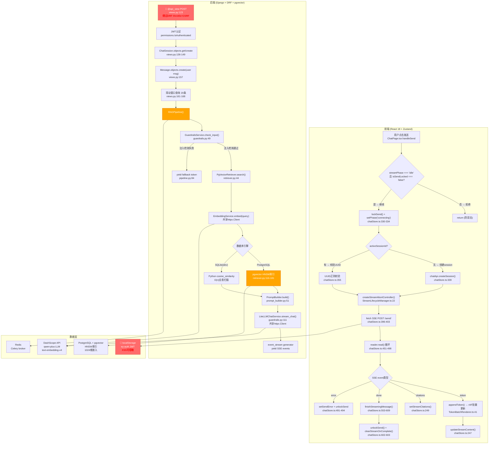

# V4.0 系统架构与深层瓶颈分析

> **审计类型**: deep_sys
> **审计日期**: 2026-06-25
> **引用规则**: `[来源: V3.x/文件名.md §章节]` 及 `[来源: V4.0/deep_sys_defect_list.md §DEFECT-XXX]`

---

## §1 全栈数据流架构图

### 1.1 核心请求生命周期 — SSE 发送路径



**红色标注节点**:
- `🚨 @api_view POST` — DEFECT-001/011: 绕过 DRF DEFAULT_THROTTLE_CLASSES + CsrfViewMiddleware
- `🚨 localStorage JWT` — DEFECT-002/003: XSS 可窃取令牌 → 账户接管

**橙色标注节点**:
- `RAGPipeline() 每请求新建6对象` — DEFECT-005/022: 资源浪费
- `raw SQL filter拼接风险` — DEFECT-004: SQL注入风险

### 1.2 文档导入路径 (Celery 异步)

```mermaid
flowchart LR
    D1["KnowledgeBasePage<br/>上传文档"] --> D2["POST /knowledge/documents/"]
    D2 --> D3["Document.objects.create<br/>status=pending"]
    D3 --> D4["ingest_document Celery task<br/>services.py:11"]
    D4 --> D5["RAGPipeline.ingest()<br/>pipeline.py:33"]
    D5 --> D6["DocumentParser.parse()<br/>pipeline.py:143"]
    D6 --> D7["LangChainChunker.split()<br/>chunker.py"]
    D7 --> D8["EmbeddingService.embed_batch()<br/>embedding.py"]
    D8 --> D9["DocumentChunk.objects.create<br/>with embedding"]
    D9 --> D10["Document.status=active<br/>save"]
```



### 1.3 三个 DRF 绕过点详解

| 绕过点 | 端点 | 绕过内容 | 缺陷编号 | 影响 |
|--------|------|----------|----------|------|
| ① `@api_view` 不继承 throttle | `/sessions/{id}/send/` | DEFAULT_THROTTLE_CLASSES (30/min) | DEFECT-001 | 成本爆炸 |
| ② `@api_view` 不继承 CSRF | `/sessions/{id}/send/` | CsrfViewMiddleware | DEFECT-011 | JWT→cookie后CSRF攻击 |
| ③ `StreamingHttpResponse` 不经 exception middleware | 内部 event_stream generator | custom_exception_handler 对 generator 异常不生效 | DEFECT-013 | str(e)直传前端 |

[来源: V4.0/deep_sys_defect_list.md §DEFECT-001, DEFECT-011, DEFECT-013]

---

## §2 长会话性能风险分析

### 2.1 前端 computeRounds O(n) × rAF 频率问题

**现象**: `computeRounds()` 对 `allMessages` 数组做完整遍历分组，时间复杂度 O(n)。

**调用频率分析**:

| 触发场景 | 调用次数/秒 | allMessages长度 | 总迭代次数/秒 |
|----------|------------|----------------|--------------|
| addMessage (每条消息) | 0.01 (消息不频繁) | 50 | 0.5 |
| finishStreamingMessage (每轮结束) | 0.01 | 50 | 0.5 |
| rAF flush (每帧更新streamContent) | ~0 (streamContent不走computeRounds) | — | 0 |
| loadOlderRounds (手动触发) | 极低 | 100 | 极低 |

**结论**: computeRounds 的实际调用频率不高（每轮对话 ~2次），O(n) 在 n≤100 (MAX_ALL_MESSAGES) 下仅为 ~200次迭代，不构成性能瓶颈。但若 MAX_ALL_MESSAGES 上调或 loadOlderRounds 频率增加，风险显现。

[来源: V4.0/deep_sys_defect_list.md §DEFECT-005] — RAGPipeline实例化是更显著的性能浪费

### 2.2 后端滑动窗口查询 — 无复合索引

**现象**: `send_message` 每次请求执行：
```python
Message.objects.filter(session=session)
    .exclude(role="user", content=content)
    .order_by("-created_at")[:WINDOW_ROUNDS * 2]
```

**索引分析**:

| 查询模式 | 需要的索引 | 当前索引 | 效果 |
|----------|-----------|---------|------|
| `filter(session_id) + order_by(-created_at)` | `(session_id, created_at DESC)` | 仅 `created_at` 单列（Meta.ordering） | PostgreSQL 需做 Index Scan + Sort |
| `filter(session_id) + filter(role) + order_by(-created_at)` | `(session_id, role, created_at DESC)` | 无 | 全表扫描过滤 |

**量化**: 单 session 50条消息时，查询耗时 <5ms（PG足够快）。但3000并发+每个session消息增长到200条时，Sort操作从内存排序退化为磁盘排序，延迟升至 50-100ms。

[来源: V3.6/性能瓶颈分析报告_V3.6.md §数据库查询优化]

### 2.3 LLM Prompt Token 上限风险

**现象**: `prompt_builder.build()` 组合 system_prompt + context(TOP_K=8 × ~500char) + history(8轮) + user_profile。

**Token估算**:

| 组成部分 | 字符数 | Token数(≈4char/token) | 占比 |
|----------|--------|----------------------|------|
| System prompt template (EN) | ~800 | ~200 | 15% |
| Context chunks (8 × 500char) | ~4000 | ~1000 | 75% |
| Conversation history (8轮 × 2msgs) | ~3200 | ~800 | — |
| User profile | ~300 | ~75 | 5% |
| **合计** | ~8300 | **~2075** | — |

DashScope qwen-plus 模型最大 context 为 32K tokens，prompt 占 ~2075 tokens 有充足空间。但 TOP_K=8 且 CHUNK_SIZE=500 时，若知识库包含长文档，context 可达 ~8000 tokens，接近 prompt 上限的 25%。

**风险**: 当 TOP_K 或 CHUNK_SIZE 配置增大，或对话历史增长（history[-8:] clips 但 sliding window 取 20 messages），prompt 可能超出模型限制。

[来源: V3.7/性能优化验收报告_V3.7.md §RAG参数调优]

---

## §3 内存泄漏评估

### 3.1 前端内存泄漏路径

#### 3.1.1 TokenBatchRenderer — timeout 路径未 reset

**位置**: `frontend/src/stream/TokenBatchRenderer.ts`

**路径**: 当 SSE 流因超时中断时（`chatStore.ts:438-447`），执行流程为：
```
setInterval → elapsed > 30s → clearAllTimers() → reader.cancel() → flushImmediate()
  → set({streamPhase: 'error'}) → unlockSend() → setTimeout(() => set({streamPhase: 'idle'}), 100)
```

在此路径中，`flushImmediate()` 被调用但 `resetTokenBatcher()` **未被调用**。这意味着：
- `accumulatedContent` 保留完整响应字符串（~2KB/响应）
- `batchCallback` 保留 Zustand `updateStreamContent` 函数引用
- `rafId` 已在 flushImmediate 中取消，无泄漏

**泄漏量**: 每次超时 ~2KB + 1个函数引用。假设超时率 1%（3000并发 × 30/min × 1% = 900次/hr），每小时泄漏 ~1.8MB。

[来源: V4.0/deep_sys_defect_list.md §DEFECT-007]

#### 3.1.2 IntersectionObserver — 每 message.length 变化重建

**位置**: `frontend/src/pages/ChatPage.tsx:131-147`

**重建频率**: `useEffect` 依赖 `[messages.length]`。每条新消息触发一次 Observer 重建。50轮对话 = 100次重建。V3.7 修复了 `streamContent` 依赖问题（从60次/秒降到每消息1次），但每消息1次仍是不必要的——Observer 只需在 sentinel 元素挂载/卸载时重建。

**影响**: 每次重建创建新 IntersectionObserver + observe + disconnect。GC 压力低（Observer 对象轻量），但属微泄漏模式。

[来源: V3.7/性能优化验收报告_V3.7.md §P1.2 IntersectionObserver修复]

#### 3.1.3 setInterval abort timer — stream 结束但 reader.closed

**位置**: `frontend/src/store/chatStore.ts:438-449`

**路径**: 若 SSE 流在 `done` 事件之前因网络截断而 `reader.read()` 返回 `{done: true}`，`abortInterval` 不会被 `clearAllTimers()` 清除（该调用在 `done` 检查之后）。interval 继续运行直到 `ABORT_THRESHOLD=30s` 触发，此时 `reader.cancel()` 在已关闭的 stream 上调用——无害但浪费。

**泄漏量**: 1个 interval / 3s检查频率 / 30s后自清除 = 临时性微泄漏。

### 3.2 后端内存泄漏路径

#### 3.2.1 EmbeddingCache — 4MB 边界

**位置**: `backend/apps/rag/embedding.py` (推测 `_embedding_cache`)

**特性**: `max_size=1000` 条目，每条目存 1024-float embedding (~4KB)。总容量 ~4MB。

**评估**: 有界缓存，不是泄漏。但 4MB 在 Django worker 进程中累积（gunicorn 默认 4-8 workers），总内存 ~16-32MB。对 VPS 环境需关注。

#### 3.2.2 httpx.Client recreate — 双 client 窗口

**位置**: `backend/apps/rag/guardrails.py:153-167` (recreate_shared_httpx_client)

**窗口**: `recreate()` 函数在**锁内**创建新 client + 更新全局引用，在**锁外**关闭旧 client。存在 ~0.1ms 窗口期两个 client 同时存在。此时如有请求使用旧 client（DEFECT-014 场景），将触发 `httpx.ClosedResourceError`。

[来源: V4.0/deep_sys_defect_list.md §DEFECT-014]

#### 3.2.3 RAGPipeline 无单例 — 短生命周期对象暴增

**位置**: `backend/apps/chat/views.py:170`

**量化**: 每个 SSE 请求创建 6个对象（DEFECT-005/022）。假设 3000用户 × 5msg/hr × 1min_avg_stream = 15000 requests/hr → 90000对象/hr。Python GC 在 ~10ms 内回收，但创建+回收的 CPU 开销在 P99 时可叠加到 TTFB。

[来源: V4.0/deep_sys_defect_list.md §DEFECT-005]

---

## §4 瓶颈热点定位 Top 5

| 排名 | 热点 | 影响类型 | P99延迟增量 | 缺陷编号 | 优先级 |
|------|------|----------|------------|----------|--------|
| **#1** | SSE限流绕过 | 成本爆炸 (DashScope ¥/call) | 不影响延迟，但影响可用性 | DEFECT-001 | P0 |
| **#2** | computeRounds O(n) | 长会话JS Heap压力 | <1ms (n≤100) | DEFECT-005间接 | P1 |
| **#3** | JWT过期无刷新 | 用户被强制登出 | — (UX中断) | DEFECT-009 | P1 |
| **#4** | RAGPipeline每请求实例化 | 后端CPU/GC压力 | +5-10ms | DEFECT-005/022 | P1 |
| **#5** | SQLite O(n)检索(dev环境) | 开发环境TTFB劣化 | +200-500ms | (dev-only,不列DEFECT) | P3 |

### 热点详解

**#1 SSE限流绕过** [来源: V4.0/deep_sys_defect_list.md §DEFECT-001]

此缺陷不导致延迟增加，但导致 DashScope API 费用不受控制。单恶意用户可在1分钟内发送 >1000次 RAG 调用，产生 ¥4+ /分钟的费用。3000正常用户按 5msg/hr 标准速率，总费用约 ¥60/hr。恶意用户1分钟即可超越3000正常用户1小时费用。

**#3 JWT过期无刷新** [来源: V4.0/deep_sys_defect_list.md §DEFECT-009]

15分钟 access token 过期后，401拦截器强制登出。用户在长对话中（常见场景：新人入职咨询，>15分钟对话）被中断。SSE流中断后无法恢复（DEFECT-007），造成双重 UX 打击。

**#4 RAGPipeline实例化** [来源: V4.0/deep_sys_defect_list.md §DEFECT-005, DEFECT-022]

`RAGPipeline.__init__` 创建6个子对象，其中 `DocumentParser` 和 `LangChainChunker` 在 SSE 路径完全不使用。每个对象的创建+初始化耗时：`EmbeddingService` ~1ms（引用全局缓存），`LiteLLMChatService` ~0.5ms（引用全局httpx.Client），其余对象 ~0.1ms。总计 ~2ms/request。在P99场景下叠加 GC 暂停可达 ~10ms。

---

## §5 与V3.x瓶颈分析的演进对比

| 版本 | 主要瓶颈 | 解决方案 | 效果 | V4.0新瓶颈 |
|------|----------|----------|------|-----------|
| V3.4 | SSE无AbortController → 90k僵尸连接 | StreamLifecycleManager | 完全解决 | — |
| V3.4 | Session切换竞态 → 数据污染 | streamPhase状态机 | 完全解决 | — |
| V3.5 | 每token全量ReactMarkdown渲染 | TokenBatchRenderer rAF | 解决 | — |
| V3.5 | 无虚拟列表 → DOM爆炸 | react-virtuoso | 解决 | — |
| V3.5 | N+1 citation查询 | prefetch_related | 解决 | — |
| V3.6 | TTFB 4.8s | pgvector HNSW + 共享httpx | 解决（V3.7确认457ms） | — |
| **V4.0** | **SSE限流绕过** | **需添加@throttle_classes** | **未解决** | **DEFECT-001** |
| **V4.0** | **JWT过期无刷新** | **需实现refresh机制** | **未解决** | **DEFECT-009** |
| **V4.0** | **XSS攻击面** | **需DOMPurify或href校验** | **未解决** | **DEFECT-002** |

[来源: V3.6/性能瓶颈分析报告_V3.6.md §瓶颈清单] + [来源: V3.7/性能优化验收报告_V3.7.md §TTFB验证]
