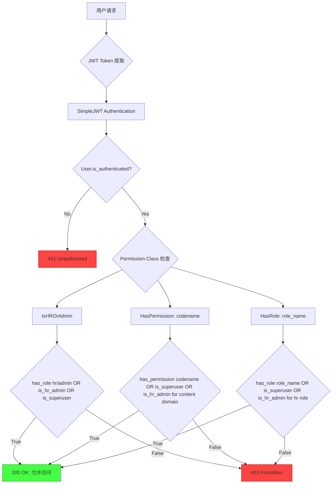
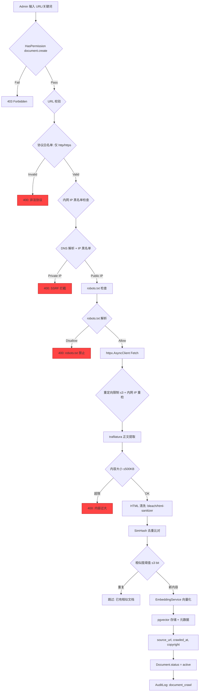
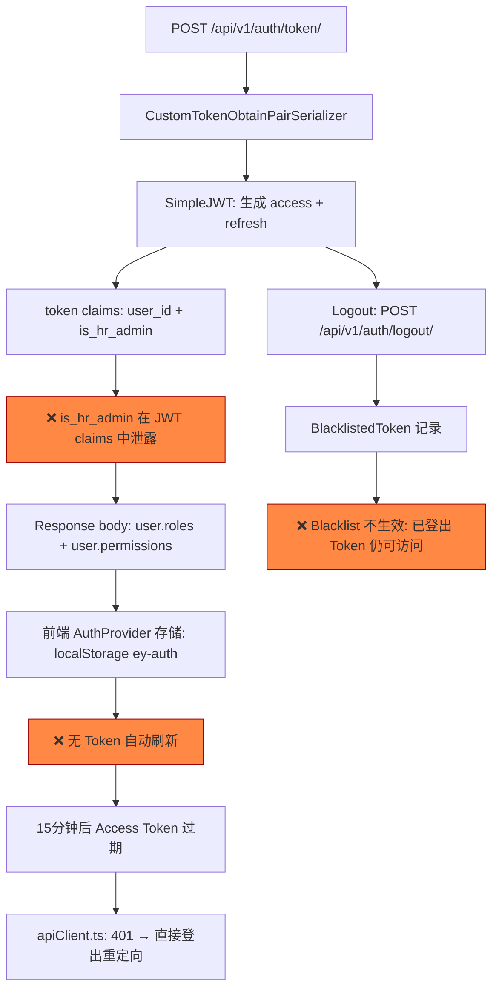

# V4.1 权限架构与功能规划

> **版本**: V4.1 — 权限架构分析 + 知识库数据处理流程 + 爬取入库预规划
> **产出路径**: `audit_reports/v4.1/kb_admin/权限架构与功能规划_V4.1.md`
> **日期**: 2026-06-26
> **审计范围**: RBAC 双轨权限体系 + 文件上传链路 + 爬虫预规划
> **引用规则**: `[来源: V4.0/kb_admin/权限架构与功能规划.md §章节]`

---

## 一、权限架构图

### 1.1 V4.1 RBAC 双轨权限验证流



> [来源: backend/apps/core/permissions.py §L13-L99] — 三类权限检查均有 Phase 2 双重授权回退路径

### 1.2 薄弱点标注

**⚠️ WP-01: JWT claims 泄露 `is_hr_admin`**
- 文件: `backend/apps/users/views.py:23`
- 代码: `token["is_hr_admin"] = user.is_hr_admin`
- 影响: JWT payload 可被任何 token 解码器读取，泄露管理员身份
- 严重度: 🔴 **高危** → KB-V4.1-009

**⚠️ WP-02: HasPermission 双重授权回退**
- 文件: `backend/apps/core/permissions.py:59-64`
- 逻辑: `is_hr_admin=True` 时，内容域权限自动放行（无需 RBAC 权限检查）
- 影响: 过渡期 HR 用户仍可通过旧布尔绕过新权限系统
- 严重度: ⚠️ **中危**（设计意图，但需在 Phase 3 关闭）

**⚠️ WP-03: `is_superuser` 全局绕过**
- 文件: `backend/apps/core/permissions.py:55`
- 逻辑: `if request.user.is_superuser: return True` 在 HasPermission/HasRole 中
- 影响: superuser 绕过所有权限检查，审计无区分
- 严重度: ⚠️ **中危**（紧急访问必要，但需审计记录）

**⚠️ WP-04: has_permission() N+1 查询**
- 文件: `backend/apps/users/models.py:92-112`
- 逻辑: 每次请求执行 `UserRole → RolePermission → Permission` 查询链
- 影响: 高并发下 DB 查询压力大（5 权限检查 = 5 次查询）
- 严重度: ⚠️ **低危**（性能影响，当前并发量可控）

---

## 二、文件上传数据处理流程图

### 2.1 完整数据流

```mermaid
graph TD
    A[HR/Admin 上传文件] --> B{IsHROrAdmin 权限检查}
    B -->|Pass| C[DocumentSerializer 校验]
    B -->|Fail| D[403 Forbidden]
    
    C --> E{file_type CHOICES 校验}
    E -->|Valid: pdf/docx/html/txt| F[文件存储到 media/documents/]
    E -->|Invalid: exe/svg| G[400 Bad Request: invalid_choice]
    
    F --> H[❌ 无 magic number 校验]
    H --> I[❌ 无文件内容/MIME 校验]
    I --> J[Document 记录入库]
    
    J --> K[Celery Task: ingest_document.delay]
    K --> L[Parser: PDF/DOCX/HTML/TXT 文本提取]
    L --> M[Chunk Split: 500 token 切片]
    M --> N[EmbeddingService: DashScope API]
    N --> O[pgvector HNSW 索引存储]
    O --> P[Document.status = active]
    
    P --> Q[聊天检索: PgVectorRetriever]
    Q --> R[❌ SQL f-string 注入风险: f"{key} = %s"]
    
    style H fill:#f84,stroke:#900
    style I fill:#f84,stroke:#900
    style R fill:#f84,stroke:#900
    style D fill:#f44,stroke:#900
    style G fill:#f44,stroke:#900
```

> [来源: backend/apps/knowledge/views.py §L22-L54] — 上传流程含 IsHROrAdmin + Celery 异步入库
> [来源: backend/apps/knowledge/models.py §FILE_TYPE_CHOICES] — 仅 4 种类型校验
> [来源: backend/apps/rag/retriever.py §L138-L142] — SQL filter key 拼接风险

### 2.2 文件上传链路薄弱点

**⚠️ WP-05: 无 magic number 校验**
- 文件: `backend/apps/knowledge/serializers.py`
- 影响: PE executable 伪装为 .txt 可被接受入库
- 严重度: 🔴 **高危** → KB-V4.1-006

**⚠️ WP-06: DEBUG 模式下 Media 无鉴权**
- 文件: `backend/config/urls.py:17-18`
- 代码: `if settings.DEBUG: urlpatterns += static(MEDIA_URL, document_root=MEDIA_ROOT)`
- 影响: 上传的 PDF/DOCX 可通过猜测 URL 公开访问
- 严重度: 🔴 **高危** → KB-V4.1-007 (P0-2 配置层残留)

**⚠️ WP-07: retriever.py SQL 注入风险**
- 文件: `backend/apps/rag/retriever.py:140`
- 代码: `f"{key} = %s"` — 用 dict key 直接构建 WHERE clause 列名
- 影响: 若未来端点允许用户传入 `filters` 参数，攻击者可注入 SQL 列名
- 严重度: 🟠 **中危**（当前无用户传入路径，但代码模式危险）→ KB-V4.1-004

**⚠️ WP-08: 无对象级权限**
- 文件: `backend/apps/knowledge/views.py:57-61`
- 代码: `DocumentDetailView` 仅用 `IsHROrAdmin`，无 `uploaded_by` 检查
- 影响: HR A 可删除 HR B 上传的文档
- 严重度: ⚠️ **低危** → KB-V4.1-003

---

## 三、网络爬取入库流程图（⚠️ 功能未实现，仅为规划）

### 3.1 预规划流程



> **⚠️ 重要声明**: 以上流程图描述的是 **尚未实现** 的功能。代码中无 crawl/scrape 端点、无 trafilatura/SimHash 库、无爬虫 UI。httpx.Client 仅用于 Embedding API（DashScope），不用于网页抓取。本流程图作为 **Prompt 2B 开发约束**，确保实现时满足安全要求。

### 3.2 爬虫链路薄弱点（预规划级）

**⚠️ WP-09: SSRF 无防护**
- 状态: 功能未实现，无任何 SSRF 防护代码
- 影响: 实现后若不加入网 IP 黑名单，攻击者可通过爬虫端点访问内网服务
- 严重度: 🔴 **高危（规划级）** → KB-V4.1-011

**⚠️ WP-10: 爬取内容 XSS**
- 状态: 功能未实现，无 HTML 清洗代码
- 影响: 爬取含 `<script>` 的页面入库后，在聊天引用中触发存储型 XSS
- 严重度: 🔴 **高危（规划级）** → KB-V4.1-016

---

## 四、JWT 签发与校验流程图



> [来源: backend/apps/users/views.py §L22-L24] — `token["is_hr_admin"] = user.is_hr_admin`
> [来源: frontend/src/auth/AuthProvider.tsx §L34-L41] — localStorage 恢复 + V4.0 旧格式迁移
> [来源: 回测验证] — Logout 后 token 仍返回 200 on /auth/me/

### JWT 薄弱点

**⚠️ WP-11: JWT claims 泄露 is_hr_admin** → KB-V4.1-009
**⚠️ WP-12: 前端无 Token 自动刷新** → KB-V4.1-010
**⚠️ WP-13: JWT Blacklist 失效** → KB-V4.1-010b

---

## 五、综合薄弱点清单

| # | 薄弱点 | 严重度 | 来源文件 | 关联漏洞 ID |
|---|---|---|---|---|
| WP-01 | JWT claims 泄露 is_hr_admin | 🔴 高 | users/views.py:23 | KB-V4.1-009 |
| WP-02 | HasPermission 双重授权回退 | ⚠️ 中 | core/permissions.py:59 | 设计意图 |
| WP-03 | is_superuser 全局绕过 | ⚠️ 中 | core/permissions.py:55 | KB-V4.1-002 |
| WP-04 | has_permission() N+1 查询 | ⚠️ 低 | users/models.py:92 | KB-V4.1-005 |
| WP-05 | 无 magic number 校验 | 🔴 高 | knowledge/serializers.py | KB-V4.1-006 |
| WP-06 | DEBUG Media 无鉴权 | 🔴 高 | config/urls.py:17 | KB-V4.1-007 |
| WP-07 | retriever.py SQL 注入风险 | 🟠 中 | rag/retriever.py:140 | KB-V4.1-004 |
| WP-08 | 无对象级权限 | ⚠️ 低 | knowledge/views.py:57 | KB-V4.1-003 |
| WP-09 | 爬虫 SSRF 无防护 | 🔴 高(规划) | 未实现 | KB-V4.1-011 |
| WP-10 | 爬取内容 XSS | 🔴 高(规划) | 未实现 | KB-V4.1-016 |

> **高危 4 项**（含 2 项规划级）+ **中危 3 项** + **低危 3 项** = **10 项薄弱点**

---

> **生成日期**: 2026-06-26
> **数据来源**: 代码审查 + Docker API 测试 + V4.0 审计报告对照
> **文件位置**: `audit_reports/v4.1/kb_admin/权限架构与功能规划_V4.1.md`
