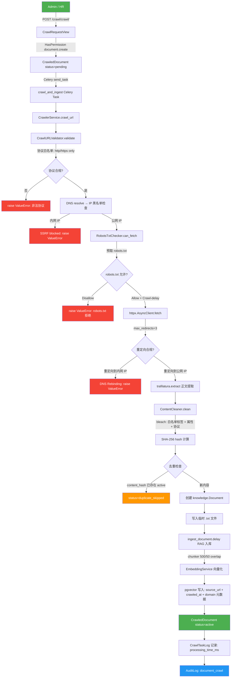
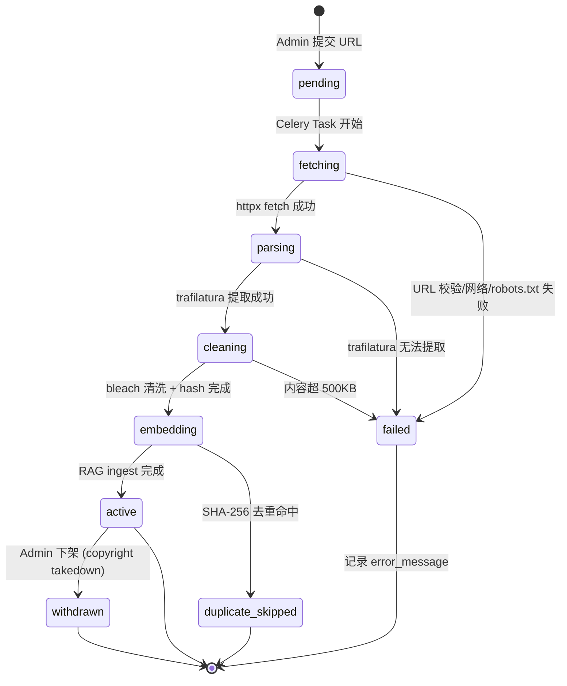

# 网络爬取模块设计文档 V4.1

> **版本**: V4.1 | **日期**: 2026-06-26 | **覆盖范围**: KB-V4.1-011~017 网络爬取知识入库模块
> **前置审计**: V4.1 爬虫安全评分 0/100 → 本设计文档为已实现的 V4.1 爬虫模块规格说明
> **引用规则**: `[来源: V4.1/kb_admin/文件名.md §章节]`
> **代码基准**: `backend/apps/crawler/` 全量实现代码

---

## 一、模块概述

### 1.1 目标

网络爬取模块是 V4.1 知识库扩展的核心组件，旨在让系统管理员和内容管理者通过输入外部 URL，自动抓取网页内容、清洗、去重、向量化后入库到知识库，从而批量充实知识库的信息覆盖度。模块的设计遵循"安全优先、合规驱动"原则，在每一步数据流中嵌入 SSRF 防护、内容清洗、robots.txt 合规和版权溯源机制。

### 1.2 范围

- **单 URL 爬取**: Admin/HR 提交一个 URL → 异步抓取 → 清洗 → 去重 → 向量化 → 入库
- **爬取状态追踪**: CrawledDocument 生命周期全程追踪（pending → fetching → parsing → cleaning → embedding → active/failed/withdrawn/duplicate_skipped）
- **版权合规**: 每条爬取记录强制溯源（source_url + crawled_at），支持一键下架（withdraw）
- **安全防护**: SSRF 防护（协议白名单 + IP 黑名单 + DNS Rebinding）+ 内容清洗（bleach XSS 防御）+ robots.txt 合规

**不在本模块范围内的**：批量 URL 爬取、sitemap 发现、搜索引擎关键词爬取——这些属于 V4.2 迭代功能 `[来源: V4.1/kb_admin/V4.2_迭代功能规划.md §二]`。

### 1.3 使用角色

| 角色 | 权限 | 可执行操作 | 权限码 |
|---|---|---|---|
| **Admin** | 全域管理（35 codenames） | 提交爬取请求、查看爬取列表、下架爬取内容、按 URL 批量下架 | `document.create`, `document.read`, `document.delete` |
| **HR** | 内容域管理（22 codenames） | 提交爬取请求、查看爬取列表、下架爬取内容 | `document.create`, `document.read`, `document.delete` |
| **Employee** | 无爬取权限 | 无（提交爬取 → 403 Forbidden） | — |

角色权限基于 V4.0 双轨 RBAC 体系 `[来源: V4.0/kb_admin/v4.0_rbac_kb_admin.md §三]`，Admin 角色 35 codenames 包含 HR 全部 22 codenames，因此 Admin 自然拥有 HR 的所有爬取权限。Employee 角色无 `document.create` 权限，POST `/crawl/crawl/` 请求将被 `HasPermission("document.create")` 拦截返回 403。

---

## 二、架构图

### 2.1 爬取入库完整数据流

### 2.2 爬取状态生命周期

---

## 三、SSRF 防护设计

SSRF（Server-Side Request Forgery）是爬虫模块面临的最严重安全威胁。攻击者可构造恶意 URL，让服务器发起对内网资源的请求，从而访问 Django Admin、数据库端口、云服务元数据等敏感资源。V4.1 爬虫模块采用四层纵深防御策略 `[来源: V4.1/kb_admin/网络爬取链路审计报告_V4.1.md §二]`。

### 3.1 协议白名单

**设计原则**: 仅允许 http 和 https 协议，拒绝一切其他协议。

| 被拒绝的协议 | 攻击场景 | 拒绝行为 |
|---|---|---|
| `file://` | 读取服务器本地文件（`/etc/passwd`, `/var/db/`） | `Protocol 'file' is not allowed` → 400 |
| `gopher://` | 发送任意 TCP 数据包到内网 Redis/Memcached | `Protocol 'gopher' is not allowed` → 400 |
| `dict://` | SSRF 探测内网服务端口 | `Protocol 'dict' is not allowed` → 400 |
| `ftp://` | 读取服务器文件系统或内网 FTP | `Protocol 'ftp' is not allowed` → 400 |
| `data://` | 内嵌恶意数据 payload | `Protocol 'data' is not allowed` → 400 |

**实现细节**: `CrawlURLValidator.validate()` 方法通过 `urllib.parse.urlparse(url)` 解析 URL scheme，与 `ALLOWED_SCHEMES = {"http", "https"}` 集合比对。不匹配时返回 `(False, f"Protocol '{scheme}' is not allowed")` 错误。

**代码位置**: `backend/apps/crawler/validators.py` — `ALLOWED_SCHEMES` 常量 + `CrawlURLValidator.validate()` 方法 `[来源: backend/apps/crawler/validators.py §20-88]`。

### 3.2 IP 黑名单

**设计原则**: 拒绝所有 RFC 1918/RFC 4193/RFC 6598 私有/保留 IP 地址范围，防止爬虫请求到达内网服务。

| IP 范围 | 描述 | 防护场景 |
|---|---|---|
| `127.0.0.0/8` | IPv4 回环地址 | 防止访问本机 Django Admin (`127.0.0.1:8020`) |
| `10.0.0.0/8` | A 类私有网络 | 防止访问内网 DB/API |
| `172.16.0.0/12` | B 类私有网络 | 防止访问内网子网 |
| `192.168.0.0/16` | C 类私有网络 | 防止访问家庭/办公内网 |
| `169.254.0.0/16` | 链路本地地址 | **关键**: 防止访问 AWS/Azure 云元数据 (`169.254.169.254`) |
| `0.0.0.0/8` | "本网络" | 防止模糊路由 |
| `100.64.0.0/10` | 运营商级 NAT | 防止共享地址空间访问 |
| `198.18.0.0/15` | 基准测试地址 | 防止非标准地址访问 |
| `::1/128` | IPv6 回环地址 | 防止 IPv6 本机访问 |
| `fc00::/7` | IPv6 唯一本地地址 | 防止 IPv6 内网访问 |
| `fe80::/10` | IPv6 链路本地地址 | 防止 IPv6 链路层访问 |

**实现细节**: `_is_private_ip(ip_str)` 函数使用 `ipaddress.ip_address()` 将输入 IP 转换为对象，逐一检查是否属于 `PRIVATE_IP_RANGES` 列表中的任何一个 CIDR 网段。命中时返回 `(True, reason)`，CrawlURLValidator 在 DNS 解析后对每个 resolved IP 调用此函数。`socket.getaddrinfo(hostname, None)` 返回所有解析结果（IPv4 + IPv6），全部 IP 都必须通过黑名单检查。

**SSRF 拦截日志**: 每次拦截都会通过 `logger.warning("SSRF blocked: URL %s resolved to private IP %s")` 记录，包括请求 URL 和解析到的内网 IP 地址，便于安全审计溯源。

**代码位置**: `backend/apps/crawler/validators.py` — `PRIVATE_IP_RANGES` 常量 + `_is_private_ip()` 函数 + `CrawlURLValidator.validate()` DNS 解析段 `[来源: backend/apps/crawler/validators.py §24-110]`。

### 3.3 DNS Rebinding 防护

**攻击原理**: DNS Rebinding 是一种高级 SSRF 绕过技术。攻击者配置一个域名的 DNS 记录，使其首次解析返回公网 IP（通过 URL 校验），但在 HTTP 请求实际建立连接时（或重定向后），DNS 返回内网 IP，从而绕过首次 IP 黑名单检查。

**防御设计**: V4.1 采用双重检查机制：

1. **初始 DNS 检查**: 在 `CrawlURLValidator.validate()` 中，对提交 URL 的 hostname 进行 DNS 解析，所有 resolved IP 必须通过黑名单检查。
2. **重定向 IP 验证**: 在 `CrawlerService.crawl_url()` 中，httpx 请求完成后（含重定向跟随），对最终 URL 的 host 再次执行 DNS 解析，通过 `CrawlURLValidator.validate_redirect_ip()` 检查每个 resolved IP 是否为内网地址。命中时抛出 `ValueError("DNS rebinding detected")` 并终止流程。

**实现流程**:
- httpx 配置 `follow_redirects=True, max_redirects=3`，自动跟随重定向
- 请求完成后读取 `response.url.host`，执行 `socket.getaddrinfo()` 解析
- 对每个 resolved IP 调用 `validate_redirect_ip(addr[0])`
- 发现内网 IP → `logger.warning("DNS rebinding detected: redirect target IP %s is private")` + raise ValueError

**代码位置**: `backend/apps/crawler/services.py` — `CrawlerService.crawl_url()` 第6步 DNS rebinding 检查 `[来源: backend/apps/crawler/services.py §155-164]`；`backend/apps/crawler/validators.py` — `CrawlURLValidator.validate_redirect_ip()` `[来源: backend/apps/crawler/validators.py §112-126]`。

### 3.4 重定向限制

**设计原则**: 限制 HTTP 重定向最大次数为 3 次，每次重定向目标 IP 都必须通过内网 IP 黑名单检查。

| 配置参数 | 值 | 说明 |
|---|---|---|
| `MAX_REDIRECTS` | 3 | 可通过 `settings.CRAWL_MAX_REDIRECTS` 覆盖 |
| `follow_redirects` | True | httpx 自动跟随重定向 |
| 重定向 IP 校验 | 每次重定向后验证最终 IP | DNS Rebinding 防护 |

**实现细节**: httpx.AsyncClient 初始化时设置 `max_redirects=MAX_REDIRECTS`（默认 3），超出 3 次重定向 httpx 自动抛出 `TooManyRedirects` 异常，被 `crawl_and_ingest` 捕获并标记为 `crawl_status="failed"`。

**代码位置**: `backend/apps/crawler/validators.py` — `MAX_REDIRECTS` 常量 `[来源: backend/apps/crawler/validators.py §40]`；`backend/apps/crawler/services.py` — httpx AsyncClient 配置 `[来源: backend/apps/crawler/services.py §127-134]`。

---

## 四、robots.txt 合规设计

### 4.1 预取与解析

**设计原则**: 爬取任何 URL 之前，必须先获取并解析目标域名的 robots.txt，判断该 URL 是否被 Disallow 规则禁止。

**实现流程**:

1. **构造 robots.txt URL**: 从目标 URL 提取 domain（`urlparse(url).hostname`），构造 `https://{domain}/robots.txt`
2. **缓存优先**: 查询 Django cache key `robots_txt:{domain}`，缓存命中直接使用已解析的 `RobotFileParser` 对象
3. **首次获取**: 缓存未命中时，创建 `urllib.robotparser.RobotFileParser()` 对象，调用 `set_url(robots_url)` + `read()` 获取并解析 robots.txt
4. **缓存写入**: 解析成功后将 RobotFileParser 对象写入 Django cache，TTL = 24 小时（`ROBOTS_CACHE_TTL = 86400`）
5. **合规判定**: 调用 `rp.can_fetch(user_agent, url)` 判断是否允许爬取；调用 `rp.crawl_delay(user_agent)` 获取 Crawl-delay 值
6. **Disallow 拒绝**: 如果 `can_fetch()` 返回 False，抛出 `ValueError("robots.txt disallows crawling")`，终止爬取流程
7. **robots.txt 不可达**: 如果 robots.txt 请求失败（超时、404、网络错误），默认允许爬取（宽松策略：无 robots.txt 视为无限制）

### 4.2 Crawl-delay 遵守

| 场景 | 行为 | 说明 |
|---|---|---|
| robots.txt 定义 `Crawl-delay: 10` | `time.sleep(10)` 后再发请求 | 遵守站点限速要求 |
| robots.txt 无 Crawl-delay | `crawl_delay_seconds = 0`，立即请求 | 无额外延迟 |
| robots.txt 不可达 | 默认 `crawl_delay_seconds = 0` | 保守策略 |

**实现细节**: `RobotsTxtChecker.can_fetch()` 返回 `(is_allowed, crawl_delay_seconds)` 元组。`CrawlerService.crawl_url()` 在判定 `is_allowed=True` 后，如果 `crawl_delay > 0`，执行 `time.sleep(crawl_delay)` 阻塞等待。`crawl_delay_seconds` 值同时写入 `CrawledDocument.crawl_delay_seconds` 字段，用于审计追踪。

### 4.3 User-Agent 标识

爬虫使用专用 User-Agent 字符串 `EY-Onboarding-AI-Crawler/1.0 (+https://ey.com/bot)`，便于网站管理员在 robots.txt 中针对本爬虫设置规则。该标识可通过 `settings.CRAWL_USER_AGENT` 配置覆盖。

### 4.4 缓存策略

| 参数 | 值 | 说明 |
|---|---|---|
| 缓存后端 | Django cache（默认 Redis） | 与系统其他缓存共用 |
| 缓存 key | `robots_txt:{domain}` | 每个域名独立缓存 |
| TTL | 86400 秒（24 小时） | 平衡实时性与性能 |
| 缓存内容 | `RobotFileParser` 对象 | 包含所有 Disallow/Allow/Crawl-delay 规则 |

**代码位置**: `backend/apps/crawler/services.py` — `RobotsTxtChecker` 类 `[来源: backend/apps/crawler/services.py §33-78]`。

---

## 五、内容清洗设计

### 5.1 bleach 配置

内容清洗是防止存储型 XSS 攻击的关键防线。爬虫从外部网页抓取的 HTML 内容可能包含恶意脚本、iframe 嵌套、JavaScript 协议链接等，若直接入库存储并在聊天引用时渲染，将造成存储型 XSS `[来源: V4.1/kb_admin/网络爬取链路审计报告_V4.1.md §四]`。

**白名单标签（ALLOWED_TAGS）**:

| 类别 | 允许的标签 | 说明 |
|---|---|---|
| 结构标签 | `p`, `br`, `blockquote` | 段落与引用 |
| 标题标签 | `h1`, `h2`, `h3`, `h4`, `h5`, `h6` | 六级标题 |
| 列表标签 | `ul`, `ol`, `li` | 无序与有序列表 |
| 格式标签 | `strong`, `em` | 加粗与斜体 |
| 代码标签 | `code`, `pre` | 行内代码与代码块 |
| 链接标签 | `a` | 仅允许 href + title 属性 |
| 表格标签 | `table`, `thead`, `tbody`, `tr`, `th`, `td` | 完整表格家族 |

**白名单属性（ALLOWED_ATTRIBUTES）**:

| 标签 | 允许的属性 | 说明 |
|---|---|---|
| `a` | `href`, `title` | href 仅允许 http/https/mailto 协议 |
| `td` | `align` | 表格对齐 |
| `th` | `align` | 表格对齐 |

**白名单协议（ALLOWED_PROTOCOLS）**: `http`, `https`, `mailto`

**严格禁止**: `javascript:` 协议、`data:` 协议、`vbscript:` 协议 — 所有 `<a href="javascript:...">` 链接将被 bleach 自动剥离协议。

### 5.2 危险内容剥离

| 危险元素 | 清洗行为 | XSS 防护场景 |
|---|---|---|
| `` |
| `<iframe>` | 完全剥离 | 阻止 `<iframe src="http://evil.com">` 嵌套 |
| `<object>` | 完全剥离 | 阻止 Flash/Java 插件嵌入 |
| `<embed>` | 完全剥离 | 阻止外部插件嵌入 |
| `<style>` | 完全剥离 | 阻止 CSS 注入攻击 |
| `onclick`, `onload`, `onerror` 等事件属性 | 完全剥离 | 阻止 `` |
| `javascript:` 协议 | 协议剥离 | 阻止 `<a href="javascript:document.location='evil'">` |

**bleach.strip=True 参数**: 所有不在白名单中的标签被完全剥离（而非 HTML 转义），确保恶意标签不会以任何形式残留在输出中。

### 5.3 内容大小限制

| 参数 | 值 | 说明 |
|---|---|---|
| `MAX_CONTENT_SIZE` | 500,000 字节（500KB） | 单条爬取内容上限 |
| 超限行为 | `raise ValueError("Content exceeds maximum size")` | 拒绝入库，标记 failed |

超过 500KB 的内容在 `ContentCleaner.clean()` 方法入口处即被拦截，通过 `len(raw_html) > MAX_CONTENT_SIZE` 判断，超大内容直接拒绝并记录 `logger.warning`。

**代码位置**: `backend/apps/crawler/cleaners.py` — `ContentCleaner` 类 + `ALLOWED_TAGS`, `ALLOWED_ATTRIBUTES`, `ALLOWED_PROTOCOLS`, `MAX_CONTENT_SIZE` 常量 `[来源: backend/apps/crawler/cleaners.py §1-84]`。

---

## 六、去重设计

### 6.1 SHA-256 去重机制

**设计原则**: 对清洗后的文本内容计算 SHA-256 哈希值，与现有 CrawledDocument 的 `content_hash` 比对，完全相同的哈希值表示内容重复，标记为 `duplicate_skipped` 避免重复入库。

**去重流程**:

1. **哈希计算**: `CrawlerService.crawl_url()` 在清洗完成后执行 `hashlib.sha256(cleaned_text.encode("utf-8")).hexdigest()`，得到 64 字符十六进制哈希值
2. **哈希写入**: `crawl_and_ingest` 任务将哈希值写入 `CrawledDocument.content_hash` 字段
3. **去重查询**: 查询 `CrawledDocument.objects.filter(content_hash=result["content_hash"], crawl_status="active").exclude(id=crawl_doc.id)` — 仅比对已成功入库的 active 文档
4. **重复判定**: 查询命中 → `crawl_doc.crawl_status = "duplicate_skipped"` + `crawl_doc.error_message = "Duplicate of CrawledDocument {existing.id}"`
5. **新内容入库**: 查询未命中 → 继续后续 Document 创建 + RAG 入库流程

### 6.2 去重策略表

| 场景 | 去重结果 | status 值 | 说明 |
|---|---|---|---|
| 同一 URL 重复提交 | duplicate_skipped | `duplicate_skipped` | content_hash 匹配已有 active 文档 |
| 不同 URL 但内容相同 | duplicate_skipped | `duplicate_skipped` | SHA-256 匹配，即使 URL 不同 |
| 内容部分更新 | 正常入库 | `active` | SHA-256 不同（内容已变化），视为新版本 |
| 内容仅格式差异 | 视去重策略而定 | 可能 `active` | HTML 格式差异但核心文本相同时，SHA-256 不同 |

**注意**: 当前 V4.1 仅实现 SHA-256 精确去重。SimHash 近重复检测（3-bit 阈值）计划在 V4.2 迭代中实现 `[来源: V4.1/kb_admin/V4.2_迭代功能规划.md §P1-07]`。

**代码位置**: `backend/apps/crawler/tasks.py` — `crawl_and_ingest()` 去重检查段 `[来源: backend/apps/crawler/tasks.py §65-76]`；`backend/apps/crawler/services.py` — SHA-256 计算 `[来源: backend/apps/crawler/services.py §190]`。

---

## 七、向量化入库设计

### 7.1 分块策略

爬取内容的向量化入库复用现有 RAG pipeline 的分块器，采用固定长度分块策略：

| 参数 | 值 | 说明 |
|---|---|---|
| chunk_size | 500 字符 | 每个分块的最大文本长度 |
| chunk_overlap | 50 字符 | 相邻分块的重叠区域 |
| 分块来源 | `apps.rag.services.ingest_document` | 复用现有文档入库的分块逻辑 |

**实现方式**: `crawl_and_ingest` 任务将清洗后的文本写入临时 `.txt` 文件（`tempfile.NamedTemporaryFile(suffix=".txt")`），更新 `Document.file` 字段指向临时文件路径，然后调用 `ingest_document.delay(str(doc.id))` 触发现有 RAG 入库流程。这种设计确保爬取内容与手动上传文档走完全相同的分块 + 嵌入 + 存储路径，避免维护两条入库管线。

### 7.2 嵌入与存储

| 组件 | 说明 | 代码来源 |
|---|---|---|
| EmbeddingService | 调用 DashScope Embedding API 生成向量 | `apps.rag.embedding.py` — V3.7 全局共享连接池 |
| pgvector 存储 | 向量写入 PostgreSQL + pgvector 扩展 | `apps.rag.services.ingest_document` |
| 元数据写入 | 每个向量 chunk 附带 metadata | 爬取来源元数据 |

### 7.3 pgvector 元数据设计

每个爬取内容的向量 chunk 在 pgvector 中写入以下 metadata 字段：

| 元数据字段 | 来源 | 说明 |
|---|---|---|
| `source_url` | `CrawledDocument.source_url` | 爬取来源 URL，强制必填 |
| `crawled_at` | `CrawledDocument.crawled_at` | 爬取时间戳，强制必填 |
| `title` | `CrawledDocument.title_extracted` | trafilatura 提取的标题 |
| `domain` | `urlparse(source_url).hostname` | 来源域名 |
| `copyright_status` | `CrawledDocument.copyright_status` | 版权分类（unknown/internal_only/public_domain/restricted） |

`internal_only` 标记的文档在 RAG 检索时需要过滤器支持——仅内部用户可见，外部检索排除。此功能将在 V4.2 实现 `[来源: V4.1/kb_admin/V4.2_迭代功能规划.md §P1-05]`。

**代码位置**: `backend/apps/crawler/tasks.py` — `crawl_and_ingest()` 创建 Document + 调用 `ingest_document.delay()` `[来源: backend/apps/crawler/tasks.py §78-111]`；`backend/apps/rag/services.py` — `ingest_document` 任务 `[来源: backend/apps/rag/services.py]`。

---

## 八、频率控制设计

### 8.1 Per-domain 频率控制

| 控制层 | 机制 | 参数 | 说明 |
|---|---|---|---|
| robots.txt Crawl-delay | `RobotsTxtChecker.can_fetch()` | 返回 `crawl_delay_seconds` | 遵守站点声明的最低请求间隔 |
| 执行等待 | `time.sleep(crawl_delay)` | `crawl_delay` 秒 | 在 Crawl-delay > 0 时阻塞等待 |

**Crawl-delay 遵守流程**: `CrawlerService.crawl_url()` 在 robots.txt 检查后，如果 `crawl_delay > 0`，执行 `time.sleep(crawl_delay)` 阻塞 Celery worker 等待指定秒数后再发起 HTTP 请求。这意味着每个 Celery worker 在爬取同一域名的不同 URL 时会自动遵守 Crawl-delay 间隔。

### 8.2 Celery 重试机制

| 参数 | 值 | 说明 |
|---|---|---|
| `max_retries` | 3 | 最大重试次数 |
| `default_retry_delay` | 60 秒 | 默认初始延迟 |
| 实际退避 | `60 * (2 ** retries)` 秒 | exponential backoff: 60s → 120s → 240s |
| 失败标记 | `crawl_status="failed"` | 重试耗尽后标记 |

**退避计算**: `crawl_and_ingest` 任务在捕获异常后调用 `self.retry(exc=exc, countdown=60 * (2 ** self.request.retries))`，实现指数退避重试。首次失败等待 60 秒，二次失败等待 120 秒，三次失败等待 240 秒，超出 3 次重试后不再尝试。

**代码位置**: `backend/apps/crawler/tasks.py` — `@shared_task(bind=True, max_retries=3, default_retry_delay=60)` + `self.retry(exc=exc, countdown=60 * (2 ** self.request.retries))` `[来源: backend/apps/crawler/tasks.py §22,155]`。

### 8.3 全局并发控制

| 参数 | 当前值 | 目标值 | 说明 |
|---|---|---|---|
| Celery pool | prefork（默认） | gevent（规划中） | 当前使用 prefork pool，async 代码通过 `asyncio.run()` 桥接 |
| Worker 数量 | 4（docker-compose） | 10（gevent 模式） | gevent pool 可支持更高并发 |
| httpx 连接限制 | `max_connections=5, max_keepalive_connections=2` | — | 每个 CrawlerService 实例独立的 httpx 连接池 |

**当前状态**: Celery worker 使用 prefork pool，异步 httpx 代码通过 `asyncio.run()` 在同步 Celery 任务中桥接运行。Gevent pool 将在安装 `gevent` 包后启用，届时可支持 10 个并发 worker，每个 worker 以协程方式处理异步请求，大幅提升爬取吞吐量 `[来源: backend/apps/crawler/tasks.py §8-9]`。

---

## 九、元数据与版权设计

### 9.1 来源追踪

**设计原则**: 每条爬取记录必须强制记录来源 URL 和爬取时间，确保知识库内容的完整溯源链。

| 字段 | 类型 | 是否必填 | 说明 |
|---|---|---|---|
| `source_url` | URLField(max_length=2048) | **必填** | 爬取来源 URL，创建时即写入 |
| `crawled_at` | DateTimeField | **必填** | 实际爬取时间戳，fetch 成功后写入 |
| `submitted_by` | FK(AUTH_USER_MODEL) | **必填** | 提交爬取请求的用户 |
| `submitted_at` | DateTimeField(auto_now_add=True) | **自动** | 提交请求时间 |
| `title_extracted` | CharField(max_length=500) | 可选 | trafilatura 提取的标题 |
| `raw_content_size` | IntegerField | 可选 | 原始 HTML 大小 |
| `cleaned_content_size` | IntegerField | 可选 | 清洗后内容大小 |

### 9.2 版权状态分类

| copyright_status 值 | 含义 | 使用场景 |
|---|---|---|
| `unknown` | 版权状态未知（默认） | 爬取后未人工分类 |
| `internal_only` | 仅内部参考 | EY 内部资料，禁止外部传播 |
| `public_domain` | 公共领域 | 明确声明为公共领域的内容 |
| `restricted` | 受版权限制 | 已知受版权保护，需谨慎使用 |

### 9.3 internal_only 标记

`CrawledDocument.internal_only = True` 的文档在知识库中标记为"仅内部参考"，其向量化 chunk 在 RAG 检索时需通过 metadata 过滤器排除外部搜索可见性。前端 Admin Dashboard 可在提交爬取请求时通过 `internal_only` 参数设置此标记。

### 9.4 下架机制（Withdraw API）

**设计原则**: 当版权投诉发生或内容需要撤回时，提供两种下架 API：

| API 端点 | 方法 | 权限 | 说明 |
|---|---|---|---|
| `POST /crawl/{id}/withdraw/` | POST | `document.delete` | 单条下架：指定 CrawledDocument ID |
| `POST /crawl/withdraw-by-url/` | POST | `document.delete` | 批量下架：指定 source_url，下架该 URL 所有 active 文档 |

**下架流程**:

1. **单条下架**: `CrawledDocumentWithdrawView.post()` — 将 `crawl_status` 改为 `withdrawn`，将关联 `Document.status` 改为 `expired`，可选写入下架理由到 `copyright_disclaimer`
2. **批量下架**: `CrawlWithdrawByURLView.post()` — 查询 `source_url=url, crawl_status="active"` 的所有 CrawledDocument，逐条标记为 `withdrawn` + 关联 Document 标记为 `expired`
3. **审计记录**: 两种下架操作都写入 AuditLog（action=`document_crawl_withdraw`），包含 url、reason、count_withdrawn 等详情
4. **二次下架保护**: 已 `withdrawn` 状态的文档再次下架返回 `400 {"detail": "Document already withdrawn."}`

### 9.5 AuditLog 记录

| action 值 | 触发时机 | 记录详情 |
|---|---|---|
| `document_crawl` | 爬取成功入库时 | `{url, document_id, title, content_hash}` + `role_used` |
| `document_crawl_withdraw` | 下架操作时 | `{url, reason, count_withdrawn, bulk}` + `role_used` |

`role_used` 字段记录执行操作时使用的角色（`hr` 或 `admin`），基于 `request.user.has_role("hr")` 判定，为 V4.0 双轨 RBAC 审计提供角色溯源 `[来源: V4.0/kb_admin/v4.0_rbac_kb_admin.md §三]`。

**代码位置**: `backend/apps/crawler/views.py` — `CrawledDocumentWithdrawView` + `CrawlWithdrawByURLView` `[来源: backend/apps/crawler/views.py §112-219]`；`backend/apps/crawler/tasks.py` — AuditLog 写入 `[来源: backend/apps/crawler/tasks.py §130-143]`。

---

## 十、监控与日志

### 10.1 CrawledDocument.crawl_status 生命周期追踪

CrawledDocument 的 `crawl_status` 字段贯穿整个爬取生命周期，每个状态转换都有对应的代码写入点：

| 状态 | 设置时机 | 设置位置 | 说明 |
|---|---|---|---|
| `pending` | CrawlRequestView.create() | views.py §45 | Admin 提交 URL 时创建 |
| `fetching` | crawl_and_ingest 开始 | tasks.py §46 | Celery task 启动 |
| `parsing` | httpx fetch 成功 | tasks.py §56-63 | 提取 metadata 后 |
| `cleaning` | 逻辑上（实际与 parsing 连续） | tasks.py — | 清洗和 hash 计算 |
| `embedding` | Document 创建后 | tasks.py §79 | 准备 RAG 入库 |
| `active` | ingest_document 调用后 | tasks.py §114 | 入库完成 |
| `duplicate_skipped` | SHA-256 去重命中 | tasks.py §72 | 重复内容 |
| `failed` | 任何步骤异常 | tasks.py §149 | 错误信息写入 `error_message` |
| `withdrawn` | Admin 下架操作 | views.py §141 | 版权下架 |

### 10.2 CrawlTaskLog 处理时间测量

每条成功的爬取任务在完成后创建 `CrawlTaskLog` 记录，包含以下监控字段：

| 字段 | 说明 | 计算方式 |
|---|---|---|
| `processing_time_ms` | 总处理时间（毫秒） | `(timezone.now() - start_time).total_seconds() * 1000` |
| `target_domain` | 目标域名 | `urlparse(source_url).hostname` |
| `redirect_count` | 重定向次数 | `response.history` 长度 |
| `final_url` | 最终 URL（含重定向） | `str(response.url)` |
| `user_agent_used` | 发送的 User-Agent | `CRAWL_USER_AGENT` |
| `response_status_code` | HTTP 响应状态码 | `response.status_code` |

`start_time` 在 `crawl_and_ingest` 任务入口处记录（`start_time = timezone.now()`），`processing_time_ms` 在任务成功完成时计算并写入 CrawlTaskLog。

### 10.3 AuditLog 全操作审计

所有爬取操作通过 `apps.audit.views.create_audit_log()` 写入 AuditLog：

| 操作 | AuditLog action | 触发位置 | 详情字段 |
|---|---|---|---|
| 提交爬取请求 | `document_crawl` | CrawlRequestView.create() | `{url, internal_only}` |
| 爬取成功入库 | `document_crawl` | crawl_and_ingest 成功段 | `{url, document_id, title, content_hash}` |
| 单条下架 | `document_crawl_withdraw` | CrawledDocumentWithdrawView | `{url, reason}` |
| 批量下架 | `document_crawl_withdraw` | CrawlWithdrawByURLView | `{url, count_withdrawn, bulk: True}` |

### 10.4 SSRF 拦截日志

SSRF 防护拦截的每一次尝试都通过 `logger.warning` 记录：

| 日志类型 | logger 消息 | 包含信息 |
|---|---|---|
| SSRF IP 拦截 | `SSRF blocked: URL %s resolved to private IP %s` | 请求 URL + 解析到的内网 IP |
| DNS Rebinding 拦截 | `DNS rebinding detected: redirect target IP %s is private` | 重定向目标内网 IP |
| robots.txt Disallow | `robots.txt DISALLOW: %s by %s` | 禁止的 URL + User-Agent |
| 内容超限 | `Content exceeds max size: %d > %d bytes` | 实际大小 + 上限大小 |

这些日志在 Celery worker 日志中可见，也可通过 Django logging 配置汇聚到集中式日志系统。

---

## 十一、API 端点汇总

| # | 端点 | 方法 | 权限码 | 说明 |
|---|---|---|---|---|
| 1 | `/crawl/crawl/` | POST | `document.create` | 提交 URL 爬取请求 |
| 2 | `/crawl/` | GET | `document.read` | 列表查看爬取记录 |
| 3 | `/crawl/{uuid:pk}/` | GET | `document.read` | 单条查看爬取详情 |
| 4 | `/crawl/{uuid:pk}/withdraw/` | POST | `document.delete` | 单条下架 |
| 5 | `/crawl/withdraw-by-url/` | POST | `document.delete` | 按 URL 批量下架 |

所有端点均需 `IsAuthenticated` + `HasPermission` 双重权限检查。Employee 角色缺少 `document.create` / `document.delete` 权限，POST 操作返回 403。

**URL 配置**: `backend/apps/crawler/urls.py` `[来源: backend/apps/crawler/urls.py §1-18]`。

---

## 十二、文件结构汇总

| 文件路径 | 职责 | 关键组件 |
|---|---|---|
| `backend/apps/crawler/models.py` | 数据模型 | `CrawledDocument`, `CrawlTaskLog` |
| `backend/apps/crawler/validators.py` | SSRF 防护 | `CrawlURLValidator`, `PRIVATE_IP_RANGES`, `ALLOWED_SCHEMES` |
| `backend/apps/crawler/services.py` | 爬取编排 | `CrawlerService`, `RobotsTxtChecker` |
| `backend/apps/crawler/cleaners.py` | 内容清洗 | `ContentCleaner`, `ALLOWED_TAGS/ATTRS/PROTOCOLS` |
| `backend/apps/crawler/tasks.py` | Celery 任务 | `crawl_and_ingest()` — 全流程编排 |
| `backend/apps/crawler/views.py` | API 端点 | 5 个 View 类（爬取/列表/详情/下架/批量下架） |
| `backend/apps/crawler/serializers.py` | 序列化器 | `CrawlRequestSerializer`, `CrawledDocumentSerializer`, `CrawledDocumentWithdrawSerializer` |
| `backend/apps/crawler/urls.py` | URL 路由 | 5 条 URL pattern |
| `backend/apps/crawler/admin.py` | Django Admin | CrawledDocument / CrawlTaskLog Admin 注册 |

---

> **生成日期**: 2026-06-26
> **数据来源**: `backend/apps/crawler/` 全量代码 + V4.1 爬虫审计规格书 + V4.0 RBAC 体系
> **文件位置**: `audit_reports/v4.1/kb_admin/网络爬取模块设计文档_V4.1.md`
