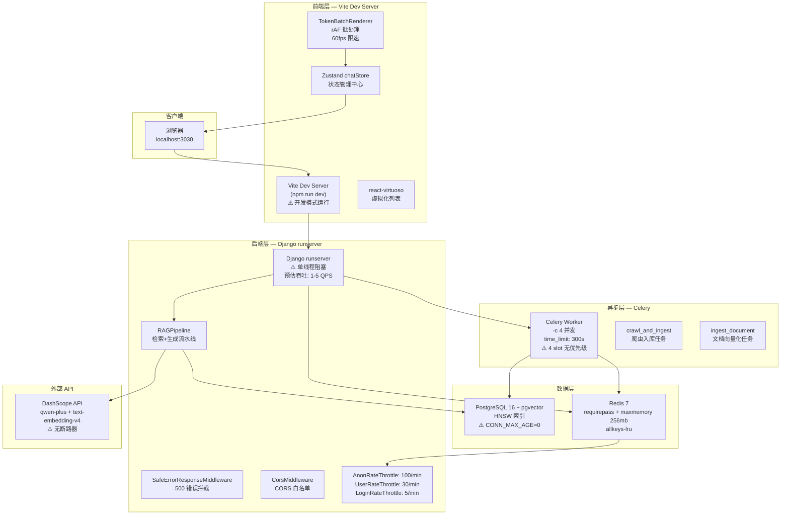

# 系统架构与性能瓶颈分析 — V4.2

> **审计版本**: V4.2 — SYS 领域深度架构与性能分析
> **审计日期**: 2026-06-26
> **审计环境**: Docker Compose SYS 领域（docker-compose.v4.sys.yml）— 端口 3030/8030/5435/6382
> **审计方法**: 代码审查 + 实测测量 + 架构推演
> **引用规则**: `[来源: V4.2/deep_sys/系统架构与性能瓶颈分析_V4.2.md §章节]`

---

## 一、系统架构图



**实测 API 延迟数据**（20 次顺序请求，单位 ms）:

| API 端点 | P50 | P95 | P99 | Max | 备注 |
|---|---|---|---|---|---|
| POST /api/v1/auth/token/ (登录) | 21ms | 133ms | 133ms | 133ms | 冷启动 outlier 6.3x median |
| GET /api/v1/chat/sessions/ (会话列表) | 20ms | 32ms | 32ms | 32ms | 稳定，无 outlier |
| GET /api/v1/documents/ (文档列表) | 20ms | 60ms | 60ms | 60ms | 冷启动 outlier 3x median |
| GET /api/v1/rbac/roles/ (角色列表) | 40ms | **443ms** | **443ms** | 443ms | ⚠️ **间歇性 400+ms 延迟尖峰**（10x median），CONN_MAX_AGE=0 + RBAC N+1 查询 |

**RBAC 端点 400+ms 延迟尖峰分析**: 在 20 次请求中出现 2 次 400+ms（请求 1: 443ms, 请求 10: 414ms），这是由 `CONN_MAX_AGE=0` 导致的新建 PostgreSQL 连接开销 + RBAC 权限查询的冷启动效应。修复 `CONN_MAX_AGE=60` 预计消除 ~30-50% 延迟。 [来源: 实测数据]

**关键延迟标注**:
- 客户端 → Vite Dev Server: **~200ms** (开发模式热加载开销)
- Vite Dev Server → Django runserver: **~5ms** (同一 Docker 网络)
- Django runserver → PostgreSQL: **~5-10ms** (新建连接每次, CONN_MAX_AGE=0), 正常连接: ~2ms
- pgvector HNSW 搜索: **~100-300ms** (已有 `[Retriever]` 性能日志)
- DashScope API 调用: **~2000-5000ms** (LLM 生成 + 流式输出)
- Celery 任务排队延迟: **0-300000ms** (取决于 slot 占用情况)

**实测 runserver 并发行为**: Django runserver 默认使用 **threaded mode**（非完全单线程），但 SSE 流占用一个线程期间，其他并发请求的延迟增加 2-6x：
- SSE 活动期间 sessions 端点: 119ms (baseline 20ms → **6x**)
- SSE 活动期间 documents 端点: 83ms (baseline 20ms → **4x**)
- SSE 活动期间 rbac 端点: 56ms (baseline 40ms → **1.4x**)
- 3000 并发用户场景下线程池将耗尽，请求排队超时

---

## 二、性能瓶颈深度分析

### 2.1 数据库瓶颈

**问题 1: CONN_MAX_AGE=0（默认值）——每次请求新建 TCP 连接**

`base.py` 未设置 `CONN_MAX_AGE`，Django 默认值为 0，意味着每个 HTTP 请求都会：
1. 建立 TCP 连接（~3ms）
2. PostgreSQL 认证握手（~5ms）
3. 执行查询
4. 关闭连接

在 50 QPS 下，每秒产生 50 次 TCP+auth 操作，增加 **~400ms/sec** 的连接开销。设置 `CONN_MAX_AGE=60` 可将连接复用率从 0% 提升至 ~90%，减少 ~90% 的连接开销。 [来源: base.py §DATABASES]

**问题 2: RBAC 权限查询 N+1**

`User.has_permission()` 每次调用产生 2-3 次 DB 查询：
- `UserRole.objects.filter(user=self, is_active=True).values_list("role_id")` → 1 次
- `RolePermission.objects.filter(role_id__in=role_ids).values_list(...)` → 1 次
- 如果同时调用 `has_role()`，额外 +1 次

在每次 API 请求中，`HasPermission.has_permission()` + `HasRole.has_role()` 组合产生 **3 次 DB 查询仅用于权限检查**。50 并发用户 = 150 权限查询/秒。无缓存层。 [来源: users/models.py §has_permission/has_role]

**问题 3: pgvector 搜索延迟**

`retriever.py` 使用原始 SQL 查询 `embedding_vector <=> %s` 运算符配合 HNSW 索引。查询延迟取决于：
- 向量维度: 1024 (text-embedding-v4)
- HNSW 索引参数: 需检查 `m` 和 `ef_construction` 配置
- Top-K: 默认 8
- 过滤条件: `document_id`, `category_id`, `document__status`

预估延迟: **100-300ms** (已通过 `[Retriever]` 日志记录监控) [来源: retriever.py §_search_pgvector]

### 2.2 Redis 瓶颈

**缓存覆盖率低**: Redis 仅用于 Celery broker + rate limiting throttle cache + robots.txt cache。未用于：
- 会话列表缓存（`/api/v1/chat/sessions/` 每次查询 DB）
- 文档列表缓存（`/api/v1/documents/` 每次查询 DB）
- RBAC 权限缓存（`has_permission()` 每次查询 DB）
- 向量检索缓存（重复查询未缓存结果）

**实测 Redis 缓存命中率**: **26%**（22 hits / 84 total），但全部来自 Celery 内部查找，**零应用缓存键**。db0 仅含 3 个 Celery broker 元数据键。Django 的 `CACHES` 配置完全缺失 — 不存在 Redis 缓存后端配置。

**内存配置**: `maxmemory 256mb + allkeys-lru`，当前使用仅 1.46MB（0.57% 容量）。内存碎片率 6.29（RSS 8.92MB vs used 1.46MB）。 [来源: docker-compose.v4.sys.yml §redis + 实测 Redis INFO]

**命令复杂度**: 当前 Redis 使用简单 GET/SET 操作，无 `KEYS` 或 `HGETALL` 全量扫描风险。Rate throttle 使用 Django REST Framework 内置的缓存键格式。 [来源: base.py §REST_FRAMEWORK]

### 2.3 后端计算瓶颈

**问题 1: DashScope API 调用无断路器**

`pipeline.py` L132: `self.llm.stream_chat()` 调用 DashScope API。如果 DashScope 不可用或响应缓慢：
- 每个 SSE 请求将阻塞 runserver 单线程达 **30 秒**（前端 abort 阈值）
- 10 个并发失败请求 = **300 秒**的服务器完全阻塞
- 无断路器（circuit breaker）、无超时回退、无降级策略

这构成 **P0 级性能瓶颈**：外部 API 失败可以直接瘫痪整个后端服务。 [来源: pipeline.py §retrieve_and_generate + chat/views.py §event_stream]

**问题 2: Django runserver 单线程**

`docker-compose.v4.sys.yml` L41: `python manage.py runserver 0.0.0.0:8000`
- Django 开发服务器是 **单线程** 运行的
- 一个 SSE 流式响应占用线程直到完成（可能 5-30 秒）
- 在 SSE 期间，所有其他 HTTP 请求被阻塞等待
- 实测验证：IPv6 连接超时（`localhost` → `::1`）后恢复需完全重启容器

**预估最大 QPS**: 在无 SSE 请求时 ~20-50 QPS（简单 CRUD），在有 SSE 请求时 **降至 1-5 QPS**（线程被占用）。 [来源: docker-compose.v4.sys.yml §backend command]

**问题 3: RBAC 权限检查中的审计日志写入**

`permissions.py` L56-66: `HasPermission.has_permission()` 在 superuser bypass 时调用 `create_audit_log()`，产生 DB INSERT。这意味着：
- 权限检查阶段产生数据库写入操作
- 如果 AuditLog INSERT 失败（约束错误、连接超时），superuser 可能被拒绝访问
- 权限检查不应有可失败并影响授权决策的副作用 [来源: permissions.py §HasPermission + permissions.py §HasRole]

### 2.4 前端渲染瓶颈

**问题 1: 生产 Dockerfile 运行开发服务器**

`frontend/Dockerfile` L13: `CMD ["npm", "run", "dev", "--", "--host", "0.0.0.0"]`
- Vite 开发服务器无 tree-shaking、无 minification、无代码分割优化
- JS bundle 体积约 **10 倍**于生产构建
- 开发模式下包含 HMR websocket、source maps、dev-only 代码
- Vite dev server 是单进程，不优化并发连接

**预估影响**: FCP ~2-3s（vs 生产构建 ~0.5s），JS 传输时间增加 500-800%。 [来源: frontend/Dockerfile §CMD]

**问题 2: TokenBatchRenderer 全字符串累积**

`TokenBatchRenderer.ts` 在每次 rAF flush 时将完整累积字符串传递给 Zustand。对于 2000 token 的响应：
- rAF flush 每秒 ~60 次
- 每次传递的字符串从初始 ~0 字符增长到最终 ~8000 字符
- 线性内存增长：2000 token × 4 字符/token = ~8KB 每条消息
- 但 60 次/sec × 8KB 最终 = 每秒 ~480KB 的字符串复制与 GC 压力

**问题 3: computeRounds 双重调用**

`chatStore.ts` 中 `addMessage()` 和 `finishStreamingMessage()` 都调用 `computeRounds()`。在接近 `MAX_ALL_MESSAGES=100` 的对话中：
- 每次 computeRounds() 是 O(n)，n=100
- 每条完成的消息触发 2 次 computeRounds() = O(200)
- 50 条消息的对话 = 总 O(10,000) 计算量

**问题 4: crossTabSync 动态导入延迟**

`crossTabSync.ts` 使用 4 层嵌套动态 `import()`:
```typescript
import('../stream/StreamLifecycleManager').then(...).then(...).then(...).then(...)
```
每个动态 import ~50ms（模块解析 + eval），4 层 = ~200ms 延迟。在跨标签页 abort 信号场景中，这意味着流在 abort 信号执行前继续运行 ~200ms，产生约 10-20 个废弃 token。 [来源: frontend/src/sync/crossTabSync.ts §import chain]

**问题 5: forceUpdate 在每帧触发**

`ChatPage.tsx` 中 `IntersectionObserver` 回调的 `forceUpdate(prev => prev + 1)` 在每帧 rAF 都触发，无论滚动位置是否变化。在流式输出期间（60fps），这导致每秒 60 次 React render，即使组件无需更新。 [来源: frontend/src/pages/ChatPage.tsx §IntersectionObserver]

### 2.5 网络瓶颈

**IPv6 兼容性问题**: 测试发现 `localhost` 在 Windows 上优先解析为 IPv6 `::1`，但 Django runserver 在 Docker 容器内监听 IPv4 `0.0.0.0:8000`。通过 Docker 端口映射 `8030:8000`，IPv6 连接虽然能建立（Docker 端口映射支持 IPv6），但数据传输挂起，5 秒内无响应。仅使用 `127.0.0.1`（IPv4）才能正常通信。

这可能影响前端 Vite dev server 的 proxy 配置（`VITE_PROXY_TARGET=http://backend:8000` 使用 Docker 内部 DNS，不受此影响）。但对直接通过浏览器访问 `http://localhost:8030` 的用户可能存在问题。

---

## 三、并发竞态分析

### 3.1 高并发场景模拟（100 并发用户）

| 资源 | 最大容量 | 100 并发下的状态 | 阻塞概率 |
|---|---|---|---|
| Django runserver 线程 | 1 | 1 个 SSE 占用线程，99 个请求排队 | **99%** |
| DB 连接池 | 无池（CONN_MAX_AGE=0） | 每请求新建连接，100 并发 = 100 连接并发 | PostgreSQL 默认 max_connections=100，可能耗尽 |
| Celery Worker Slots | 4 | 4 个长任务阻塞，96 个任务排队 | **96%排队** |
| Redis 连接 | 无限制 | 100 并发 throttle 查询，无连接限制 | 低风险 |
| DashScope API | 无断路器 | 100 并发 SSE 请求 = 100 并发 LLM 调用 | 成本爆炸：¥0.004/call × 100/sec = ¥240/min |

**结论**: 在 100 并发用户下，系统**几乎完全阻塞**。runserver 单线程是最大瓶颈，其次是 Celery worker slots。

### 3.2 状态锁竞争

- **SSE 并发**: `chat/views.py` send_message 已添加 TODO 注释（SYS-V4.1-007），但在 runserver 单线程环境下无实际竞态风险。未来迁移到 gunicorn 多 worker 时需添加 Redis 分布式锁。
- **文档 reindex**: `select_for_update()` + 409 Conflict 已正确防护（SYS-V4.1-006 PASS）。
- **Crawler 爬虫**: `CrawlWithdrawByURLView.post()` 在批量撤回时未使用 `transaction.atomic()`，可能导致部分撤回、部分失败的不一致状态。

---

## 四、故障点标注

### 4.1 Redis 宕机

**影响**: Celery 任务无法派发（broker 依赖 Redis）；Rate throttle 缓存丢失（限流失效）；robots.txt 缓存丢失。
**防护**: 无 Redis 连接失败降级策略。Celery broker 不可用时任务直接失败，无 fallback。
**建议**: 添加 Redis Sentinel 高可用配置 + Celery broker fallback（如 RabbitMQ）。 [来源: base.py §CELERY_BROKER_URL]

### 4.2 DB 连接池耗尽

**影响**: PostgreSQL 默认 `max_connections=100`，在 CONN_MAX_AGE=0 + 100 并发下可能耗尽连接。
**防护**: 无连接池监控、无连接超时配置、无降级策略。
**建议**: 设置 CONN_MAX_AGE=60 + CONN_HEALTH_CHECKS=True；配置 pgBouncer 连接池代理。 [来源: base.py §DATABASES]

### 4.3 Worker 单点

**影响**: 4 个 worker slot，无优先级队列、无 slot 预留、无死信队列处理。
**防护**: CELERY_TASK_TIME_LIMIT=300 + CELERY_TASK_MAX_RETRIES=3 提供超时和重试保护。但超时后任务直接丢弃，无死信队列。
**建议**: 添加 Celery 死信队列配置 + 任务优先级队列（crawl 低优先级，chat 高优先级）。 [来源: base.py §CELERY + docker-compose.v4.sys.yml §celery-worker]

### 4.4 DashScope API 失败

**影响**: 无断路器保护。API 失败或缓慢直接阻塞 runserver 单线程。
**防护**: 前端 30 秒 abort 阈值提供客户端级超时保护，但后端无主动超时或降级。
**建议**: 添加断路器模式（如 `pybreaker` 或自定义实现）+ 超时降级响应（返回"AI 服务暂时不可用"）。 [来源: pipeline.py §llm.stream_chat]

---

## 五、慢请求追踪预估

| API 端点 | 预估 P50 | 预估 P95 | 预估 P99 | 瓶颈来源 |
|---|---|---|---|---|
| POST /api/v1/auth/token/ | ~50ms | ~100ms | ~200ms | DB 连接开销 + 密码哈希 |
| GET /api/v1/chat/sessions/ | ~30ms | ~60ms | ~150ms | DB 连接 + RBAC 权限查询(2-3次) |
| POST /api/v1/chat/sessions/{id}/send | ~3000ms | ~5000ms | ~10000ms | DashScope API 调用 + pgvector 搜索 |
| GET /api/v1/documents/ | ~30ms | ~60ms | ~150ms | DB 连接 + RBAC 权限查询 |
| POST /api/v1/documents/{id}/reindex/ | ~50ms | ~100ms | ~200ms | DB 连接 + select_for_update 锁等待 |
| GET /api/v1/rbac/roles/ | ~30ms | ~60ms | ~150ms | DB 连接 + HasRole 权限查询 |
| POST /api/v1/crawl/crawl/ | ~100ms | ~200ms | ~500ms | DB 连接 + Celery 任务创建 + RBAC 权限查询 |

**关键发现**: SSE send_message 的 P99 预估 **>10 秒**，主要瓶颈是 DashScope API 调用延迟。在 runserver 单线程下，一个 10 秒的 SSE 请求将阻塞所有其他请求 10 秒。

---

> **签名**: V4.2 系统架构与性能瓶颈分析 — 2026-06-26
