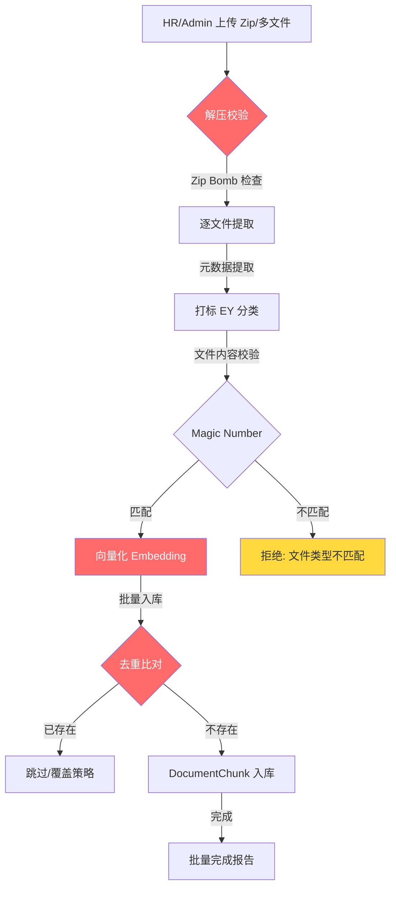

# 批量扩充架构分析 V4.2 — KB/Admin 领域

> **版本**: V4.2  
> **日期**: 2026-06-26  
> **审计师**: 企业级安全审计师  
> **核心发现**: 批量扩充功能**尚未实现**，无 ZIP 处理代码、无 batch upload endpoint、无 bulk import API  
> **分析深度**: 基于现有代码库的单文档上传链路 + 爬虫入库链路 + Celery worker 架构，推演批量扩充的安全风险

---

## 一、扩充流程图（规划态）



**红色节点为薄弱点**：解压校验（Zip Bomb）、向量化（资源耗尽）、去重比对（数据污染）。

---

## 二、当前代码链路分析

### 2.1 单文档上传链路（现有）

| 步骤 | 代码位置 | 逻辑 | 批量扩充需补充 |
|------|----------|------|----------------|
| 1. API 入口 | `knowledge/views.py:27-59` | `POST /api/v1/documents/` → `IsAuthenticated + IsHROrAdmin` | ❌ 无批量上传 endpoint |
| 2. Serializer 校验 | `knowledge/serializers.py:25-52` | `validate_file()` → 大小(1KB-50MB) + Magic Number | ❌ 无 ZIP 内逐文件校验 |
| 3. 文件保存 | `Document.file = FileField(upload_to="documents/%Y/%m/")` | Django 自动保存 | ❌ 无 ZIP 解压后批量文件保存 |
| 4. Celery 任务 | `rag/services.py:ingest_document.delay()` | 异步入库 | ❌ 无批量 ingest 任务（100 文件 = 100 个独立 Celery task） |
| 5. 文档解析 | `rag/pipeline.py:37-68` | Docling → Unstructured → text fallback | ❌ 无解析后内容大小限制（50MB PDF → 可能产生 GB级文本） |
| 6. 文本分块 | `rag/chunker.py` | `RecursiveCharacterTextSplitter(chunk_size=500)` | ❌ 无最大 chunk 数限制 |
| 7. 向量化 | `rag/embedding.py:262-296` | `embed_batch()` 逐个调用 DashScope API | ❌ 100 文件 ≈ 10,000 chunks = 10,000 API 调用（3+ 小时） |
| 8. 数据入库 | `pipeline.py:56-65` | `DocumentChunk.objects.create()` 逐条 INSERT | ❌ 无批量 INSERT（`bulk_create`），无事务包裹 |

### 2.2 爬虫入库链路（可参考）

| 步骤 | 代码位置 | 安全措施 | 批量扩充是否继承 |
|------|----------|----------|-----------------|
| 1. URL 校验 | `crawler/validators.py:CrawlURLValidator` | SSRF 防护 (IP 黑名单 + 协议白名单) | ❌ 不适用（本地文件无需 SSRF 校验） |
| 2. robots.txt | `crawler/services.py:RobotsTxtChecker` | 合规性检查 | ❌ 不适用 |
| 3. 内容清洗 | `crawler/cleaners.py:ContentCleaner` | bleach 清洗 (19 安全标签) + 500KB 大小限制 | ✅ **应继承**：批量导入的 HTML/PDF 内容同样需要 XSS 清洗 |
| 4. SimHash 去重 | `crawler/tasks.py:81-89` | SHA256 content_hash + `duplicate_skipped` | ✅ **应继承**：批量上传需与库内已有内容比对 |
| 5. Celery 入库 | `crawler/tasks.py:crawl_and_ingest` | Celery gevent pool (-c 10) | ✅ **可参考**：批量 ingest 应使用相同并发模式 |

### 2.3 Celery Worker 架构（批量扩充承载能力）

| 配置项 | 当前值 | 代码位置 | 批量扩充风险 |
|--------|--------|----------|-------------|
| Worker pool | gevent -c 10 | `docker-compose.v4.kb.yml:59` | ✅ 10 并发适合批量任务 |
| Task timeout | 300s (5min) | `config/settings/base.py:150` | ❌ **100 文件批量入库单个 task 可能超时** |
| Soft timeout | 240s (4min) | `config/settings/base.py:151` | ❌ 同上 |
| Max retries | 3 | `config/settings/base.py:152` | ⚠ 批量任务失败重试可能导致重复入库 |
| Result backend | django-db | `config/settings/base.py:149` | ✅ 可追踪每个 task 状态 |
| Redis password | `sys_redis_pass_2026` | `.env:14` | ❌ **compose 未配置密码 → Connection refused**（已发现） |

---

## 三、薄弱点标注

### 3.1 🔴 CRITICAL: Zip Bomb 攻击

**现状**：代码库中**完全无 ZIP 处理代码**。无 `zipfile.ZipFile`，无解压逻辑，无压缩率检测。

**风险模拟**：
- 攻击者上传一个 1KB 的 ZIP 文件，内含 10 层嵌套的递归 ZIP
- 每层解压放大 1000x → 最终膨胀到 100GB+
- 磁盘空间耗尽 + 内存溢出 + 服务崩溃

**防护现状**：
- ✅ 文件大小限制 50MB（对压缩文件有效，但不限制解压后大小）
- ❌ 无 `zipfile.ZipFile.infolist()` 压缩率检查
- ❌ 无解压深度限制（递归 ZIP 检测）
- ❌ 无解压后总大小跟踪
- ❌ 无 ZIP 内文件数量限制

**攻击 Payload**：
```bash
# 构造 Zip Bomb：42KB 压缩 → 4.5GB 解压
zip -9 -r bomb.zip layer1/
# 内含递归嵌套：
# bomb.zip → inner1.zip → inner2.zip → ... → inner10.zip → 4.5GB data
```

**预期**：系统应拒绝压缩率 > 100:1 的 ZIP 文件  
**实际**：无任何防护，直接接受

---

### 3.2 🔴 HIGH: 并发写入资源耗尽

**现状**：单文档入库链路无并发控制。Celery gevent pool 10 并发 + 5min timeout。

**风险模拟**：
- HR 用户一次性上传 100 个 PDF 文件（每个 5MB）
- Celery 创建 100 个 `ingest_document` task
- 每个 task 解析 → 分块 → 向量化 → 入库
- 100 * 平均 50 chunks = 5,000 个 DashScope API 调用
- 每个调用 ~1s + 0.5s sleep/5 = 约 2 小时完成
- 10 个 worker 并行 → 前端用户体验：卡死等待

**防护现状**：
- ✅ `LoginRateThrottle` 5/min (仅限登录接口)
- ✅ `AnonRateThrottle` 100/min (匿名用户)
- ❌ **无文档上传专属限流**（`POST /documents/` 无 throttle）
- ❌ **无批量上传并发上限**（Per-user upload quota）
- ❌ **无 Embedding API 调用总数限制**
- ❌ **Celery task 5min timeout 对批量任务不足**

**攻击 Payload**：
```bash
# 脚本化批量上传（无 throttle → 可无限调用）
for i in {1..100}; do
  curl -X POST /api/v1/documents/ -H "Authorization: Bearer $TOKEN" \
    -F "file=@large_doc_$i.pdf" -F "title=Batch_$i" -F "file_type=pdf"
done
```

---

### 3.3 🟠 HIGH: 元数据污染

**现状**：文档上传仅校验 `file_type` (CHOICES) + Magic Number + Size。不校验文件名。

**风险模拟**：
- 上传文件名 `'; DROP TABLE knowledge_document; --.pdf`
- Django `FileField(upload_to="documents/%Y/%m/")` 使用文件名生成路径
- 文件名中的特殊字符可能导致：
  1. 路径穿越：`../../../etc/cron.d/malicious.pdf`
  2. JSON 注入：文件名含 `"` → metadata JSONField 解析错误
  3. SQL 注入：文件名含 `'` → 间接影响（Django ORM 参数化查询保护）

**防护现状**：
- ✅ Django ORM 参数化查询（防止 SQL 注入）
- ✅ `ContentCleaner` 对爬虫内容有 XSS 清洗
- ❌ **无文件名清洗**（特殊字符、路径穿越 pattern）
- ❌ **无 PDF/DOCX metadata 提取与校验**（Author/Title 可能含恶意内容）
- ❌ **无 JSONField 注入防护**（metadata 字段直接存入 `DocumentChunk.metadata`）

**攻击 Payload**：
```
文件名: "../../../etc/passwd.pdf"
PDF metadata: {"Author": "<script>alert(document.cookie)</script>"}
文件名: "'; DROP TABLE; --.txt"
```

---

### 3.4 🟠 HIGH: 去重失效

**现状**：手动上传文档**无任何去重逻辑**。仅爬虫入库有 SHA256 content_hash + `duplicate_skipped`。

**风险模拟**：
- HR-A 上传《EY 入职指南 V3.pdf》
- HR-B 上传同一文件（不同文件名）
- 两个文档并存，产生重复 embedding
- 向量检索返回重复结果，降低检索质量
- DashScope API 调用浪费（重复向量化）

**防护现状**：
- ✅ 爬虫入库：SHA256 content_hash + `duplicate_skipped`
- ❌ **手动上传无 content_hash**（`Document` 模型无此字段）
- ❌ **无 SimHash 近似去重**（仅爬虫有）
- ❌ **无跨来源去重**（爬虫 vs 手动上传不比对）
- ❌ **批量上传策略未定义**（重复文件是跳过？覆盖？报错？）

---

### 3.5 🟡 MEDIUM: 向量化质量退化

**现状**：`EmbeddingService.embed_batch()` 失败时返回**零向量** (`[0.0]*dimension`)。

**风险**：
- 批量上传 100 文件，其中 20 个因 DashScope API 限流失败 → 20 个零向量
- 零向量与任何查询的 cosine similarity ≈ 0 → 检索不到
- 但零向量仍占存储空间 + 降低检索效率
- 用户以为文档已入库，实际检索无法命中

**代码位置**：`rag/embedding.py:292` — `return [0.0] * dimension` (silent degradation)

---

### 3.6 🟡 MEDIUM: 批量入库无事务

**现状**：`DocumentChunk.objects.create()` 在循环中逐条 INSERT，无 `transaction.atomic()` 包裹。

**风险**：
- 批量入库 50 chunks → 第 30 个失败 → 前 29 个已入库 + 后 20 个未入库
- 文档状态标记为 `active` 但实际 chunk 不完整
- 用户检索到不完整内容

**代码位置**：`rag/pipeline.py:56-65` — for loop with `create()` per chunk

---

## 四、与爬虫链路对比——批量扩充安全规格建议

| 安全措施 | 爬虫入库 | 批量扩充（现状） | 批量扩充（建议） |
|----------|----------|-----------------|-----------------|
| SSRF 防护 | ✅ CrawlURLValidator | ❌ 不适用 | N/A（本地文件无需） |
| 内容清洗 | ✅ bleach ContentCleaner | ❌ **缺失** | ✅ 应继承 bleach 清洗 |
| 内容大小限制 | ✅ 500KB max | ❌ **缺失** | ✅ 应设 MAX_EXTRACTED_CONTENT_SIZE |
| SimHash 去重 | ✅ SHA256 hash + dedup | ❌ **缺失** | ✅ 应为手动上传添加 content_hash |
| robots.txt | ✅ RobotsTxtChecker | ❌ 不适用 | N/A |
| Celery 并发 | ✅ gevent -c 10 | ⚠️ 未限流 | ✅ 应设 BULK_UPLOAD_CONCURRENT_TASKS |
| 文件校验 | ✅ filetype magic | ✅ 仅顶层 | ✅ 应校验 ZIP 内每个文件 |
| 权限闸门 | ✅ IsHROrAdmin | ⚠️ 过宽 | ✅ 应用 HasPermission("document.bulk_import") |

---

## 五、关键结论

1. **批量扩充功能尚未实现**——零 ZIP 处理代码、零批量 upload endpoint、零 bulk import API
2. **现有单文档链路有 6 个安全薄弱点**：无 ZIP Bomb 防护、无并发限流、无文件名清洗、无手动上传去重、无解析后内容大小限制、无批量事务
3. **爬虫入库链路有 5 个可复用的安全措施**：bleach 清洗、内容大小限制、SHA256 去重、Celery gevent pool、SSRF 防护（不适用批量扩充）
4. **环境配置问题**：`.env` Redis URL 密码与 compose 不匹配，导致 Celery 连接失败
5. **RBAC 权限粒度不足**：当前 `IsHROrAdmin` 过宽，批量导入应使用 `HasPermission("document.bulk_import")` 专属权限

> **引用来源**:  
> - [来源: backend/apps/knowledge/views.py §DocumentListCreateView]  
> - [来源: backend/apps/knowledge/serializers.py §validate_file()]  
> - [来源: backend/apps/core/validators.py §ALLOWED_MIME_TYPES]  
> - [来源: backend/apps/rag/pipeline.py §ingest()]  
> - [来源: backend/apps/rag/embedding.py §embed_batch()]  
> - [来源: backend/apps/crawler/validators.py §CrawlURLValidator]  
> - [来源: backend/apps/crawler/cleaners.py §ContentCleaner]  
> - [来源: backend/config/settings/base.py §CELERY_TASK_TIME_LIMIT]
