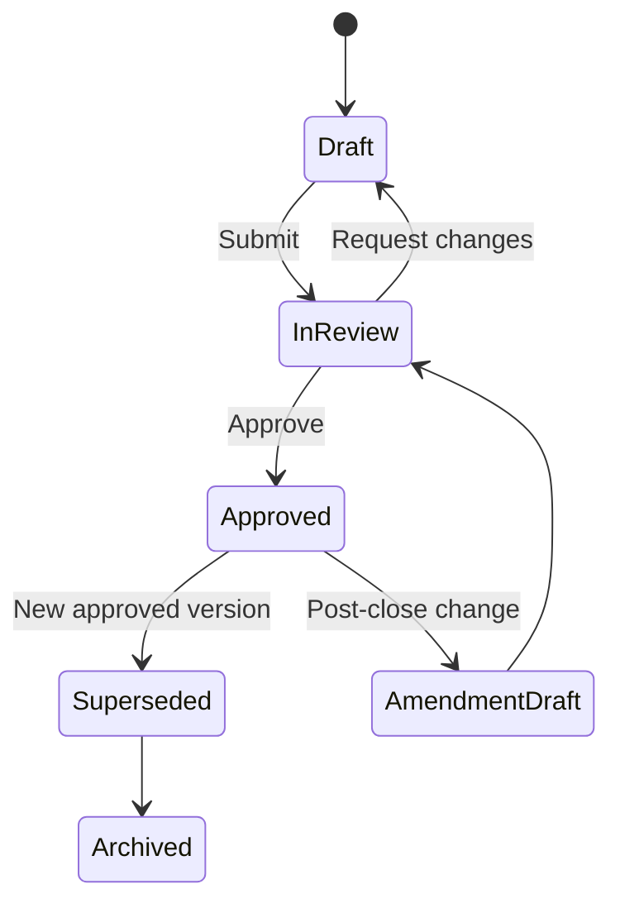
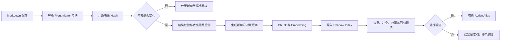

# 四大事务所项目组级知识库模板与索引系统 SPEC

> 文件建议：`specs/project-team-knowledge-template-index.md`  
> 文档版本：v1.0  
> 状态：Product / UX / Engineering Draft  
> 重点业务线：Audit / Assurance 审计与鉴证  
> 兼容业务线：Tax、Deals / Strategy & Transactions、Consulting / Risk Advisory  
> 产品形态：内置 Obsidian 式 Markdown 工作区、图谱与 AI Chat 的企业 Web 应用

---

## 1. 文档目标

本 SPEC 只处理“项目组级别”的知识库，不讨论事务所全局知识库的完整治理体系。

系统需要解决五个核心问题：

1. 用户注册并选择业务线后，如何获得不同的项目创建模板；
2. 审计项目中，如何按财年、审计阶段、会计科目、流程、风险和责任人组织知识；
3. 审计员如何只维护自己负责的科目 Markdown，同时经理和合伙人可以复核、批准和追踪；
4. 项目持续更新时，如何增量建立索引，而不是把所有文件反复重新向量化；
5. AI 如何只引用正确项目、正确财年、正确状态和正确权限下的证据，避免旧内容、草稿和冲突内容增加幻觉。

本设计的核心判断是：

> **用户界面可以以“科目入口”为中心，但系统底层必须以“有版本、有作用域、有状态、有责任人、有有效期的知识对象”为中心。**

---

## 2. 范围与非目标

### 2.1 本期范围

- 业务线驱动的项目模板；
- 项目创建向导；
- 审计项目空间；
- 科目负责人和复核人分配；
- 财年和阶段管理；
- Markdown 编辑、版本、审核、水印；
- 项目级混合索引；
- 财年滚转和 Fork；
- 项目知识图谱、时间轴和健康度；
- AI 检索、引用和拒答策略；
- Tax、Deals、Consulting 的模板骨架。

### 2.2 非目标

- 替代正式审计底稿系统；
- 自动作出审计意见或法律结论；
- 允许未经审批的知识自动成为事务所级方法论；
- 将所有历史项目数据默认开放给跨项目搜索；
- 仅靠向量相似度决定答案。

---

## 3. 核心产品原则

1. **项目边界优先**：先确定组织、业务线、客户、项目、实体、财年，再做语义检索。
2. **责任到人**：每一个关键科目或工作流必须存在 Owner 和 Reviewer。
3. **版本不可覆盖**：每次发布生成不可变版本，禁止直接覆盖历史批准版本。
4. **草稿与已批准内容分离索引**：草稿不能默认参与正式 AI 回答。
5. **财年是索引边界**：FY26 与 FY27 不能只靠文件夹区分。
6. **更新是增量事件**：只重新索引发生变化的知识对象和受影响关系。
7. **水印不污染正文**：更新人、审核人、水印保存在元数据和审计记录中。
8. **回答必须可证明**：没有满足门槛的证据包时，AI 应拒答或要求用户缩小范围。
9. **继承优于复制**：新财年默认引用上一年批准内容，通过确认或 Fork 形成当年版本。
10. **同一事实只有一个当前权威版本**：其他版本必须标记为历史、草稿、冲突或已替代。

---

## 4. 业务线驱动的模板选择

### 4.1 用户注册字段

用户注册或首次加入组织时，建议收集：

```yaml
business_line: audit | tax | deals | consulting
sub_service_line: string
region: string
jurisdiction: string
industry_focus: [string]
grade: associate | senior | manager | director | partner | specialist
languages: [string]
professional_certifications: [string]
```

`business_line` 用于提供默认模板，但不能锁死用户。一个用户可同时属于多个业务线或被邀请进入其他业务线项目。

### 4.2 模板解析顺序

```text
事务所基础模板
  + 业务线模板
  + 子业务线模板
  + 行业模板
  + 地区 / 法规模板
  + 项目类型模板
  + 项目本地配置
```

后层只能覆盖被允许覆盖的字段。强制方法论、监管规则和安全规则不能被项目本地模板关闭。


### 4.3 Template Manifest

每个模板应包含一个结构化清单：

```yaml
template_id: audit_statutory_standard
business_line: audit
engagement_type: statutory_audit
version: 3.2.0
required_dimensions:
  - fiscal_year
  - audit_phase
  - entity
  - account_or_workstream
required_roles:
  - engagement_partner
  - engagement_manager
  - knowledge_admin
default_views:
  - account_matrix
  - timeline
  - knowledge_graph
  - health_dashboard
index_policy: audit_project_v2
rollforward_policy: audit_fy_rollforward_v2
approval_policy: audit_two_level_review
```

---

## 5. 通用项目知识空间模型

所有业务线共享以下顶层实体：

```text
Organization
└── Business Line
    └── Client
        └── Engagement / Project
            ├── Project Profile
            ├── Project Members
            ├── Period / Fiscal Year
            ├── Workstreams
            ├── Knowledge Objects
            ├── Issues & Decisions
            ├── Deliverables
            ├── Timeline
            ├── Graph
            └── Index Versions
```

### 5.1 Project Profile 必填字段

```yaml
project_id: uuid
project_name: string
business_line: audit | tax | deals | consulting
engagement_type: string
client_id: uuid
client_name: string
entities: [uuid]
industry: string
jurisdiction: [string]
period_start: date
period_end: date
fiscal_year: FY26
status: setup | active | closing | archived
confidentiality_level: normal | restricted | highly_restricted
template_id: string
template_version: string
```

### 5.2 项目公共导航

```text
项目首页
├── 项目概况
├── 我的任务
├── 工作流 / 科目
├── 风险与问题
├── 决策与结论
├── 交付物
├── 项目时间轴
├── 知识图谱
├── 知识健康度
├── 更新中心
└── 设置与权限
```

---

# Part A：审计项目组知识库设计

## 6. 审计项目创建向导

创建审计项目时建议分 6 步：

### Step 1：项目基本信息

- 客户；
- 集团 / 单体；
- 主体列表；
- 项目类型：法定审计、集团审计、专项审计、审阅、其他鉴证；
- 财务报告框架：IFRS、US GAAP、本地准则等；
- 审计准则与事务所方法论版本；
- 行业；
- 主要地区；
- 项目开始和结束日期。

### Step 2：财年和阶段

- 当前财年，例如 FY26；
- 比较期，例如 FY25；
- 阶段启用：Planning、Interim、Year-end、Completion；
- 是否存在多报告期或短会计期间；
- 是否从上一财年滚转。

### Step 3：科目与流程范围

系统从标准科目库生成候选列表，项目经理可以：

- 启用或停用科目；
- 合并或拆分科目；
- 新建行业专属科目；
- 为科目绑定业务流程；
- 标记重大科目；
- 标记显著风险和舞弊风险；
- 绑定涉及的主体和系统。

### Step 4：责任分配

每个科目至少分配：

- `Owner`：主要更新人；
- `Backup Owner`：备份更新人；
- `Reviewer`：一审；
- `Approver`：必要时二审或经理批准；
- `Specialist`：税务、IT、估值、精算等专家。

支持按职级批量分配，也支持 RACI。

### Step 5：模板预览

展示即将创建的：

- 科目入口；
- 财年目录；
- 审计阶段；
- 必填页面；
- 默认权限；
- 更新和复核周期；
- 索引策略。

### Step 6：创建与初始化

创建后执行：

1. 固化模板版本；
2. 创建 FY 工作区；
3. 创建科目主页和初始 Markdown；
4. 建立 Owner / Reviewer 权限；
5. 建立空索引版本；
6. 如选择滚转，则引入上一年已批准版本的只读引用；
7. 生成项目健康度基线。

---

## 7. 审计项目首页

项目首页不应只是文件列表，建议包含：

### 7.1 顶部上下文栏

```text
客户：ABC Group
项目：FY26 Statutory Audit
主体：Consolidated
阶段：Interim
当前知识模式：Approved Only
索引版本：audit-abc-fy26-v18
```

所有 Chat、搜索和图谱默认继承该上下文。

### 7.2 我的责任区

展示当前用户：

- 负责科目；
- 待更新页面；
- 待回应评论；
- 待复核变更；
- 即将过期知识；
- 上一财年尚未确认滚转内容。

### 7.3 科目覆盖矩阵

| 科目 | Owner | Reviewer | 风险等级 | 当前阶段 | 状态 | 最后更新 | 健康度 |
|---|---|---|---:|---|---|---|---:|
| Revenue | Senior A | Manager B | High | Interim | Review | 2 天前 | 84 |
| Cash | Associate C | Senior D | Medium | Interim | Approved | 6 天前 | 91 |
| PPE | Senior E | Manager B | Medium | Planning | Stale | 65 天前 | 58 |

### 7.4 项目级警报

- 重大科目没有 Owner；
- 高风险科目没有已批准结论；
- 当前财年仍引用未确认的上一年内容；
- 存在互相冲突的批准知识；
- 新版本索引尚未通过验证；
- AI 最近多次因证据不足拒答。

---

## 8. 审计科目入口设计

### 8.1 一级入口建议

项目左侧导航将“科目”作为核心入口：

```text
财务报表科目
├── Cash and Cash Equivalents
├── Revenue
├── Trade Receivables
├── Inventory
├── Property, Plant and Equipment
├── Intangible Assets
├── Investments
├── Borrowings
├── Trade Payables
├── Payroll
├── Taxation
├── Equity
├── Provisions
├── Related Parties
├── Consolidation
└── Financial Statement Disclosures
```

同时保留横向入口：

- 业务流程；
- 风险；
- 认定；
- 审计阶段；
- 主体；
- 系统；
- 未解决问题。

科目入口是浏览方式，不是唯一存储路径。

### 8.2 科目卡片

每个科目卡片展示：

```yaml
account_name: Revenue
account_code: REV
materiality: 12000000
risk_level: high
significant_account: true
fraud_risk: true
owner: user_123
reviewer: user_456
current_phase: interim
knowledge_status: in_review
last_approved_at: 2026-07-18
open_issues: 3
health_score: 84
```

### 8.3 科目页面标签

建议页面结构：

1. **Overview**：范围、余额、变动、主体、系统；
2. **Accounting**：会计政策和适用准则；
3. **Process**：流程叙述和流程图；
4. **Risks & Assertions**：风险、舞弊风险、认定；
5. **Controls**：关键控制、控制负责人、频率；
6. **Audit Approach**：总体审计应对；
7. **Procedures**：Planning / Interim / Year-end / Completion；
8. **Evidence**：证据入口和来源；
9. **Issues**：发现、差异、管理层解释；
10. **Conclusion**：当前结论和复核状态；
11. **Prior Year**：上一财年批准版本对比；
12. **Timeline**：全部变更；
13. **Graph**：关联科目、流程、风险、控制和问题。

### 8.4 “一个科目一个 MD”与原子化知识对象

为了符合审计员只维护自己科目 Markdown 的工作习惯，前端可以呈现一个主文件：

```text
/FY26/accounts/revenue/README.md
```

但系统不应把整份文件作为一个不可分割对象。保存时应按标题块拆成稳定知识块：

```text
Revenue Account Home
├── block: overview
├── block: accounting_policy
├── block: process_narrative
├── block: risks
├── block: controls
├── block: audit_approach
├── block: procedures_interim
├── block: procedures_year_end
├── block: issues
└── block: conclusion
```

这样既保留 Markdown 体验，也能做到：

- 不同章节独立复核；
- 只重建变化章节的索引；
- AI 不会把无关章节全部塞入上下文；
- 结论可以只引用已批准块；
- 同一文件中的草稿块和已批准块可以分离。

---

## 9. 审计科目 Markdown 模板

建议科目主页使用 Front Matter：

```markdown
---
object_type: audit_account
project_id: prj_abc_fy26
fiscal_year: FY26
entity_scope:
  - consolidated
account_code: REV
account_name: Revenue
business_processes:
  - order_to_cash
assertions:
  - occurrence
  - cutoff
  - accuracy
risk_level: high
significant_account: true
fraud_risk: true
owner_id: usr_a
reviewer_id: usr_b
status: in_review
valid_from: 2026-01-01
valid_to: 2026-12-31
prior_year_object_id: ko_rev_fy25_v12
template_version: audit_account_3.1
---

# Revenue

## Scope and current-year changes

<!-- block:type=overview; owner=usr_a; review_required=true -->

## Accounting policy

<!-- block:type=accounting_policy; authority=project_approved -->

## Process and systems

<!-- block:type=process_narrative -->

## Risks and assertions

<!-- block:type=risk_assessment -->

## Key controls

<!-- block:type=control_summary -->

## Audit approach

<!-- block:type=audit_approach -->

## Interim procedures and results

<!-- block:type=procedure_result; phase=interim -->

## Year-end procedures and results

<!-- block:type=procedure_result; phase=year_end -->

## Issues and findings

<!-- block:type=issue_summary -->

## Conclusion

<!-- block:type=conclusion; approval_required=manager -->
```

### 9.1 必填校验

高风险或重大科目在进入 Approved 前必须满足：

- Owner 和 Reviewer 已分配；
- 风险和认定不为空；
- 审计应对不为空；
- 关键结论存在；
- 结论关联至少一个证据或正式底稿链接；
- 所有未解决冲突已关闭或获批例外；
- 财年和主体范围明确；
- 复核人不是最后一次实质修改人，除非被授权例外。

---

## 10. 财年、阶段和滚转机制

### 10.1 财年作为三重边界

`FY26` 同时是：

- 用户工作上下文；
- 检索过滤条件；
- 已批准知识快照边界。

### 10.2 阶段状态

```text
Planning → Interim → Year-end → Completion → Archived
```

科目可以处于不同阶段，但项目有一个当前默认阶段。

### 10.3 新财年创建

创建 FY27 时不要复制整个 FY26 文件树。推荐生成继承关系：

```text
FY27 Revenue Draft
  inherits_from → FY26 Revenue Approved v12
```

用户看到上一年内容，但每个块具有滚转状态：

- `Unreviewed Carry-forward`：尚未确认；
- `Confirmed No Change`：确认无变化；
- `Updated`：当年已修改；
- `Not Applicable`：当年不适用；
- `Replaced`：被新对象替代。

### 10.4 Fork 规则

以下情况自动或手动 Fork：

- 当前财年内容需要修改；
- 项目需要偏离业务线模板；
- 集团项目下某组成部分需要本地化；
- 方法论更新后，项目需保留旧版本并注明原因；
- 某段内容需要独立审批。

Fork 后保留：

```yaml
forked_from_object_id: string
forked_from_version: string
fork_reason: string
forked_by: user_id
forked_at: datetime
```

### 10.5 冻结

完成阶段后：

- 当前财年 Approved Index 冻结；
- 只允许受控后续事件修改；
- 修改产生 Amendment 版本；
- 不覆盖原完成日快照；
- AI 默认优先引用完成日快照，除非用户明确选择后续事件视图。

---

## 11. 更新人水印与责任归属

### 11.1 不要把水印直接写进正文

正文中反复出现“由张三更新”会：

- 污染 Embedding；
- 增加无意义 Token；
- 影响复制和导出；
- 使 AI 将人员信息误认为专业结论的一部分。

### 11.2 三层归属机制

**第一层：页面可见信息**

```text
当前版本：v18
Owner：张三
最后实质更新：张三，2026-07-24 18:32
Reviewer：李四
批准状态：In Review
```

**第二层：块级归属**

每个章节记录：

```yaml
created_by: user_id
last_content_editor: user_id
last_metadata_editor: user_id
reviewed_by: user_id
approved_by: user_id
change_reason: string
```

**第三层：不可篡改审计日志**

记录：

- 原始内容哈希；
- 新内容哈希；
- Diff；
- 时间；
- 用户；
- IP / Session；
- 操作类型；
- 审批动作；
- 索引版本；
- 导出记录。

### 11.3 导出水印

导出 PDF / Word 时可配置：

```text
CONFIDENTIAL — ABC Group FY26 Audit
Exported by Zhang San on 2026-07-26
Knowledge snapshot: audit-abc-fy26-v18
```

水印只存在于导出渲染层，不进入知识正文和索引正文。

---

## 12. 编辑、复核和发布状态机



### 12.1 状态定义

| 状态 | 是否允许编辑 | 默认进入正式索引 | AI 默认引用 |
|---|---:|---:|---:|
| Draft | 是 | 否 | 否 |
| In Review | 受限 | 否 | 否 |
| Approved | 否，需新版本 | 是 | 是 |
| Superseded | 否 | 历史索引 | 仅时间查询 |
| Archived | 否 | 冷索引 | 否 |
| Amendment Draft | 是 | 否 | 否 |

### 12.2 双索引模式

项目至少维持两个逻辑索引：

```text
project_fy_approved
project_fy_working
```

- `Approved` 模式：只检索已批准知识；
- `Working` 模式：允许检索草稿和复核中知识，但必须明显标注状态；
- 普通用户默认 `Approved`；
- 项目成员在编辑场景可选择 `Working`；
- 对外导出或正式结论禁止使用 Working 模式。

---

# Part B：项目级索引系统

## 13. 为什么持续更新会增加幻觉

持续更新本身不会必然增加幻觉，错误的索引方式才会增加幻觉。常见原因包括：

1. 新旧版本同时留在同一个向量库；
2. 草稿、评论、导航、水印和已批准结论混在一起；
3. FY25、FY26、FY27 没有检索隔离；
4. 同一科目不同主体的内容被合并；
5. 删除内容只从数据库删除，但向量索引仍残留；
6. 整个 Markdown 每次重新切块，导致 Chunk ID 全部变化；
7. 只按相似度排序，没有考虑权限、权威性、状态和有效期；
8. 多份文档表达冲突时，模型仍被要求给出唯一答案；
9. 检索返回过多相似但重复的段落；
10. 回答没有证据门槛。

因此系统目标不是“更多向量”，而是“更少、更准、可追溯的当前证据”。

---

## 14. 知识对象与索引单元

### 14.1 Knowledge Object

最小治理对象建议为知识块，而不是文件：

```yaml
knowledge_object_id: uuid
project_id: uuid
business_line: audit
fiscal_year: FY26
entity_id: consolidated
account_code: REV
object_type: risk_assessment
phase: interim
status: approved
version: 8
source_file_id: file_rev_readme
source_block_id: risks_and_assertions
content_hash: sha256
valid_from: date
valid_to: date | null
supersedes_id: uuid | null
owner_id: uuid
reviewer_id: uuid
approved_by: uuid | null
approved_at: datetime | null
security_scope: project
```

### 14.2 稳定 Chunk ID

```text
chunk_id = hash(project_id + fiscal_year + source_file_id + source_block_id + semantic_segment_no)
```

只有发生变化的块重新切分和重新 Embedding。未变化块保留原 Chunk ID。

### 14.3 删除和替代

删除不能只做物理删除。必须写 Tombstone：

```yaml
chunk_id: string
status: deleted
invalidated_at: datetime
invalidated_by: user_id
replacement_chunk_id: string | null
```

索引发布时主动删除或屏蔽旧向量，避免“幽灵内容”。

---

## 15. 索引分区设计

### 15.1 逻辑分区

推荐以以下字段建立强过滤：

```text
organization_id
business_line
client_id
project_id
fiscal_year
entity_id
knowledge_status
security_scope
```

不要为每个科目建立独立物理向量库。科目、流程、风险等采用元数据过滤和倒排索引，避免索引数量爆炸。

### 15.2 索引类型

项目级检索不是单一 pgvector 查询，应包含：

1. **Metadata Index**：项目、财年、科目、主体、阶段、状态、权限；
2. **Lexical Index**：BM25 / PostgreSQL FTS，适合准则编号、控制编号、专有名词；
3. **Vector Index**：语义检索；
4. **Graph Index**：科目—流程—风险—控制—程序—证据—结论关系；
5. **Temporal Index**：有效期、更新时间、财年、完成日；
6. **Authority Index**：监管、事务所方法论、项目批准、项目草稿的权威等级；
7. **Audit Index**：来源、版本、审批人、内容哈希和索引版本。

### 15.3 Approved 与 Working 分离

物理实现可选：

**方案 A：同表不同状态过滤**

适合 MVP，但必须保证过滤条件无法被绕过。

**方案 B：独立命名空间 / Collection**

```text
org_x/project_y/fy26/approved
org_x/project_y/fy26/working
```

安全性和回滚更清晰，推荐生产环境采用。

---

## 16. 增量索引流水线



### 16.1 保存不等于发布

- `Save`：保存草稿版本；
- `Submit`：提交复核；
- `Approve`：批准内容；
- `Publish Index`：将批准内容写入候选索引；
- `Activate`：验证后切换为正式检索版本。

### 16.2 索引事件

```yaml
IndexRequested:
  knowledge_object_id: uuid
  version: integer
  target_namespace: working | approved
  reason: content_changed | metadata_changed | permission_changed | deleted
```

### 16.3 哪些变更需要重新 Embedding

| 变更 | 重新 Embedding | 重新写元数据 | 触发权限缓存失效 |
|---|---:|---:|---:|
| 正文变化 | 是 | 是 | 否 |
| 标题变化 | 是 | 是 | 否 |
| 科目标签变化 | 否或局部 | 是 | 否 |
| Owner 变化 | 否 | 是 | 否 |
| 权限变化 | 否 | 是 | 是 |
| 状态 Draft→Approved | 否 | 是并移动命名空间 | 否 |
| 删除 | 否 | Tombstone | 是 |
| 水印变化 | 否 | 否 | 否 |

---

## 17. 查询路由与检索流程

### 17.1 查询上下文锁

每次 Chat 请求必须带：

```yaml
organization_id: org_x
user_id: usr_x
business_line: audit
project_id: prj_abc
default_fiscal_year: FY26
entity_scope: [consolidated]
phase_scope: [interim]
knowledge_mode: approved
```

用户可以明确切换财年、主体、科目或 Working 模式，但系统必须在回答顶部显示当前范围。

### 17.2 查询理解

查询路由器提取：

- 业务线；
- 项目；
- 财年；
- 主体；
- 科目；
- 流程；
- 风险；
- 认定；
- 阶段；
- 文档类型；
- 是否需要历史比较；
- 是否允许草稿。

示例：

> “FY26 中期审计收入截止性测试有什么更新？”

解析为：

```yaml
fiscal_year: FY26
phase: interim
account: revenue
assertion: cutoff
intent: current_year_change
status: approved
```

### 17.3 检索顺序

```text
1. ACL / 项目权限过滤
2. 项目和财年过滤
3. 主体、科目、阶段和状态过滤
4. BM25 + Vector 并行召回
5. RRF 融合
6. 图谱一跳扩展
7. 权威、时间、状态重排
8. 去重与来源多样化
9. 冲突检测
10. Evidence Gate
11. 生成带引用回答
```

### 17.4 建议重排分数

```text
final_score =
  0.30 * semantic_score
+ 0.20 * lexical_score
+ 0.15 * metadata_match
+ 0.15 * authority_score
+ 0.10 * temporal_validity
+ 0.05 * graph_proximity
+ 0.05 * review_quality
- conflict_penalty
- staleness_penalty
- duplication_penalty
```

其中：

- 权限不匹配不是扣分，而是直接排除；
- 财年不匹配默认直接排除；
- Superseded 内容只在历史比较模式下召回；
- Draft 内容只在 Working 模式下召回。

---

## 18. 防幻觉机制

### 18.1 Evidence Gate

AI 生成答案前检查：

```yaml
minimum_sources: 1
minimum_authoritative_sources_for_conclusion: 1
minimum_retrieval_score: configurable
cross_source_conflict: false
all_sources_accessible_to_user: true
all_sources_in_selected_fy: true
citation_coverage_target: 0.9
```

无法满足时返回：

- “当前 FY26 Approved 知识中没有足够证据”；
- “存在两个已批准但互相冲突的结论”；
- “找到内容，但属于 FY25”；
- “相关内容仍处于 Draft，是否切换 Working 模式查看？”

### 18.2 证据包限制

建议：

- 默认最多 6–8 个高质量 Chunk；
- 同一来源最多 2–3 个 Chunk；
- 优先完整语义块，不盲目截断；
- 合并完全重复内容；
- 数字、日期、结论必须保留原文上下文；
- 不把导航栏、评论、水印、历史 Diff 送给生成模型。

### 18.3 冲突策略

当系统发现：

```text
FY26 Revenue Conclusion v7: no exception
FY26 Revenue Issue Memo v4: unresolved exception remains
```

AI 不能自行选择其一，应：

1. 标明冲突；
2. 展示两个来源及状态；
3. 判断是否存在 `supersedes` 或正式审批关系；
4. 无法确定时拒绝给出唯一结论；
5. 向 Owner 和 Reviewer 创建冲突任务。

### 18.4 数字事实账本

对高风险结构化事实建立 `Fact Record`：

```yaml
fact_type: account_balance | materiality | sample_size | exception_count
subject: revenue
value: 185000000
unit: CNY
as_of_date: 2026-06-30
source_object_id: uuid
status: approved
```

AI 回答金额、日期、样本量、差异数量时优先读取事实账本并引用来源，减少从自然语言段落中误读数字。

### 18.5 引用覆盖检查

生成后执行：

- 每个专业判断是否有引用；
- 每个数字是否有引用；
- 引用是否属于当前财年和当前主体；
- 引用内容是否真的支持该句；
- 引用是否已被替代；
- 用户是否有权打开引用。

未通过则重新生成或拒答。

---

## 19. 重复、陈旧和冲突治理

### 19.1 重复检测

在同一项目、财年、科目和对象类型内检测：

- 完全相同 Hash；
- 高文本相似度；
- 相同控制编号；
- 相同风险编号；
- 同一来源重复上传；
- 同一上一年内容被复制多次。

处理方式：

- 合并为一个权威对象；
- 其他对象改为引用；
- 不允许重复对象同时进入 Approved Index。

### 19.2 陈旧评分

```text
staleness_score =
  age_weight
+ source_changed_weight
+ method_version_changed_weight
+ owner_inactive_weight
+ prior_year_unconfirmed_weight
+ unresolved_review_comment_weight
```

示例规则：

- 上一财年滚转后 30 天仍未确认；
- 方法论版本已经升级；
- 流程、系统或关键控制发生变化；
- Owner 已离开项目；
- 当前财年余额变化超过阈值但科目说明未更新；
- 重大风险科目在当前阶段无新结论。

### 19.3 单一权威规则

同一组合只能存在一个当前批准对象：

```text
(project_id, fiscal_year, entity_id, account_code, object_type, phase, valid_time)
```

如需要多个观点，必须明确标记为不同作用域或不同方案，而不是制造多个“当前结论”。

---

## 20. 知识图谱

### 20.1 审计图谱节点

- Account；
- Disclosure；
- Business Process；
- Risk；
- Assertion；
- Control；
- Audit Procedure；
- Evidence；
- Issue；
- Adjustment；
- Conclusion；
- Entity；
- System；
- Person；
- Standard / Methodology；
- Knowledge Object。

### 20.2 关系类型

```text
ACCOUNT ─belongs_to→ ENTITY
ACCOUNT ─processed_by→ BUSINESS_PROCESS
RISK ─affects→ ACCOUNT
RISK ─relates_to→ ASSERTION
CONTROL ─mitigates→ RISK
PROCEDURE ─responds_to→ RISK
PROCEDURE ─tests→ CONTROL
EVIDENCE ─supports→ PROCEDURE
ISSUE ─identified_by→ PROCEDURE
ISSUE ─affects→ CONCLUSION
CONCLUSION ─supported_by→ EVIDENCE
KNOWLEDGE_OBJECT ─supersedes→ KNOWLEDGE_OBJECT
FY27_OBJECT ─inherits_from→ FY26_OBJECT
PERSON ─owns→ ACCOUNT
PERSON ─reviews→ KNOWLEDGE_OBJECT
```

### 20.3 图谱交互

用户在 Revenue 页面默认只显示两跳以内：

```text
Revenue → Order-to-Cash → Fraud Risk → Cut-off → Controls → Procedures → Issues
```

支持：

- 按财年过滤；
- 按阶段过滤；
- 只显示未解决问题；
- 显示 Owner 和 Reviewer；
- 比较 FY25 与 FY26 的关系变化；
- 点击节点进入对应 Markdown 块。

图谱用于导航和检索扩展，不应替代正式关系数据表。

---

## 21. 时间轴设计

时间轴应同时支持三个层级：

### 21.1 项目时间轴

- 项目创建；
- 阶段切换；
- 方法论更新；
- 重大风险新增；
- 索引发布；
- 财年冻结；
- 后续事项修改。

### 21.2 科目时间轴

- Owner 变更；
- 余额更新；
- 流程变更；
- 风险评估变更；
- 关键控制变更；
- 审计程序完成；
- 问题产生和关闭；
- 结论批准。

### 21.3 内容时间轴

- 版本 Diff；
- 提交复核；
- 复核意见；
- 批准；
- 索引激活；
- 被替代；
- 导出。

用户可以切换“业务事件时间”和“编辑事件时间”，两者不能混为一谈。

---

## 22. 健康度设计

### 22.1 科目健康度

建议 100 分：

```text
20 分：Owner / Reviewer 完整
20 分：必填知识块完整
15 分：内容新鲜度
15 分：风险—程序—证据关系覆盖
10 分：复核和批准完成度
10 分：无冲突和无重复
10 分：AI 检索与引用测试通过
```

重大科目可设置最低门槛，例如低于 75 分禁止进入完成阶段。

### 22.2 项目健康度

按风险加权，而不是简单平均：

```text
project_health = Σ(account_health × risk_weight) / Σ(risk_weight)
```

### 22.3 索引健康度

- 活跃 Chunk 数；
- 已失效 Chunk 是否仍可召回；
- 无来源 Chunk 数；
- 重复率；
- 冲突率；
- FY 隔离测试成功率；
- 权限隔离测试成功率；
- 引用可打开率；
- 典型问题命中率；
- 索引版本年龄。

### 22.4 健康度不是单纯更新频率

频繁编辑不等于健康。一个已批准、仍有效且没有业务变化的知识块即使 90 天未修改，也可能比昨天创建的未审核草稿更健康。

---

## 23. 关键视图

除 Obsidian Map 外，项目应有：

1. **Account Matrix**：科目、Owner、Reviewer、风险、状态、健康度；
2. **Responsibility Map**：谁负责什么，是否存在人员过载和无人负责；
3. **Prior-year Diff**：FY25 与 FY26 的内容和关系变化；
4. **Coverage Matrix**：风险 × 认定 × 控制 × 程序 × 证据；
5. **Conflict Center**：互相冲突的知识；
6. **Staleness Center**：需确认和即将过期内容；
7. **Index Health**：索引版本、错误、回归测试；
8. **Timeline**：业务事件和编辑事件；
9. **Graph**：关系网络；
10. **AI Citation Analytics**：哪些知识经常被引用，哪些关键知识从未被召回。

---

## 24. 审计角色与权限

### 24.1 角色

- Engagement Partner；
- Engagement Manager；
- Senior / In-charge；
- Associate；
- Specialist；
- Quality Reviewer；
- Project Knowledge Admin；
- Read-only Guest。

### 24.2 科目级权限

除项目成员权限外，增加对象级 ABAC：

```yaml
can_edit_if:
  - user_id == owner_id
  - user_id == backup_owner_id
  - user_role in [manager, knowledge_admin]
can_review_if:
  - user_id == reviewer_id
  - user_role in [manager, partner, quality_reviewer]
can_approve_if:
  - user_role in [manager, partner]
  - user_id != last_content_editor
```

### 24.3 权限变更的索引处理

权限变化时无需重新 Embedding，但必须：

- 更新 Chunk ACL；
- 清理检索缓存；
- 清理会话证据缓存；
- 重新执行权限隔离测试；
- 保证历史引用链接也执行实时权限检查。

---

# Part C：其他业务线模板

## 25. Tax 项目组知识库模板

### 25.1 主要维度

```text
客户
└── 法人 / 纳税主体
    └── 税务年度 / 申报期
        └── 税种
            └── 司法辖区
                └── 工作流 / 议题
```

### 25.2 一级入口

- Corporate Income Tax；
- VAT / GST；
- Transfer Pricing；
- Employment Tax；
- Customs；
- Withholding Tax；
- Tax Provision；
- Tax Controversy；
- Incentives；
- Filing Calendar。

### 25.3 Tax 知识对象

- 法规和税率；
- 申报要求；
- 客户事实；
- 税务立场；
- 计算逻辑；
- 调整事项；
- 申报状态；
- 税务机关问询；
- 风险；
- 建议；
- 批准结论。

### 25.4 Tax 索引强过滤

```text
project_id
legal_entity
jurisdiction
tax_type
tax_period
filing_status
law_effective_date
knowledge_status
```

法规知识必须以 `effective_from / effective_to` 为核心，不能仅按上传日期排序。

### 25.5 Tax 页面模板

```markdown
# Corporate Income Tax — Entity A — FY26

## Filing obligations
## Applicable law and rates
## Client facts
## Computation assumptions
## Permanent differences
## Temporary differences
## Tax positions
## Risks and open questions
## Filing status
## Authority correspondence
## Conclusion and approval
```

---

## 26. Deals / Transaction 项目组知识库模板

### 26.1 主要维度

```text
Deal
├── Target / Entity
├── Data Room
├── Workstream
├── Analysis Period
├── Issue
├── Adjustment
├── Request List
└── Deliverable
```

### 26.2 一级入口

- Financial Due Diligence；
- Tax Due Diligence；
- Commercial Due Diligence；
- Valuation；
- Modelling；
- SPA Advisory；
- Integration / Separation；
- Data Request List；
- Red Flags；
- Deal Adjustments。

### 26.3 典型工作流页面

```markdown
# Quality of Earnings

## Scope
## Source data
## Normalization policy
## Reported EBITDA
## Adjustments
## Recurring vs non-recurring items
## Management explanations
## Supporting evidence
## Open questions
## Review status
## Final conclusion
```

### 26.4 Deals 索引强过滤

```text
project_id
target_entity
workstream
analysis_period
data_room_source
issue_status
confidentiality_ring
knowledge_status
```

必须保留数据室文件版本、下载时间和来源路径。交易项目中“最新上传”不代表“最终确认”，需要显式来源状态。

---

## 27. Consulting / Risk Advisory 项目组知识库模板

### 27.1 主要维度

```text
Project
├── Workstream
├── Capability / Domain
├── Process
├── Requirement
├── Finding
├── Recommendation
├── Decision
├── Deliverable
└── Milestone
```

### 27.2 一级入口

- Project Charter；
- Stakeholders；
- Current State；
- Requirements；
- Process Maps；
- Data and Systems；
- Risks and Controls；
- Findings；
- Recommendations；
- Decisions；
- Deliverables；
- Change Requests；
- Benefits Tracking。

### 27.3 Consulting 索引强过滤

```text
project_id
workstream
process
capability
stakeholder_group
milestone
requirement_status
deliverable_version
knowledge_status
```

### 27.4 典型页面

```markdown
# Procure-to-Pay Workstream

## Objective
## Current state
## Pain points
## Requirements
## Target state
## Risks and dependencies
## Decisions
## Actions
## Deliverables
## Benefits and KPIs
```

---

## 28. 跨业务线模板合同

每个业务线模板必须定义：

```yaml
primary_navigation_dimension: account | tax_type | workstream
period_dimension: fiscal_year | tax_period | analysis_period | milestone
ownership_unit: account | tax_stream | workstream
required_object_types: [string]
required_metadata: [string]
review_workflow: string
index_filters: [string]
validity_rules: [string]
rollforward_rules: [string]
health_score_formula: string
retrieval_policy: string
```

不同业务线可以有不同的前端入口，但必须共享同一套版本、权限、审计日志和索引发布基础设施。

---

# Part D：数据与接口

## 29. 推荐数据实体

### 29.1 核心实体

```text
business_line_template
project
project_period
project_entity
project_member
workstream
account_catalog
project_account
knowledge_file
knowledge_block
knowledge_object
knowledge_version
knowledge_relation
fact_record
review_request
review_comment
approval_record
change_event
index_version
index_document
index_validation_run
retrieval_log
citation_log
health_snapshot
```

### 29.2 project_account

```sql
project_account (
  id uuid primary key,
  project_id uuid not null,
  fiscal_year varchar not null,
  entity_id uuid not null,
  account_code varchar not null,
  account_name varchar not null,
  significant_account boolean default false,
  risk_level varchar not null,
  owner_id uuid,
  backup_owner_id uuid,
  reviewer_id uuid,
  approver_id uuid,
  status varchar not null,
  health_score numeric,
  prior_year_account_id uuid,
  created_at timestamptz,
  updated_at timestamptz
);
```

### 29.3 knowledge_block

```sql
knowledge_block (
  id uuid primary key,
  file_id uuid not null,
  stable_block_key varchar not null,
  object_type varchar not null,
  heading varchar,
  current_version_id uuid,
  owner_id uuid,
  reviewer_id uuid,
  approval_required boolean default true,
  unique(file_id, stable_block_key)
);
```

### 29.4 knowledge_version

```sql
knowledge_version (
  id uuid primary key,
  knowledge_block_id uuid not null,
  version_no integer not null,
  content_markdown text not null,
  content_hash varchar not null,
  status varchar not null,
  change_reason text,
  created_by uuid not null,
  created_at timestamptz not null,
  approved_by uuid,
  approved_at timestamptz,
  supersedes_version_id uuid,
  index_state varchar not null,
  unique(knowledge_block_id, version_no)
);
```

---

## 30. API 草案

### 30.1 创建审计项目

```http
POST /api/projects/audit
```

```json
{
  "clientId": "client_abc",
  "engagementType": "statutory_audit",
  "fiscalYear": "FY26",
  "entities": ["consolidated"],
  "industry": "retail",
  "templateId": "audit_statutory_standard",
  "rollForwardFromProjectPeriodId": "fy25_period_id"
}
```

### 30.2 初始化科目

```http
POST /api/projects/{projectId}/periods/{fy}/accounts:initialize
```

### 30.3 分配科目责任人

```http
PATCH /api/project-accounts/{accountId}/assignment
```

### 30.4 提交复核

```http
POST /api/knowledge-blocks/{blockId}/versions/{versionId}:submit
```

### 30.5 批准并请求索引

```http
POST /api/knowledge-blocks/{blockId}/versions/{versionId}:approve
```

### 30.6 查询

```http
POST /api/chat/retrieve
```

```json
{
  "projectId": "prj_abc",
  "fiscalYear": "FY26",
  "entityScope": ["consolidated"],
  "accountScope": ["REV"],
  "phaseScope": ["interim"],
  "knowledgeMode": "approved",
  "question": "收入截止性测试有哪些未解决问题？"
}
```

### 30.7 获取科目健康度

```http
GET /api/projects/{projectId}/periods/{fy}/accounts/{accountId}/health
```

### 30.8 财年滚转

```http
POST /api/projects/{projectId}/periods:roll-forward
```

---

## 31. 索引版本和发布

### 31.1 Index Version

```yaml
index_version_id: idx_audit_abc_fy26_018
project_id: prj_abc
fiscal_year: FY26
namespace: approved
source_cutoff_at: 2026-07-26T02:00:00+08:00
object_count: 1842
chunk_count: 4760
embedding_model: configured_model
schema_version: audit_index_v2
status: shadow | active | failed | retired
```

### 31.2 Shadow Validation

激活前必须测试：

- 典型问题是否命中正确科目；
- FY25 内容是否不会进入 FY26 默认回答；
- Draft 是否不会进入 Approved 模式；
- 被删除或替代 Chunk 是否无法召回；
- 无权限用户无法检索受限科目；
- 引用链接可打开；
- 关键问题答案与上一索引相比没有异常退化；
- 冲突问题能够返回冲突，而不是伪造统一结论。

### 31.3 蓝绿切换

```text
active alias → index_v18
shadow alias → index_v19
```

验证成功后原子切换：

```text
active alias → index_v19
rollback alias → index_v18
```

---

## 32. AI 回答输出规范

每次回答至少展示：

```text
范围：ABC Group / FY26 / Consolidated / Revenue / Approved
回答：……
依据：3 个已批准知识块
最后批准时间：2026-07-24
```

### 32.1 引用卡片

引用应包含：

- 科目或工作流；
- Markdown 标题；
- 财年；
- 主体；
- 状态；
- 版本；
- Owner；
- Reviewer / Approver；
- 原文片段；
- 打开原文按钮。

### 32.2 历史查询

用户问“去年怎么处理”时，系统明确切换为历史模式，不能让 FY25 证据混入 FY26 的当前结论。

### 32.3 Working 模式警告

```text
当前回答包含 2 条尚未批准的草稿内容，不得用于正式结论或对外交付。
```

---

## 33. 通知与任务

自动创建任务的典型条件：

- 用户被分配新的科目；
- 上一财年内容等待确认；
- 当前阶段即将结束但结论未批准；
- Reviewer 请求修改；
- 方法论更新影响项目；
- 科目知识健康度跌破阈值；
- 存在索引冲突；
- 索引验证失败；
- Owner 离开项目；
- 重大科目长期无更新。

---

## 34. MVP 建议

### 34.1 MVP 必须实现

1. 注册业务线字段和业务线模板选择；
2. 审计项目创建向导；
3. FY、阶段、主体和科目结构；
4. 科目 Owner / Reviewer 分配；
5. 一个科目一个 Markdown 入口；
6. Front Matter 和稳定块解析；
7. Draft / In Review / Approved 状态；
8. 块级版本和 Diff；
9. 页面更新人、审核人和导出水印；
10. Approved 与 Working 检索模式；
11. Metadata + BM25 + Vector 混合检索；
12. 项目、FY、主体、科目、状态和权限强过滤；
13. 增量索引和 Tombstone；
14. 引用卡片和 Evidence Gate；
15. 科目矩阵、时间轴、简单图谱和健康度；
16. FY Roll-forward 与 Confirm / Fork；
17. Tax、Deals、Consulting 的基础模板 Manifest。

### 34.2 Phase 2

- 风险—控制—程序—证据覆盖矩阵；
- 结构化事实账本；
- 自动冲突检测；
- 方法论更新影响分析；
- 图谱辅助召回；
- 索引蓝绿发布；
- 黄金问题回归测试；
- 集团审计和组成部分权限。

### 34.3 Phase 3

- 跨项目匿名经验复用；
- 项目优秀实践反哺业务线模板；
- 自动建议科目和风险；
- 质量审阅助手；
- 监管变化自动影响分析；
- 更细粒度事实核验和计算校验。

---

## 35. MVP 验收标准

### 35.1 科目责任

- 每个启用科目可以分配 Owner 和 Reviewer；
- 普通审计员默认只能编辑自己负责的科目；
- 经理可以查看全项目覆盖矩阵；
- 未分配 Owner 的重大科目产生警报。

### 35.2 财年隔离

- FY26 默认检索不返回 FY25 Chunk；
- 只有历史比较或 Prior Year 模式可以返回 FY25；
- FY27 滚转内容在确认前标记为 Unreviewed Carry-forward；
- 冻结 FY 的修改生成 Amendment。

### 35.3 版本与水印

- 每次保存产生版本或版本草稿；
- 可以查看块级 Diff；
- 页面显示最后实质更新人；
- 导出文件显示项目和索引快照水印；
- 水印文本不进入 Embedding 正文。

### 35.4 索引正确性

- 修改 Revenue 的 `risks` 块时，仅该块及受影响关系重新索引；
- 被替代版本无法在当前模式召回；
- Draft 不进入 Approved 模式；
- 权限变化后旧缓存不会继续暴露内容；
- 索引失败时继续使用上一 Active Index。

### 35.5 AI 回答

- 回答展示当前项目、财年、主体和知识模式；
- 所有关键结论可打开引用；
- 冲突证据不会被强行合并；
- 证据不足时明确拒答；
- 数字和日期优先引用结构化事实或原始证据。

---

## 36. 不建议采用的设计

1. 每个项目只有一个“大知识库”向量 Collection；
2. 每个会计科目创建一个独立向量数据库；
3. 新文件上传后直接覆盖正式索引；
4. 所有历史版本永久参与默认检索；
5. 只按更新时间判断权威性；
6. 把更新人水印写入每段正文；
7. 整份 Markdown 每次保存都重新切块；
8. 仅依靠文件夹名称表达 FY、阶段和科目；
9. AI 在找不到批准证据时自动使用草稿补足；
10. 让项目成员通过修改标签绕过权限或审批；
11. 图谱只做炫酷展示，不连接真实关系数据；
12. 用“文档数量”作为知识健康度的主要指标。

---

## 37. 推荐的产品主线

对于审计项目组，建议将产品主线设计成：

```text
创建项目
→ 选择 FY 与模板
→ 生成科目矩阵
→ 分配 Owner / Reviewer
→ 每人维护自己的科目 Markdown
→ 按块提交复核和批准
→ 增量写入 Shadow Index
→ 通过验证后激活 Approved Index
→ AI 在项目 / FY / 主体 / 科目范围内回答并引用
→ 时间轴、图谱和健康度持续发现缺口
→ 下一财年通过继承、确认和 Fork 滚转
```

前端让用户感受到的是“按科目工作”；后台真正运行的是“按知识对象治理、按版本发布、按多维元数据检索”。这两层必须同时存在。

---

## 38. 一个完整示例

### 38.1 项目创建

经理创建：

```text
ABC Group / FY26 Statutory Audit / Consolidated
```

选择 Retail 行业模板，启用 Revenue、Inventory、Cash、PPE 等科目，并将 Revenue 分配给 Senior A，Reviewer 为 Manager B。

### 38.2 审计员更新

Senior A 打开：

```text
FY26 → Revenue → README.md
```

只修改 `Process and systems` 与 `Interim procedures and results` 两个块。系统计算 Hash 后发现只有两个块变化，因此只创建两个新知识版本并写入 Working Index。

### 38.3 复核批准

Manager B 请求修改一处截止性测试描述。Senior A 修改后重新提交。Manager B 批准：

- `process_narrative v6`；
- `procedure_result_interim v9`。

系统将两条批准版本写入 Shadow Approved Index，运行 FY 隔离、权限、引用和回归测试。测试通过后切换为 Active v19。

### 38.4 AI 查询

用户问：

> “FY26 收入截止性测试发现了什么问题？”

系统锁定：

```text
ABC Group / FY26 / Consolidated / Revenue / Interim / Approved
```

检索到：

- 当前已批准的截止性程序结果；
- 一个未关闭问题；
- 支持该问题的证据；
- 当前结论。

如问题页显示未关闭，但结论页写“无异常”，系统识别冲突并返回两条来源，要求项目组确认，而不是输出虚假的确定性结论。

### 38.5 FY27 滚转

创建 FY27 后，Revenue 页面继承 FY26 已批准块。Senior A 必须逐块确认：

- 会计政策：Confirmed No Change；
- 流程：Updated；
- 风险：Updated；
- 去年问题：Not Applicable；
- 审计结论：重新创建，不允许直接沿用。

FY26 保持冻结且可追溯，FY27 形成自己的 Approved Index。

---

## 39. 最终结论

项目组级知识库的正确抽象不是：

```text
项目 → 文件夹 → Markdown → 向量库
```

而应是：

```text
项目上下文
→ 业务线模板
→ 财年 / 阶段 / 主体 / 责任单元
→ 有类型和版本的知识块
→ 审核批准
→ 增量索引
→ 权限、时间和权威过滤
→ 可引用的 AI 回答
```

审计业务线最适合以“科目矩阵 + 科目 Markdown 入口”作为前端主体验，以“知识对象 + 混合索引 + 图谱 + 财年版本”作为后端核心。
