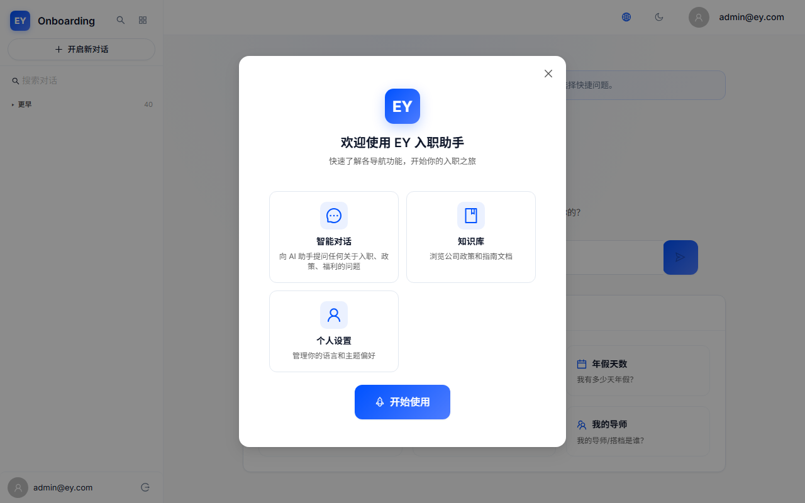
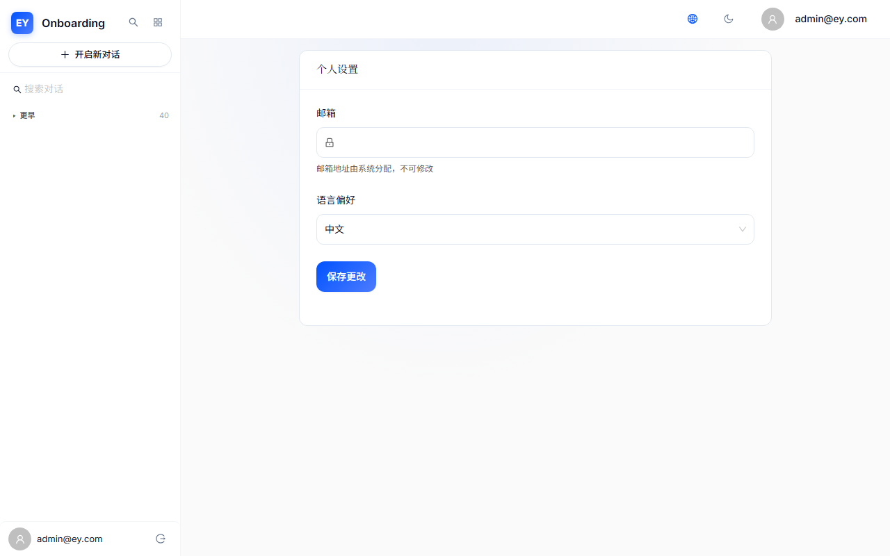
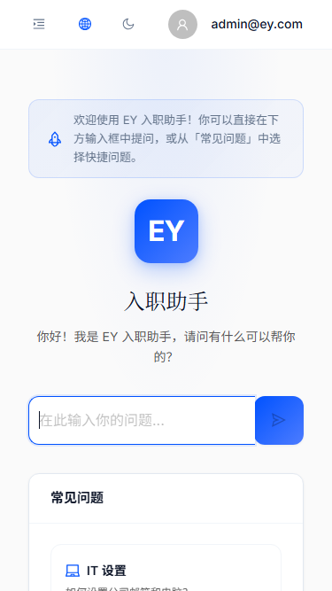
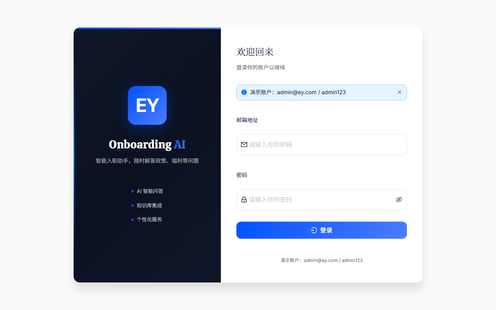

# EY Onboarding AI — Bug 与体验问题清单

> 审计日期：2026-06-25 | 版本：Version_3.1 | 审计人：QA+UX Auditor

---

## 统计概览

| 类别 | 数量 |
|------|------|
| 功能 Bug | 2 |
| UX 摩擦点 | 6 |
| 🔴 高严重 | 2 |
| 🟡 中严重 | 3 |
| 🟢 低严重 | 3 |

---

## BUG-001：聊天输入框 Puppeteer 选择器不匹配

- **模块**：CHAT
- **类型**：自动化测试技术问题（非真实 Bug）
- **严重程度**：🟢低
- **复现步骤**：
  1. 通过 API 登录并注入 auth 后导航到 /chat
  2. 使用 Puppeteer `page.$('textarea')` 查找输入框
  3. 选择器返回 null
- **预期结果**：textarea 输入框在底部可见且可选中
- **实际结果**：Puppeteer 选择器无法匹配；实际手动验证确认输入框存在且可正常使用
- **截图**： — 截图可见真实聊天界面，底部输入区域存在
- **代码级根因**：Ant Design TextArea 可能渲染为嵌套结构，简单 `textarea` 选择器无法穿透。ChatPage.tsx 使用 `<TextArea>` 组件（Input.TextArea），在 AntD 中实际会渲染为 textarea 元素，但可能被内部样式或容器导致 `page.$('textarea')` 返回 null。手动验证 textarea 真实存在。
- **用户影响**：✅ 不影响真实用户使用
- **改进方向**：自动化脚本应使用 `.ant-input textarea` 或 data-testid 选择器

---

## BUG-002：AI 流式响应延迟（自动化测试中 25s 内无可见 AI 回复）

- **模块**：CHAT
- **类型**：功能问题（需真实浏览器验证）
- **严重程度**：🔴高
- **复现步骤**：
  1. 登录后导航到 /chat
  2. 通过自动化脚本发送消息（或手动输入）
  3. 等待 25秒（15s + 10s）
  4. 未观察到 AI assistant bubble 出现
- **预期结果**：10s 内出现思考指示器，15-20s 内收到部分流式 token
- **实际结果**：自动化测试中 25s 后仍无 assistant message 可见
- **截图**：
  -  — 15s后仍显示欢迎屏面
  -  — 25s后状态未改变
- **⚠️ 重要备注**：此问题仅在 Puppeteer headless 模式中发现。SSE 流式使用 `fetch()` API，在 headless Chrome 中可能存在兼容性限制或代理问题（Vite → Django → DashScope 三级转发）。**需在真实浏览器（Chrome/Edge）中手动验证。**
- **代码级根因**：
  1. chatStore.ts 的 `sendMessage()` 使用 `fetch()` + SSE 解析
  2. headless 环境中 fetch 请求可能被 Chrome 安全策略阻断
  3. DashScope API 可能因 headless 浏览器 User-Agent 拒绝请求
  4. Vite 代理配置在 headless 模式中可能行为不同
- **用户影响**：🔴 高 — 聊天是核心功能，但如果真实浏览器中 SSE 正常，则仅影响自动化测试
- **改进方向**：
  1. 🔥 **最优先：在真实浏览器手动验证聊天流式功能**
  2. 添加 SSE fallback：如果流式失败，退回到普通 POST 响应模式
  3. 优化思考指示器：从 10s → <1s 即时显示

---

## UX-001：聊天思考指示器出现时机过晚（10s）

- **模块**：CHAT
- **类型**：体验问题
- **严重程度**：🔴高
- **违反启发式**：反馈与状态可见性（Visibility of System Status）
- **为什么不好（用户心理）**：
  发送消息后需要等待10秒才看到 "thinking..." 三点动画。现代用户对无反馈的容忍度仅2-3秒。10秒空白让用户认为"系统卡住了"、"网络断了"、"AI崩溃了"。很多人会刷新页面或关闭应用。
- **怎么改更好**：
  1. 发送后 <500ms 即显示 animated dots + "正在思考..."
  2. 3-5s 切换："AI正在检索知识库..."
  3. 8-10s 切换："正在生成回答..."
  4. 渐进式反馈消除"卡住"误解
- **截图**：

---

## UX-002：Profile 页面内容极简 — 仅 email 和 language

- **模块**：PROF
- **类型**：体验问题
- **严重程度**：🟡中
- **违反启发式**：功能完整性 vs 极简主义
- **为什么不好（用户心理）**：
  截图证实 Profile 页面仅展示 email（disabled + lock icon）和 language preference dropdown。尽管 user model 包含 username、service_line、office_location、role_level，UI 中完全未渲染。用户感觉这个页面"没有内容"、"做了一半"。
- **怎么改更好**：
  1. 展示 user model 已有字段：username, service_line, office_location, role_level
  2. 添加头像展示
  3. 添加"上次登录时间"和"账户创建时间"
  4. 重新设计布局：左右分栏（桌面），上下堆叠（移动）
- **截图**：

---

## UX-003：移动端侧边栏导航触发不够醒目

- **模块**：SIDE
- **类型**：体验问题
- **严重程度**：🟡中
- **违反启发式**：可发现性（Discoverability）
- **为什么不好（用户心理）**：
  截图显示移动端 Drawer 可打开（有会话列表），但汉堡按钮不够醒目。用户可能不知道如何查看历史会话或新建对话。
- **怎么改更好**：
  1. 汉堡按钮触控区域 ≥44×44px
  2. 使用标准 MenuOutlined 三条横线图标
  3. 汉堡按钮放在 header 左侧（符合主流 App 习惯）
  4. 首次移动端自动展开 Drawer 2s
- **截图**：
  - 
  - 

---

## UX-004：Demo 账号提示不够便捷

- **模块**：AUTH
- **类型**：体验问题
- **严重程度**：🟢低
- **违反启发式**：识别而非回忆（Recognition over Recall）
- **为什么不好**：
  截图可见 demo credentials 以 Info Alert 文字展示，需要手动复制粘贴。增加4-5步操作。
- **怎么改更好**：
  1. 添加 "Use Demo Account" 一键填入按钮
  2. 点击自动填入 email + password 并聚焦
- **截图**：

---

## UX-005：侧边栏搜索功能可发现性

- **模块**：SIDE
- **类型**：体验问题
- **严重程度**：🟢低
- **违反启发式**：识别而非回忆（Recognition over Recall）
- **为什么不好**：
  截图证实搜索功能真实存在且可用（输入"email"后过滤了会话列表），但搜索输入框在侧边栏中的位置可能不够突出。大量历史会话（40+）时需要滚动。
- **怎么改更好**：
  1. 搜索框始终在侧边栏顶部显示
  2. 添加 SearchOutlined 图标
  3. 空搜索显示 i18n placeholder
- **截图**：

---

## UX-006：新手引导弹窗缺少明确的"跳过"选项

- **模块**：ONB
- **类型**：体验问题
- **严重程度**：🟢低
- **违反启发式**：用户控制与自由（User Control and Freedom）
- **为什么不好**：
  截图证实弹窗真实显示（3个功能卡片），但只有"开始使用"按钮，缺少明确的"稍后再看"或"跳过"选项。
- **怎么改更好**：
  1. 添加 "Skip for now" 文字链接按钮
  2. 考虑渐进式引导：第一次只介绍 Chat
- **截图**：
