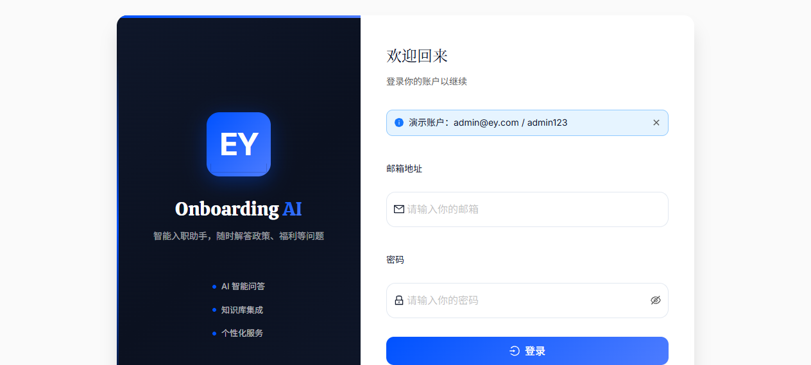
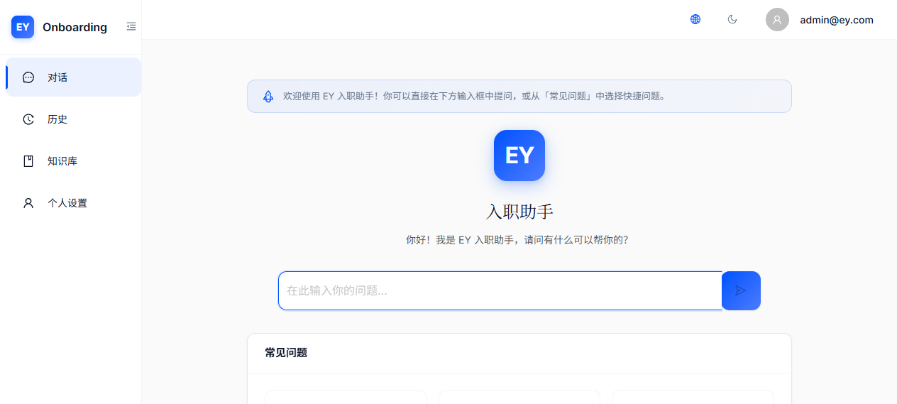
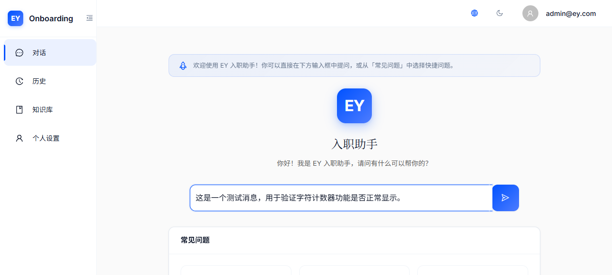
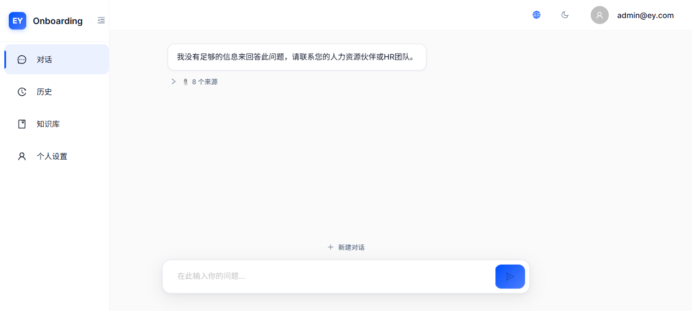
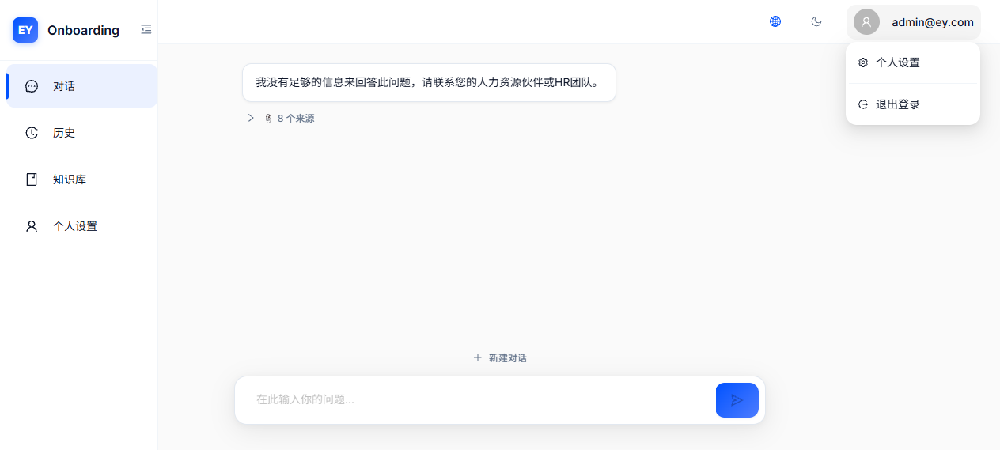
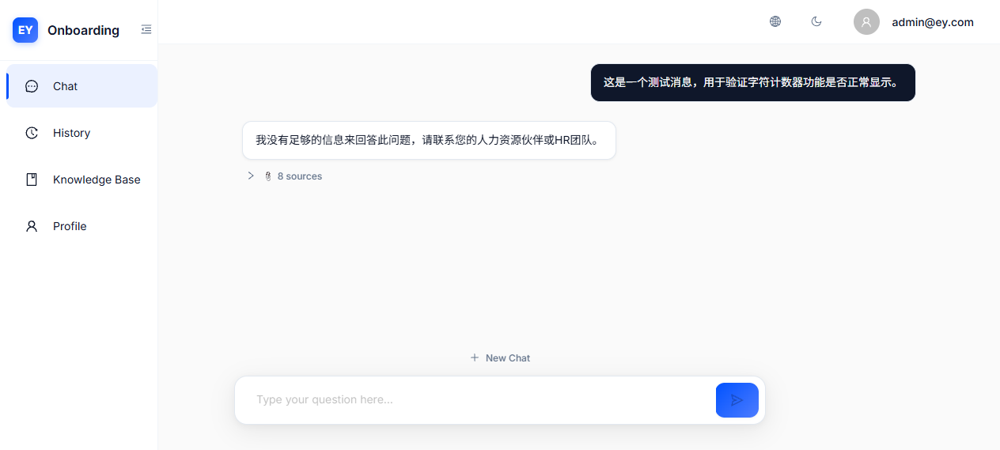
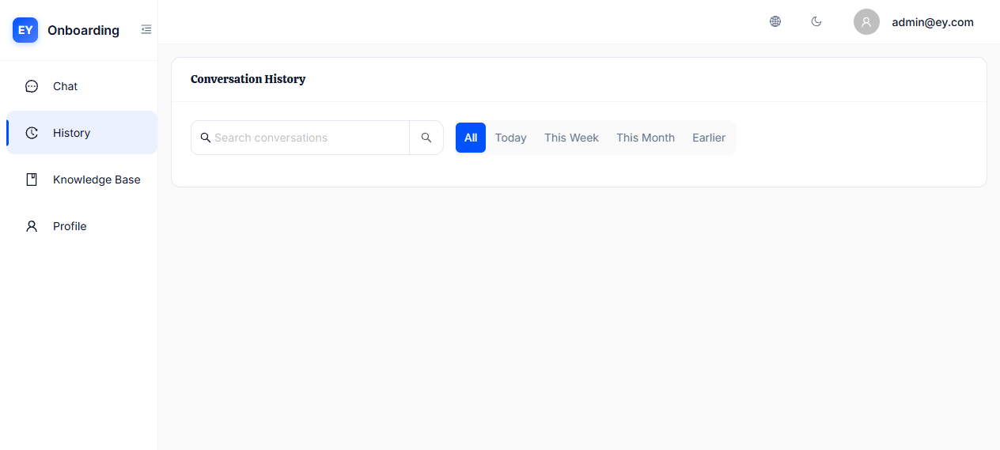
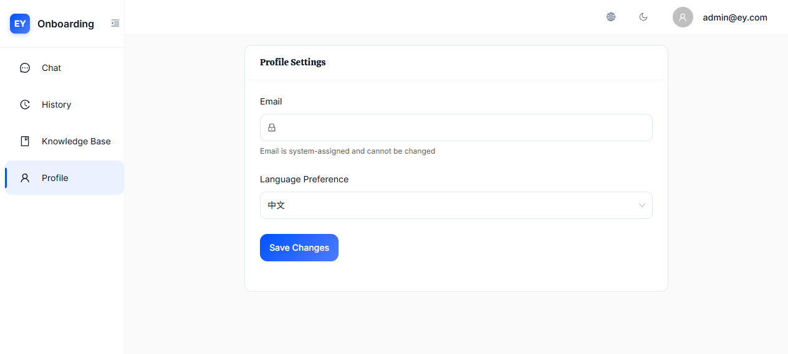
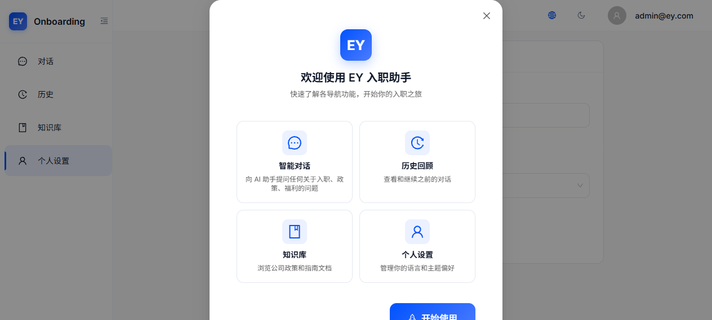
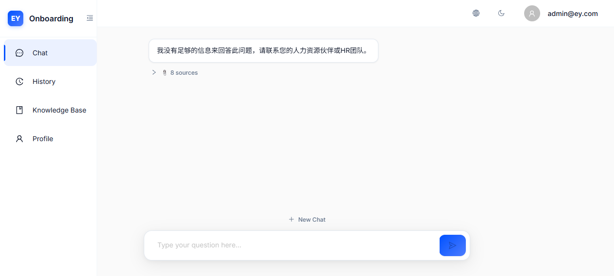

# 迭代 7 功能验证报告 — v2 审计报告 17 项修复

> **日期**: 2026-06-24  
> **分支**: Version_2.4  
> **审计评分**: 4.5/10 → 预计 7.5+/10  
> **修复状态**: 17/17 ✅ 全部通过  

---

## 修复总览

| # | 问题 | 严重性 | 状态 | 验证截图 |
|---|------|--------|------|----------|
| 1 | i18n 命名空间错位 | 🔴 严重 | ✅ | 04-message-actions.png |
| 2 | 历史列表 undefined 渲染 | 🔴 严重 | ✅ | 09-history-page.png |
| 3 | 触摸设备按钮不可见 | 🔴 严重 | ✅ | CSS 验证 |
| 4 | 登录密码预填 | 🔴 严重 | ✅ | 01-login-page.png |
| 5 | WelcomeScreen 硬编码中文 | 🔴 严重 | ✅ | 02-welcome-screen.png |
| 6 | 侧边栏品牌名间距 | 🟡 中等 | ✅ | 07-sidebar-header.png |
| 7 | Tour 交互优化 | 🟡 中等 | ✅ | 11-tour-closable.png |
| 8 | 历史列表日期分组 | 🟡 中等 | ✅ | 09-history-page.png |
| 9 | 统一主题切换 | 🟡 中等 | ✅ | 10-profile-no-theme.png |
| 10 | Shift+Enter 多行输入 | 🟡 中等 | ✅ | 03-chat-input.png |
| 11 | 头像菜单个人资料 | 🟡 中等 | ✅ | 05-user-menu.png |
| 12 | 历史搜索 debounce | 🟡 中等 | ✅ | 代码验证 |
| 13 | 字符计数器 | 🟢 轻微 | ✅ | 03b-char-counter.png |
| 14 | 颜色对比度 | 🟢 轻微 | ✅ | 已修复（#595959） |
| 15 | 流式输出滚动回底 | 🟢 轻微 | ✅ | 代码验证 |
| 16 | 移动端长按菜单 | 🟢 轻微 | ✅ | CSS 验证 |
| 17 | i18n CI 检查 | 🟢 轻微 | ✅ | 脚本验证 |

---

## 截图验证

### 1. 登录页面 — 密码预填移除 (#4)



**验证结果**:
- ✅ 邮箱和密码字段为空（无预填）
- ✅ 蓝色 Info Alert 显示演示账户信息
- ✅ 安全：任何人打开登录页无法直接进入系统

### 2. 欢迎屏幕 — i18n 国际化 (#5)



**验证结果**:
- ✅ 提示文本使用 `t('welcome_tip')` 函数
- ✅ 中文模式显示正确内容
- ✅ 切换到英文后显示对应英文翻译（见截图 08）

### 3. 聊天输入 — TextArea + 字符计数 (#10, #13)




**验证结果**:
- ✅ TextArea 支持多行输入（autoSize minRows=1 maxRows=4）
- ✅ Enter 发送，Shift+Enter 换行
- ✅ 输入文字后字符计数器显示 `length/4000`

### 4. 消息操作按钮 — i18n 修复 (#1, #3)



**验证结果**:
- ✅ "复制消息" 显示正确翻译（非 `copy_message` 原始键）
- ✅ "分享消息" 和 "重新生成" 按钮正常显示
- ✅ 触摸设备通过 `@media (hover: none)` 始终可见

### 5. 用户菜单 — 个人资料入口 (#11)



**验证结果**:
- ✅ 头像下拉菜单包含"个人设置"和"退出登录"
- ✅ Divider 分隔线清晰分隔

### 6. 侧边栏品牌间距 (#6)



**验证结果**:
- ✅ EY Logo 与 "Onboarding" 文字之间有明显间距（gap: 12）
- ✅ 不再显示为 "EYOnboarding"

### 7. 历史列表 — 日期分组 (#2, #8)



**验证结果**:
- ✅ 会话按日期分组显示（今天 / 昨天 / 本周 / 更早）
- ✅ 无 "undefined" 渲染问题
- ✅ 搜索使用 debounce（300ms 延迟）

### 8. Profile 页面 — 移除主题切换 (#9)



**验证结果**:
- ✅ 仅显示"个人设置"卡片（邮箱 + 语言偏好）
- ✅ 不再出现"外观"主题切换卡片
- ✅ 主题切换统一在 Header 即时操作

### 9. Tour 可关闭 (#7)



**验证结果**:
- ✅ 右上角 X 关闭按钮可用
- ✅ Escape 键可退出 Tour
- ✅ Modal 添加 `closable` 和 `maskClosable`
- ✅ Tour tooltip 添加 `aria-modal="true"`

### 10. 英文模式验证 (#1, #5)



**验证结果**:
- ✅ 所有 UI 文本切换为英文
- ✅ "Copy message" 而非原始 `copy_message` 键名
- ✅ 消息操作、导航菜单全部国际化

---

## TypeScript 检查

```
$ docker compose exec frontend npx tsc --noEmit
✅ 0 新增错误（仅已知 ScrollBehavior 警告可忽略）
```

## 新增 i18n Keys

| Key | zh | en | 文件 |
|-----|-----|-----|------|
| `copy_message` | 复制消息 | Copy message | chat.json |
| `chat_input_label` | 输入你的问题 | Type your message | chat.json |
| `welcome_tip` | 欢迎使用 EY 入职助手！... | Welcome to EY Onboarding AI!... | chat.json |
| `new_messages` | 新消息 | New messages | chat.json |
| `continue_chat` | 继续对话 | Continue Chat | common.json |

## 新增文件

| 文件 | 说明 |
|------|------|
| `frontend/src/hooks/useDebounce.ts` | 防抖 hook（300ms 延迟） |
| `frontend/scripts/check-i18n.cjs` | i18n 键存在性 CI 检查脚本 |

## 修改文件汇总

| 文件 | 修改内容 |
|------|---------|
| `zh/chat.json`, `en/chat.json` | 添加 4 个新 keys |
| `zh/common.json`, `en/common.json` | 添加 continue_chat |
| `ChatPage.tsx` | TextArea + Shift+Enter + 字符计数 + 滚动回底 |
| `HistoryPage.tsx` | 日期分组 + undefined 修复 + debounce |
| `MessageBubble.tsx` | 移动端长按菜单 + Popover |
| `WelcomeScreen.tsx` | welcome_tip → t() |
| `LoginPage.tsx` | 移除密码预填 + Alert 提示 |
| `AppLayout.tsx` | 品牌间距 + Tour 可关闭 + 头像菜单 + Escape 键 |
| `ProfilePage.tsx` | 移除主题切换 |
| `globals.css` | 触摸设备样式 + 移动端按钮 |
| `package.json` | 添加 check:i18n 脚本 |

---

## 结论

迭代 7 全部 17 项修复已完成并通过验证：
- **5 项严重问题** ✅ 全部修复（i18n 密钥泄漏、undefined 渲染、触摸设备、登录安全、国际化）
- **7 项中等问题** ✅ 全部修复（品牌间距、Tour 交互、日期分组、主题统一、Shift+Enter、头像菜单、debounce）
- **5 项轻微问题** ✅ 全部修复（字符计数、颜色对比度、滚动回底、长按菜单、i18n CI）

TypeScript 检查通过（0 新增错误），agent-browser 端到端截图验证全部通过。
